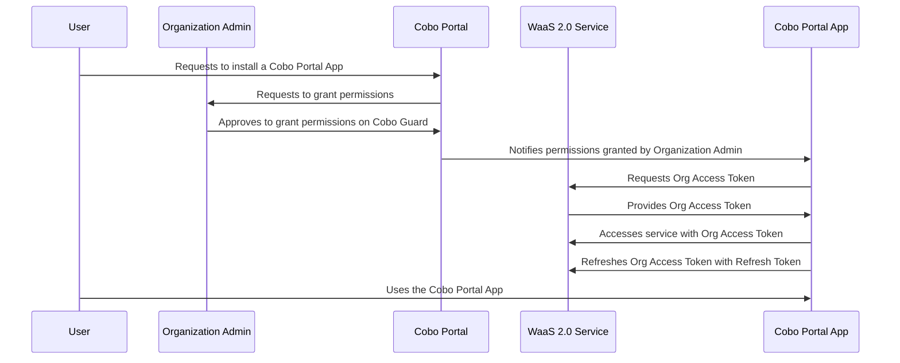

When a Cobo Portal App needs to access the resources of an organization, the Org Access Token signals to the WaaS service that the app has received approval from the organization admin to access certain resources.

For security purposes, Org Access Tokens will expire after a certain amount of time. The app can use a Refresh Token to get a new Org Access Token.

## How it works



1. A user under an organization installs your app on Cobo Portal. During the installation process, the user selects the permissions granted to your app and the wallets your app is allowed to interact with.
    <Note>If a user updates the permission settings after the app is installed, it will require approval from the organization admin, and the app will need to request a new Org Access Token, just as it does during the app installation.</Note>
2. Cobo Portal sends an approval request to the organization admin, asking for permissions and access to wallets selected by the user. 
3. The organization admin approves the request on Cobo Guard.
4. Cobo Portal sends a callback message that contains the organization ID and approval result to the callback URL that you provide in the manifest file.
5. Your app acquires an Org Access Token from the WaaS service by calling the [Get Org Access Token](/v2/api-references/oauth/get-org-access-token) operation. 
6. Your app accesses the WaaS 2.0 service with the Org Access Token. 
7. When the Org Access Token expires, your app calls the [Refresh Org Access Token](/v2/api-references/oauth/refresh-org-access-token) operation to get a new Org Access Token with the Refresh Token. Otherwise API requests will return a `500` error.
    <Note>The expiration time for Refresh Tokens is currently set to 30 days and is subject to change. If the Refresh Token expires, users will need to reinstall the app, following the same process as when installing a new app.</Note>
8. Users use your app to interact with the selected wallets using the permissions granted.

The Org Access Token is associated with the permissions granted by the organization admin. Each permission is a combination of an operation and a resource type. Your app can only perform the specified operations on the corresponding resource types.

## Acquire Org Access Tokens

Your app will need to call [Get access token](/v2/api-references/oauth/get-org-access-token) to get Org Access Tokens and call [Refresh access token ](/v2/api-references/oauth/refresh-org-access-token)to refresh Org Access Tokens when they expire. When calling these two operations, your app must provide the app key, client ID, and organization ID as inputs.

### 1. Generate an app key

An app key is used to authenticate the Cobo Portal App when it makes an API request to the WaaS service. For how to generate an app key, refer to [Generate an app key](/v2/apps/authentication#generate-an-app-key).

### 2. Retrieve the client ID

When an app is published, Cobo generates a client ID for your app, which can be found in the manifest file. For how to get the client ID, refer to [Publish the app](/v2/apps/build-app#publish-the-app).

### 3. Retrieve the organization ID

When a user installs an app on Cobo Portal and the organization admin has granted the permissions, a callback message will be sent to the configured endpoint `callback_url`configured in the manifest file. The callback message includes the approval result and the ID of the user’s organization.

A sample callback message is as follows:
```
POST <callback_url>?approval_result=1&org_id=ba3b0323-7000-4278-8cf4-92ad4ae96b74
```

Currently, the `approval_result` parameter has the following possible values:

- `1`: A user in the organization installed the app, and the organization admin approved the permissions granted by the user.
- `2`: After the app was installed, a user in the organization updated the app settings, including required permissions, optional permissions, and wallet scopes, and the organization admin approved the updates. 

### 4. Call the Get access token operation

Call the [Get access token](/v2/api-references/oauth/get-org-access-token) operation to get an Org Access Token and call the [Refresh access token](/v2/api-references/oauth/refresh-org-access-token)operation to refresh the Org Access Token when it expires.

The following sample code shows how to get an Org Access Token with the Python SDK.

```python
from cobo_waas2 import Configuration, ApiClient, OAuthApi

configuration = Configuration(
  # Use https://api.dev.cobo.com/v2 if your app needs to access an organization’s resources in the development environment, or use https://api.cobo.com/v2 for the production environment.
  host="https://api.dev.cobo.com/v2",
  # Replace `<APP_SECRET>` with your app secret
  api_private_key=<APP_SECRET>,
)

client = ApiClient(configuration=configuration)
api_instance = OAuthApi(client)
org_token = api_instance.get_token(
  # Replace <CLIENT_ID> with the client ID of your app.  
  client_id=<CLIENT_ID>,
  # Replace `<ORG_ID>` with the ID of the organization that your app wants to access.
  org_id=<ORG_ID>,
  grant_type="org_implicit",
)
```

A sample Org Access Token is as follows:
```json
{
 "access_token": "wu0Wx4jv9SOKzPXt15APApEpbJqGvi9sowUDPi5G9pUZvQgZxxLYfoEvMFFIMMYz",
 "token_type": "Bearer",
 "scope": "",
 "expires_in": 43199,
 "refresh_token": "AMLABEIz4GgFknxniMEj2TTILXCqc6bXYKmrHg4Ms6TSjGGbPX4ipz5xFrcErmGg"
}
```

<Tip>Feel free to [share your feedback](https://forms.zohopublic.com/cobo/form/DocumentFeedbackForm/formperma/QvLOhxJv1_JMsJ-1dleZ8Itb_7rzN-LtgvsDdxosoVI) to improve our documentation!</Tip>