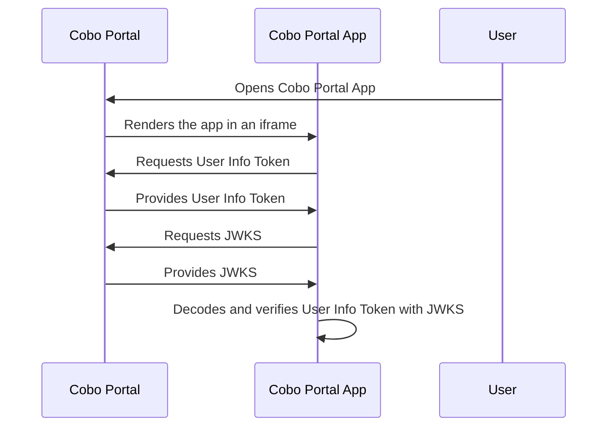

import WaasSkillReminder from '/snippets/waas_skill_reminder.mdx';

<WaasSkillReminder />

User Info Tokens are JSON Web Tokens (JWTs) signed by Cobo Portal. These tokens allow Cobo Portal Apps to retrieve information about users, including their user ID, email address, and permissions. A Cobo Portal App can use the information to verify a user's identity and control their access to the organization's resources based on the permissions. 

## How it works



1. A user opens a Cobo Portal App on Cobo Portal.
2. Cobo Portal renders the app in an iframe.
3. The app requests a User Info Token from Cobo Portal.
4. Cobo Portal provides the User Info Token.
5. The app requests JSON Web Key Set (JWKS) from Cobo Portal.
6. Cobo Portal provides the JWKS.
7. The app decodes and verifies the User Info Token using the JWKS.
    <Note>Please use the algorithm specified in the `alg` field of the JWT header to perform the verification.</Note>

## Request a User Info Token

To obtain a User Info Token, follow these steps:

1. Install Cobo UI Toolkit by running the following command:
    ```shell
    npm install cobo-ui-toolkit
    ```
2. Use the `getAuthInfo` function provided by Cobo UI Toolkit:
    ```javascript
    import { getAuthInfo } from 'cobo-ui-toolkit';


    const authInfo = await getAuthInfo();

    /*
    type AuthInfo = {
        // The User Info Token
        token: string;
        // The organization ID of the user
        orgID: string;
        // The user ID
        userID?: string;
    };
    */

    if (authInfo.data) {
        // Handle the User Info Token.
        // Handle the organization ID.
    } else if (authInfo.error) {
        // Handle errors.
    }
    ```

Here is an example of what a decoded User Info Token looks like:

```json
{
    "sub": "1234",
    "email": "dev@cobo.com",
    "role_names": [
        "Viewer",
        "Spender",
        "Approver",
        "Operator",
        "Admin"
    ],
    "iss": "https://portal.dev.cobo.com/",
    "iat": 1723705170,
    "exp": 1723705470,
    "jti": "6a02090be57a4718bc1b0a3914d70584",
    "aud": "I5rK1KnSA9xtIbIrqdzJLVPrTc0EsaGG"
}
```

## Validate a User Info Token

Validate the User Info Token with the JWKS. To retrieve JWKS, send an HTTP GET request to the appropriate URL based on the environment in which your app is used:
- Production environment: `https://api.cobo.com/v2/oauth/authorize/jwks.json`
- Development environment: `https://api.dev.cobo.com/v2/oauth/authorize/jwks.json`

Additionally, you need to verify the `iss` (issuer), `exp` (expiration ), and `aud` (audience) fields are correct.