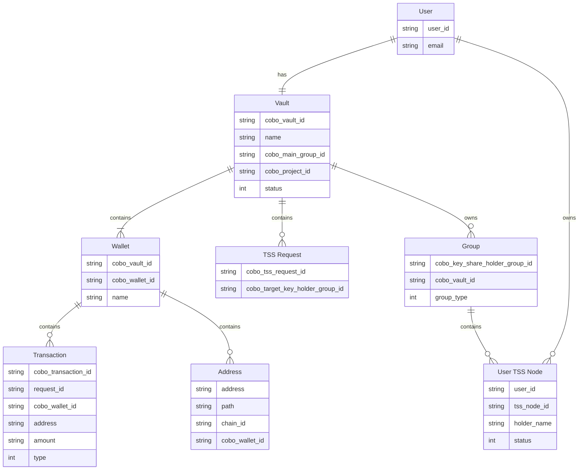

This guide gets you started with using MPC Wallets (User-Controlled Wallets). For a high-level overview of what User-Controlled Wallets are, see [Introduction to User-Controlled Wallets](https://manuals.cobo.com/en/portal/mpc-wallets/introduction#user-controlled-wallets). By following this guide, you will be able to build a User-Controlled Wallet by using the [Cobo Wallet-as-a-Service (WaaS) 2.0 API](/v2/guides/overview/introduction) and UCW SDK to:

<Steps>
  <Step title="Complete the initial setup">
    1. Create projects with the Client Backend or Cobo Portal
    2. Install the UCW SDK
    3. Initialize the UCW SDK
    4. Create a vault
    5. Create a Main Group
    <Steps>
</Steps>
  </Step>
  <Step title="Create a wallet and an address">
  </Step>
  <Step title="Create a transaction">
  </Step>
  <Step title="Back up and restore">
    1. Back up and restore your key shares with iCloud
    2. Create a Recovery Group
    3. Perform recovery from Recovery Group
    4. Perform disaster recovery
  </Step>
</Steps>

<Tip>Some links in this document may not be functional until all relevant documentation for User-Controlled Wallets has been published.</Tip>

<Note>You can choose between the 2-2, 2-3, or 3-3 [signature scheme](https://manuals.cobo.com/en/portal/mpc-wallets/introduction#threshold-signature-scheme-tss) for your User-Controlled Wallets. For the purposes of this documentation, we will use the 2-2 signature scheme.</Note>

<Note>This guide uses the [development environment](https://www.cobo.com/developers/v2/guides/overview/environments) in all its code samples. It is recommended that you use the development environment to test your new features first before deploying them to the production environment.</Note>

## Technical architecture

The following diagram illustrates the components within a fully-functioning User-Controlled Wallet:


<Note>You only need to focus on implementing the Client Backend and Client App. The Cobo Backend, Cobo TSS Relay, and UCW SDK are managed and provided by Cobo.</Note>

Use the following tabs to learn more about each component in the technical architecture:

<Tabs>
  <Tab title="Client Backend">
    Your server responsible for interacting with the Cobo Backend using the WaaS 2.0 API. Client Backend is also used to communicate with your Client Apps. To get started, you can download our Client Backend Demo [here](https://github.com/CoboGlobal/cobo-ucw-demo-backend) to set up a working example of a User-Controlled Wallet before developing your own implementation.
  </Tab>
  <Tab title="Client App">
    A user-facing application you build that utilizes the UCW SDK to communicate with the Cobo TSS Relay. Client App is also used to communicate with your Client Backend. To get started, you can download our Client App Demo [here](https://github.com/CoboGlobal/cobo-ucw-demo-app-ios) to set up a working example of a User-Controlled Wallet before developing your own implementation.
  </Tab>
  <Tab title="Cobo Backend">
    The Cobo server that handles the WaaS 2.0 API calls from the Client Backend.
  </Tab>
  <Tab title="Cobo TSS Relay">
    A part of the Cobo Backend.
  </Tab>
  <Tab title="UCW SDK">
    The SDK provided by Cobo that allows your Client App to interact with the Cobo TSS Relay. To get started, you can download our UCW SDK Demo [here](https://github.com/CoboGlobal/cobo-ucw-sdk-ios.git) to set up a working example of a User-Controlled Wallet before developing your own implementation.
  </Tab>
  <Tab title="API Co-Signer">
    This applies only if you're building a User-Controlled Wallet with a 2-3 or 3-3 [signature scheme](https://manuals.cobo.com/en/portal/mpc-wallets/introduction#threshold-signature-scheme-tss), where you will need to build an [API Co-Signer](https://manuals.cobo.com/en/portal/mpc-wallets/ocw/holder-group-main-group#create-a-main-group) to sign transactions. Please note that for the 2-3 signature scheme, Cobo must be one of the signers, while the second signer can either be the UCW SDK in a Client App or the API Co-Signer.
  </Tab>
</Tabs>

<Info>To learn about the general architecture of an MPC Wallet, see Organization-Controlled Wallet's [Technical architecture](/v2/guides/mpc-wallets/get-started-ocw#technical-architecture).</Info>

## Data model
The following diagram presents an example of a User-Controlled Wallet data model that you can reference when developing your own implementation. It provides a clear representation of how users, vaults, wallets, transactions, addresses, TSS requests, groups, and TSS Nodes interact in a working User-Controlled Wallet.


Use the tabs below to learn more about each entity and attribute in the data model.


<AccordionGroup>
  <Accordion title="User">
    #### Attributes:
    - `user_id`: Unique identifier for the user.
    - `email`: User's email address.

    #### Relationships:
    - **Has** a direct relationship with Vault, indicating that a user has exactly one vault and each vault corresponds to exactly one user.
    - **Owns** User TSS Node, where a user has zero or more TSS Nodes and each TSS Node is owned by exactly one user.
  </Accordion>
  <Accordion title="Vault">
    #### Attributes:
    - `cobo_vault_id`: Unique identifier for the vault in the Cobo system.
    - `name`: The name of the vault.
    - `cobo_main_group_id`: The currently active Main Group this vault owns that holds the authority to sign transactions.
        - <Info>Even though a vault can own multiple Main Groups and Recovery Groups, only one Main Group can be active at any given time.</Info>
    - `cobo_project_id`: The project to which the vault belongs.
    - `status`: The vault's current status.

    #### Relationships:
    - **Contains** Wallet, meaning that a vault can hold one or more wallets, and a wallet belongs to exactly one vault.
    - **Contains** TSS Request, showing that a vault may have zero or more pending or processed TSS requests, and each TSS request corresponds to exactly one vault.
    - **Owns** Group, indicating that a vault owns multiple Main Groups and Recovery Groups.
  </Accordion>
  <Accordion title="Wallet">
    #### Attributes:
    - `cobo_vault_id`: Identifier linking the wallet to the vault that contains this wallet.
    - `cobo_wallet_id`: Unique identifier for the wallet.
    - `name`: The name of the wallet.

    #### Relationships:
    - **Contains** Transaction, showing that a wallet can include zero or more transactions, and each transaction corresponds to exactly one wallet.
    - **Contains** Address, meaning a wallet can have zero or more blockchain addresses associated with it, and each address corresponds to exactly one wallet.
  </Accordion>
  <Accordion title="Transaction">
    #### Attributes:
    - `cobo_transaction_id`: Unique identifier for the transaction in the Cobo system.
    - `request_id`: The request ID associated with the transaction.
    - `cobo_wallet_id`: The wallet associated with the transaction.
    - `address`: The blockchain address involved in the transaction.
    - `amount`: The amount involved in the transaction.
    - `type`: Type of transaction (e.g., deposit, withdrawal).

    #### Relationships:
    - **Belongs to** Wallet, indicating that each transaction is linked to exactly one wallet.
  </Accordion>
  <Accordion title="Address">
    #### Attributes:
    - `address`: The blockchain address associated with the wallet.
    - `path`: The derivation path of the address.
    - `chain_id`: The ID of the blockchain network associated with the address.
    - `cobo_wallet_id`: Identifier linking the address to its wallet.

    #### Relationships:
    - **Belongs to** Wallet, indicating that each address is part of exactly one wallet.
  </Accordion>
  <Accordion title="TSS Request">
    #### Attributes:
    - `cobo_tss_request_id`: Unique identifier for the [TSS request](https://www.cobo.com/developers/v2/api-references/wallets--mpc-wallets/create-tss-request).
    - `cobo_target_key_holder_group_id`: The target key share holder group involved in the TSS request.

    #### Relationships:
    - **Belongs to** Vault, showing that TSS requests are linked to exactly one vault, and each vault contains zero or more TSS requests.
  </Accordion>
  <Accordion title="Group">
    #### Attributes:
    - `cobo_key_share_holder_group_id`: Unique identifier for the [key share holder group](https://www.cobo.com/developers/v2/guides/mpc-wallets/get-started-ocw#create-a-key-share-holder-group).
    - `cobo_vault_id`: Unique identifier for the vault that owns this key share holder group.
    - `group_type`: Type of key share holder group (i.e. Main Group or Recovery Group).

    #### Relationships:
    - **Contains** User TSS Node, meaning that a group can hold multiple TSS Nodes, and each TSS Node corresponds to exactly one group.
  </Accordion>
  <Accordion title="User TSS Node">
    #### Attributes:
    - `user_id`: Unique identifier for the user of the TSS Node.
    - `tss_node_id`: Unique identifier for the TSS Node.
    - `holder_name`: The name of the holder.
    - `status`: The status of the TSS Node.

    #### Relationships:
    - **Belongs to** Group, meaning that a key share holder group contains zero or more TSS Nodes, and each TSS Node belongs to exactly one key share holder group.
    - **Owned by** User. Each user owns to zero or more TSS Nodes, and each TSS Node is owned by exactly one user.
  </Accordion>
</AccordionGroup>

## Prerequisites

- Follow the instructions in [Get started with WaaS 2.0](https://www.cobo.com/developers/v2/guides/get-started-with-waas) to set up your account and send your first API request to the WaaS 2.0 service.
- If you choose to use a WaaS SDK instead of manually writing the API requests, refer to the SDK guide corresponding to the programming language of your choice ([Python](https://www.cobo.com/developers/v2/developer-tools/quickstart-python), [Java](https://github.com/CoboGlobal/cobo-waas2-java-sdk), [Go](https://www.cobo.com/developers/v2/developer-tools/quickstart-go), [JavaScript](https://github.com/CoboGlobal/cobo-waas2-js-sdk)) to integrate the SDK into your Client Backend.
- Prepare some test tokens as you will need them when testing the deposit feature. To know which test tokens you can use, refer to [Query chain and token information](https://docs.google.com/document/d/14fjeIBG_luQJb6mU4BYqMIzCMacCXKG3foZfMald9zc/edit#heading=h.eyriyqbnqjcs). In most cases, you can use XTN as the test token.
- It is highly recommended that you set up a callback endpoint to receive and approve withdrawal requests and a webhook endpoint to receive real-time notifications regarding transaction status updates and other events of your concern. To learn how to set up and register webhook and callback endpoints, refer to [Introduction to webhooks and callbacks](https://www.cobo.com/developers/v2/guides/webhooks-callbacks/introduction).

## 1. Complete the initial setup

<Steps>
  <Step title="Create projects with the Client Backend or Cobo Portal.">
    You can create projects with either the Client Backend or directly on Cobo Portal.
    - To create projects with the Client Backend, call the [Create project](https://www.cobo.com/developers/v2/api-references/wallets--mpc-wallets/create-project) operation.
    - To create projects with Cobo Portal, see our [upcoming Product Manuals for User-Controlled Wallets](https://manuals.cobo.com/en/portal/mpc-wallets/ucw/introduction).
  </Step>
  <Step title="Install UCW SDK">
    To install the UCW SDK, see our upcoming article on "Get started with UCW SDK", which shows how you can download the UCW SDK, add it to your iOS app development environment, initialize the UCW SDK in your Client App, and invoke a UCW SDK operation.
  </Step>
  <Step title="Initialize UCW SDK">
    This section outlines the sequence of operations for initializing the UCW SDK from a Client App. The initialization process is straightforward, with a single interaction between the Client App and the UCW SDK to ensure that the UCW SDK is set up and ready for further operations.

    The UCW SDK needs to be initialized in the Client App to facilitate communication with the Cobo TSS Relay. This initialization also sets up the TSS Node ID, a unique identifier for the node participating in key generation.


    ```mermaid
    sequenceDiagram
        autonumber
        participant App as Client App
        participant SDK as UCW SDK

        App ->> SDK: Init
        activate App
        SDK ->> App: return success
        deactivate App
    ```


    #### Sequence of operations

    - **Initialize UCW SDK**

        - Client App → UCW SDK

            1. Client App sends a request to initialize the UCW SDK by calling the [Initialize Secrets](http://localhost:3000/v2/ucw_sdk/initialize-secrets/initialize-secrets) operation.

        - UCW SDK → Client App

            2. UCW SDK returns a success message indicating that the initialization has been completed successfully.

  </Step>
  <Step title="Create a vault">
    This section explains the sequence of operations involved in creating a [vault](/v2/guides/mpc-wallets/get-started-ocw#technical-architecture). The process involves interactions between the Client App, Client Backend, and the Cobo Backend.

    ```mermaid
    sequenceDiagram
        autonumber
        participant App as Client App
        participant C as Client Backend
        participant P as Cobo Backend

        App ->> +C: POST /v1/vaults/initialize
        activate App
        C ->> +P: POST /v2/wallets/mpc/vaults , {project_id}
        P ->> -C: return {vault_id}
        C ->> C: bind {vault_id} to {user_id}
        C ->> -App: return {vault_info}
        deactivate App
    ```


    #### Sequence of operations

    - **Send vault creation request to Client Backend**

        - Client App → Client Backend

            1. Client App sends a request to the Client Backend to create a vault.

    - **Create the vault in Cobo Backend**

        - Client Backend → Cobo Backend

            2. Client Backend forwards the request to the Cobo Backend to create a new vault for the specified project by calling the [Create vault](http://localhost:3000/v2/api-references/wallets--mpc-wallets/create-vault) operation.

        - Cobo Backend → Client Backend

            3. Cobo Backend responds with the newly created vault ID.

    - **Binding the vault to the user**

        - Client Backend

            4. Client Backend binds the newly created vault ID to an associated User ID.

    - **Return vault information to Client App**

        - Client Backend → Client App

            5. Client Backend returns the vault information, including the vault ID and other metadata, to the Client App.
  </Step>
  <Step title="Create a Main Group">
    This section details the sequence of operations involved in creating a Main Group and performing a key generation process using the Client App, UCW SDK, Client Backend, Cobo Backend, and Cobo TSS Relay.

    ```mermaid
    sequenceDiagram
        autonumber
        participant App as Client App
        participant SDK as UCW SDK
        participant C as Client Backend
        participant P as Cobo Backend
        participant R as Cobo TSS Relay

        App ->> SDK: Open
        activate App
        SDK ->> App: SDKInstance
        App ->> SDK: SDKInstance.GetTSSNodeID
        SDK ->> App: return {tss_node_id}
        deactivate App

        App ->> +C: POST /v1/vaults/{vault_id}/tss/generate_main_group , {tss_node_id}
        C ->> P: POST /v2/wallets/mpc/vaults/{vault_id}/key_share_holder_groups , {type: main_group, key_share_holders}
        P ->> C: return {key_share_holder_group_id}
        C ->> C: bind {key_share_holder_group_id} to {vault_id}
        C ->> C: bind {tss_node_id} to {key_share_holder_group_id}
        C ->> +P: POST /v2/wallets/mpc/vaults/{vault_id}/tss_requests , {KeyGen}
        P ->> C: return {tss_request_id}
        C ->> -App: return {tss_request_id, status: PendingKeyHolderConfirmation}
        P ->> P: cobo risk control
        P ->> R: POST create_tss_request
        R ->> P: return 200 OK

        alt use webhook
            P ->> C: POST /v1/webhook , {tss_request_event_type, tss_request_info}
        else use polling
            C ->> P: GET /v2/wallets/mpc/vaults/{vault_id}/tss_requests/{tss_request_id}
            P ->> -C: return {tss_request_id, status: KeyGenerating}
        end

        activate App
        alt use push
            C ->> +App: push notification
        else use polling
            App ->> C: GET /v1/vaults/{vault_id}/tss/requests
            C ->> App: return {tss_request_id, status: KeyGenerating}
        end


        App ->> +SDK: SDKInstance.GetTSSRequests
        SDK ->> R: GetTSSRequests
        R ->> SDK: {tss_request_info}
        SDK ->> -App: {tss_request_info}
        App ->> App: review pending TSSRequest
        App ->> +SDK: SDKInstance.ApproveTSSRequest {tss_request_id}
        SDK ->> R: participate in keygen
        R ->> SDK: {keygen result}
        App ->> SDK: SDKInstance.GetTSSRequests
        SDK ->> -App: {tss_request_info}
        App ->> C: /v1/tss_requests/{tss_request_id}/report
        deactivate App

        R ->> P: {keygen result}

        alt use webhook
            P ->> C: POST /v1/webhook , {keygen result}
        else use polling
            C ->> P: GET /v2/wallets/mpc/vaults/{vault_id}/tss_requests/
            P ->> C: request_status: {keygen result}
        end

    ```

    #### Sequence of operations


    - **Open UCW SDK in the Client App**

        - Client App → UCW SDK

            1. Client App opens a UCW SDK instance by calling the [Create UCW SDK](http://localhost:3000/v2/ucw_sdk/ucwsdk-class/create-ucw-sdk) and [Create UCW SDK Public](http://localhost:3000/v2/ucw_sdk/ucwsdkpublic-class/create-ucw-sdk-public) operations.

        - UCW SDK → Client App

            2. UCW SDK returns an instance of the UCWSDK and UCWSDKPublic class that is used for further interactions.

    - **Retrieve TSS Node ID**

        - Client App → UCW SDK

            3. Client App calls the [Get TSS Node ID](http://localhost:3000/v2/ucw_sdk/ucwsdkpublic-class/get-tss-node-id) operation on the UCWSDKPublic to retrieve the TSS Node ID.

        - UCW SDK → Client App

            4. UCW SDK responds with the TSS Node ID.


    - **Initialize Main Group creation**

        - Client App → Client Backend

            5. Client App sends a request to the Client Backend to generate the Main Group for the vault specified by vault ID, also passing the TSS Node ID.

        - Client Backend → Cobo Backend

            6. Client Backend calls the [Create key share holder group](http://localhost:3000/v2/api-references/wallets--mpc-wallets/create-key-share-holder-group) operation, instructing the Cobo Backend to create a Main Group.

        - Cobo Backend → Client Backend

            7. Cobo Backend responds with a key share holder group ID, indicating that the Main Group has been successfully created.

        - Client Backend

            8. Client Backend binds the key share holder group ID to the vault ID.

            9. Client Backend binds the TSS Node ID with the key share holder group ID.

    - **Initialize key generation request**

        - Client Backend → Cobo Backend

            10. Client Backend calls the [Create TSS request](http://localhost:3000/v2/api-references/wallets--mpc-wallets/create-tss-request) operation, instructing the Cobo Backend to initiate the key generation process.

        - Cobo Backend → Client Backend

            11. Cobo Backend responds with a TSS request ID and a status of the TSS request.

        - Client Backend → Client App

            12. Client Backend sends the TSS request ID and the TSS request status to the Client App, notifying the Client App that the TSS request is pending key share holder confirmations.

    - **Cobo Backend risk controls and TSS request creation**

        - Cobo Backend

            13. Cobo Backend performs risk control checks before forwarding the request to the Cobo TSS Relay.

        - Cobo Backend → Cobo TSS Relay

            14. Cobo Backend sends the request to the Cobo TSS Relay to create a TSS request.

        - Cobo TSS Relay → Cobo Backend

            15. Cobo TSS Relay confirms the request creation with a 200 OK response.

    - **(Optional) Monitor the TSS request status on Client Backend**

        - Cobo Backend → Client Backend

            You can optionally monitor the status of the TSS request on the Client Backend through either webhook or polling.

                - **Webhook option**

                    16. Cobo Backend sends a webhook to the Client Backend with the current status of the TSS request.

                        <Info>To see the available webhook event types, see [Webhook event types](https://www.cobo.com/developers/v2/guides/webhooks-callbacks/webhook-event-type#webhook-event-types).</Info>

                        <Info>To see how to set up your Client Backend to receive webhook events, see [Set up a callback or webhook endpoint](https://www.cobo.com/developers/v2/guides/webhooks-callbacks/set-up-endpoint).</Info>

                - **Polling option**

                    17. Client Backend polls the Cobo Backend to retrieve the status of the TSS request by calling the [Get TSS request](http://localhost:3000/v2/api-references/wallets--mpc-wallets/get-tss-request) operation.

                    18. Cobo Backend returns the status of the TSS request.

        - **(Optional) Monitor TSS request status on Client App**
            - Client Backend → Client App

                You can optionally monitor the status of the TSS request on the Client App through either app notification or polling.

                    - **App notification option**

                        19. Client Backend pushes a notification to the Client App with the TSS request status.

                    - **Polling option**

                        20. Client App polls the Client Backend for the TSS request status.

                        21. Client Backend returns the TSS request status.

    - **Review and approval of TSS request in Client App**

        - Client App → UCW SDK

            22. Client App calls the UCW SDK to get the pending TSS requests by calling the [Get TSS requests](http://localhost:3000/v2/ucw_sdk/ucwsdk-class/get-tss-requests) operation.

        - UCW SDK → Cobo TSS Relay

            23. UCW SDK forwards the request to the Cobo TSS Relay.

            24. Cobo TSS Relay returns the TSS request information to UCW SDK.

        - UCW SDK → Client App

            25. The UCW SDK returns the TSS request information to the Client App.

        - Client App

            26. User reviews the TSS request on the Client App.

        - Client App → UCW SDK

            27. User uses the Client App to approve the TSS request. The Client App calls the [Approve TSS requests](http://localhost:3000/v2/ucw_sdk/ucwsdk-class/approve-tss-requests) operation and passes in the TSS request ID.

        - UCW SDK → Cobo TSS Relay

            28. UCW SDK participates in the key generation process by forwarding user's approval to the Cobo TSS Relay.

            29. Cobo TSS Relay returns the key generation result to the UCW SDK.

        - Client App → UCW SDK

            30. Client App checks the status of the TSS request with the UCW SDK by calling the [Get TSS requests](http://localhost:3000/v2/ucw_sdk/ucwsdk-class/get-tss-requests) operation.

        - UCW SDK → Client App

            31. UCW SDK returns the updated status of the TSS request.

    - **Key generation result transmission**

        - Client App → Client Backend

            32. Client App sends the key generation result to the Client Backend.

        - Cobo TSS Relay → Cobo Backend

            33. Cobo TSS Relay sends the key generation result to the Cobo Backend.

    - **(Optional) Monitor key generation result on Client Backend**
        - Cobo Backend → Client Backend

            You can optionally monitor the key generation result on Client Backend through either webhook or polling.

            - **Webhook option**

                34. Cobo Backend sends the key generation result via a webhook event to the Client Backend.

                    <Info>To see the available webhook event types, see [Webhook event types](https://www.cobo.com/developers/v2/guides/webhooks-callbacks/webhook-event-type#webhook-event-types).</Info>

                    <Info>To see how to set up your Client Backend to receive webhook events, see [Set up a callback or webhook endpoint](https://www.cobo.com/developers/v2/guides/webhooks-callbacks/set-up-endpoint).</Info>

            - **Polling Option**

                35. Client Backend polls the Cobo Backend for the key generation result by calling the [Get TSS request](http://localhost:3000/v2/api-references/wallets--mpc-wallets/get-tss-request) operation.

                36. Cobo Backend returns the key generation result.
  </Step>
</Steps>


## 2. Create a wallet and an address
<Steps>
  <Step title="">
    This section details the sequence of operations involved in creating a wallet and generating an address within your User-Controlled Wallets. The process involves interactions between the Client App, Client Backend, and Cobo Backend.

    ```mermaid
    sequenceDiagram
        autonumber
        participant App as Client App
        participant C as Client Backend
        participant P as Cobo Backend

        App ->> +C: POST /v1/vaults/{vault_id}/wallets
        C ->> P: POST /v2/wallets, {vault_id, name}
        P ->> C: return {wallet_info}
        C ->> C: save wallet info
        C ->> -App: return {wallet_id}
        App ->> +C: POST /v1/wallets/{wallet_id}/address
        C ->> P: POST /v2/wallets/{wallet_id}/addresses, {chain_id,count}
        P ->> C: return {address_info}
        C ->> C: save address info
        C ->> -App: return {address}
    ```

    #### Sequence of operations

        - **Create a wallet**

          - Client App → Client Backend

            1. Client App initiates the process by sending a request to the Client Backend to create a wallet within a vault specified by vault ID.

          - Client Backend → Cobo Backend


            2. Client Backend forwards the request to the Cobo Backend by calling the [Create wallet](http://localhost:3000/v2/api-references/wallets/create-wallet) operation and passing in the necessary vault ID and wallet name to create the wallet.

          - Cobo Backend → Client Backend

            3. Cobo Backend processes the wallet creation and returns the information of the newly created wallet, including its wallet ID.

          - Client Backend

            4. Client Backend saves the wallet information, such as wallet ID and other metadata, for future reference.

          - Client Backend → Client App

            5. Client Backend sends the wallet ID back to the Client App.

        - **Generate an address**

          - Client App → Client Backend

            6. Client App sends a request to the Client Backend to generate an address for the newly created wallet.

          - Client Backend → Cobo Backend

            7. Client Backend forwards the request to the Cobo Backend by calling the [Create addresses in wallet](http://localhost:3000/v2/api-references/wallets/create-addresses-in-wallet) operation, specifying the wallet ID, the chain ID, and the number of addresses to create (count).

          - Cobo Backend → Client Backend

            8. Cobo Backend generates the addresses and returns the address information, which includes the generated addresses.

          - Client Backend

            9. Client Backend saves the address information, including the addresses and associated metadata, for the wallet.

          - Client Backend → Client App

            10. Client Backend returns the generated address to the Client App.
  </Step>
</Steps>


## 3. Create a transaction

<Steps>
  <Step title="">
    This section details the process of estimating transaction fees, submitting a transaction, and participating in the signing process for a transaction in your User-Controlled Wallets. It outlines the sequence of interactions between the Client App, UCW SDK, Client Backend, Cobo Backend, and Cobo TSS Relay.

    ```mermaid
    sequenceDiagram
        autonumber
        participant App as Client App
        participant SDK as UCW SDK
        participant C as Client Backend
        participant P as Cobo Backend
        participant R as Cobo TSS Relay

        App ->> +C: POST /v1/wallets/{wallet_id}/transactions/estimate_fee , {tx_data}
        C ->> +P: POST /v2/transactions/estimate_fee , {wallet_id, tx_data}
        P ->> -C: return {estimate_fee_info}
        C ->> -App: return {estimate_fee_info}

        App ->> App: select fee

        App ->> +C: POST /v1/wallets/{wallet_id}/transactions , {tx_data}
        C ->> +P: POST /v2/transactions/transfer , {tx_request_id, wallet_id, tx_data}
        P ->> C: return {transaction_id, transaction_info}
        C ->> -App: return {tx_request_id, transaction_id}
        P ->> P: cobo risk control
        P ->> +R: POST create_tss_request
        R ->> -P: return 200 OK
        P ->> -C: use [webhook] or [polling] , {transaction_event_type, transaction_info}

        activate App
        alt use push
            C ->> +App: push notification
        else use polling
            App ->> +C: GET /v1/wallets/{wallet_id}/transactions , {status: unfinished, transaction_info}
            C ->> -App: return {transaction_info}
        end

        App ->> +SDK: SDKInstance.GetTransactions, {transaction_id}
        SDK ->> +R: GetTransactions, {transaction_id}
        R ->> -SDK: {transaction_task_info}
        SDK ->> -App: {transaction_info}

        App ->> App: review transaction info
        App ->> +SDK: SDKInstance.ApproveTransactions {transaction_id}
        SDK ->> +R: participate in signing
        R ->> -SDK: {signature}
        App ->> SDK: SDKInstance.GetTransactions, {transaction_id}
        SDK ->> -App: {transaction_info}
        App ->> C: POST /v1/transactions/{transaction_id}/report
        deactivate App

        R ->> +P: {signature}
        P ->> -C: use [webhook] or [polling] , {transaction_event_type, transaction_info}


    ```

    #### Sequence of operations

        - **Estimate transaction fee**

          - Client App → Client Backend

            1. Client App initiates a fee estimation request by sending transaction data to the Client Backend.

          - Client Backend → Cobo Backend

            2. Client Backend forwards the request to the Cobo Backend to estimate the fee for the transaction by calling the [Estimate transaction fee](http://localhost:3000/v2/api-references/transactions/estimate-transaction-fee) operation.

          - Cobo Backend → Client Backend

            3. Cobo Backend processes the request and returns the estimated fee information.

          - Client Backend → Client App

            4. Client Backend returns the estimated fee information to the Client App.

          - Client App

            5. User reviews and selects the appropriate fee using the Client App.

        - **Submit transaction**

          - Client App → Client Backend

            6. After selecting the fee, the Client App submits the transaction data to the Client Backend for processing.

          - Client Backend → Cobo Backend

            7. Client Backend forwards the transaction data to the Cobo Backend to initiate the transaction by calling the [Transfer token](http://localhost:3000/v2/api-references/transactions/transfer-token) operation.

          - Cobo Backend → Client Backend

            8. Cobo Backend processes the request and returns the transaction ID and other transaction information.

          - Client Backend → Client App

            9. Client Backend returns the transaction information to the Client App.

        - **Perform risk controls and TSS request processing**

          - Cobo Backend

            10. Cobo Backend performs internal risk control checks before proceeding with the transaction.

          - Cobo Backend → Cobo TSS Relay

            11. Cobo Backend sends a request to the Cobo TSS Relay to create a TSS request for the transaction.

          - Cobo TSS Relay → Cobo Backend

            12. Cobo TSS Relay confirms the creation of the TSS request with a 200 OK response.

        - **Monitor transaction status on Client Backend**
          - Cobo Backend → Client Backend

            (13) You can monitor the status of the transaction on the Client Backend through either webhook or polling.

            - **Webhook option**

              Cobo Backend sends transaction updates to the Client Backend using webhooks.

                <Info>To see the available webhook event types, see [Webhook event types](https://www.cobo.com/developers/v2/guides/webhooks-callbacks/webhook-event-type#webhook-event-types).</Info>

                <Info>To see how to set up your Client Backend to receive webhook events, see [Set up a callback or webhook endpoint](https://www.cobo.com/developers/v2/guides/webhooks-callbacks/set-up-endpoint).</Info>

            - **Polling option**

              Client Backend polls the Cobo Backend to get updates on the transaction status by calling the [Get transaction information](http://localhost:3000/v2/api-references/transactions/get-transaction-information) operation.

              Cobo Backend returns the transaction status to the Client Backend.

        - **(Optional) Monitor transaction status on Client App**

          - Client Backend → Client App

            You can optionally send the transaction status to the Client App through push notifications or polling.

            - **Push notification option**

              14. Client Backend sends a push notification to the Client App with the transaction status.

            - **Polling option**

              15. Client App polls the Client Backend for the transaction status.

              16. Client Backend returns the transaction status to the Client App.

        - **Review and approve the transaction**

          - Client App → UCW SDK

            17. Client App calls the UCW SDK to retrieve detailed transaction information by calling the [Get transactions](http://localhost:3000/v2/ucw_sdk/ucwsdk-class/get-transactions) operation.

          - UCW SDK → Cobo TSS Relay

            18. UCW SDK forwards the request to the Cobo TSS Relay to retrieve the transaction information.

            19. Cobo TSS Relay returns the transaction information to the UCW SDK.

          - UCW SDK → Client App

            20. UCW SDK returns the transaction information to the Client App.

          - Client App

            21. User reviews the transaction information on the Client App.

          - Client App → UCW SDK

            22. Client App approves the transaction using the UCW SDK by calling the [Approve transactions](http://localhost:3000/v2/ucw_sdk/ucwsdk-class/get-transactions) operation, initiating the signing process.

          - UCW SDK → Cobo TSS Relay

            23. UCW SDK participates in the signing process by forwarding the transaction approval to the Cobo TSS Relay.

            24. Cobo TSS Relay returns the signature to the UCW SDK.

        - **Update transaction status**

          - Client App → UCW SDK

            25. Client App checks the status of the transaction via the UCW SDK by calling the [Get transactions](http://localhost:3000/v2/ucw_sdk/ucwsdk-class/get-transactions) operation.

          - UCW SDK → Client App

            26. UCW SDK returns the current transaction status to the Client App.

          - Client App → Client Backend

            27. Client App sends a transaction status update to the Client Backend.

        - **Finalize the transaction**

          - Cobo TSS Relay → Cobo Backend

            28. Cobo TSS Relay sends the final signature to the Cobo Backend.

          - Cobo Backend → Client Backend

            29. You can get the final transaction information on the Client Backend via webhook or polling.

            - **Webhook Option**

              Cobo Backend sends the final transaction information via webhook to the Client Backend.

                <Info>To see the available webhook event types, see [Webhook event types](https://www.cobo.com/developers/v2/guides/webhooks-callbacks/webhook-event-type#webhook-event-types).</Info>

                <Info>To see how to set up your Client Backend to receive webhook events, see [Set up a callback or webhook endpoint](https://www.cobo.com/developers/v2/guides/webhooks-callbacks/set-up-endpoint).</Info>

            - **Polling option**

              Client Backend polls the Cobo Backend for the final transaction information by calling the [Get transaction information](http://localhost:3000/v2/api-references/transactions/get-transaction-information) operation.

              Cobo Backend returns the transaction status to the Client Backend.

  </Step>
</Steps>

## 4. Backup and restore

<Steps>
  <Step title="Back up and restore your key shares with iCloud">
    This section describes the process of exporting encrypted Secrets from one instance of the UCW SDK in a Client App, saving it to an iCloud server, and subsequently importing the Secrets into another instance of the UCW SDK in a different Client App.
    <Info>A Secrets file contains all essential information about the TSS Node, including your TSS Node ID and key shares.</Info>
    The following sequence diagram details the interactions between the two Client Apps, their respective UCW SDK instances, and the iCloud server.


    ```mermaid
    sequenceDiagram
        autonumber
        participant App1 as Client App 1
        participant SDK1 as UCW SDK 1
        participant App2 as Client App 2
        participant SDK2 as UCW SDK 2
        participant I as iCloud Server

        App1 ->> +SDK1: Open
        activate App1
        SDK1 ->> -App1: SDKInstance
        App1 ->> +SDK1: SDKInstance.ExportSecrets(passphrase)
        SDK1 ->> -App1: return {encrypted_secrets}
        App1 ->>- I: save {encrypted_secrets} to
        I ->> +App2: load {encrypted_secrets} from
        App2 ->> +SDK2: ImportSecrets(passphrase, encrypted_secrets)
        SDK2 ->> -App2: ok
        deactivate App2

    ```

    #### Sequence of operations

        - **Open UCW SDK 1 in Client App 1**

          - Client App 1 → UCW SDK 1

            1. Client App 1 opens an instance of the UCW SDK 1 by calling the [Create UCW SDK](http://localhost:3000/v2/ucw_sdk/ucwsdk-class/create-ucw-sdk) operation.

          - UCW SDK 1 → Client App 1

            2. UCW SDK 1 returns an instance of itself to Client App 1, which can now be used to perform further operations.

        - **Export Secrets**

          - Client App 1 → UCW SDK 1

            3. Client App 1 calls the [Export Secrets](http://localhost:3000/v2/ucw_sdk/ucwsdk-class/export-secrets) operation on the UCW SDK 1 instance, providing a passphrase for encryption.

          - UCW SDK 1 → Client App 1

            4. UCW SDK 1 encrypts the Secrets using the provided passphrase and returns the encrypted Secrets.

        - **Save encrypted Secrets to iCloud**

          - Client App 1 → iCloud Server

            5. Client App 1 saves the encrypted Secrets to iCloud for secure storage.

        - **Load encrypted Secrets from iCloud**

          - iCloud Server → Client App 2

            6. Client App 2 retrieves the encrypted Secrets from iCloud for use in its own UCW SDK 2 instance.

        - **Import Secrets into UCW SDK 2**

          - Client App 2 → UCW SDK 2

            7. Client App 2 calls the [Import Secrets](http://localhost:3000/v2/ucw_sdk/other-apis/import-secrets) operation and provides the passphrase and the encrypted Secrets, which allows UCW SDK 2 to import the Secrets.

          - UCW SDK 2 → Client App 2

            8. UCW SDK 2 decrypts and imports the Secrets successfully, confirming the operation with Client App 2.

  </Step>
  <Step title="Create a Recovery Group">
    This section outlines the flow for creating a [Recovery Group](https://manuals.cobo.com/en/portal/mpc-wallets/ocw/holder-group-recovery-group) and performing a key generation process using the UCW SDK. The process involves multiple Client Apps, the Client Backend, the Cobo Backend, and the Cobo TSS Relay.

    ```mermaid
    sequenceDiagram
        autonumber
        participant App1 as Client App 1
        participant SDK1 as UCW SDK 1
        participant App23 as Client App 2,3
        participant SDK23 as UCW SDK 2,3
        participant C as Client Backend
        participant P as Cobo Backend
        participant R as Cobo TSS Relay

        App23 ->> +SDK23: Init and Open
        activate App23
        SDK23 ->> -App23: SDKInstance
        App23 ->> +SDK23: SDKInstance.GetNodeInfo
        SDK23 ->> -App23: return {tss_node_id}

        App1 ->> App1: input {app2_tss_node_id, app3_tss_node_id}

        App1 ->> C: POST /v1/vaults/{vault_id}/tss/generate_recovery_group , {app1_tss_node_id, app2_tss_node_id, app3_tss_node_id}
        activate C
        C ->> +P: POST /v2/wallets/mpc/vaults/{vault_id}/key_share_holder_groups , {type: recovery_group, key_share_holders}
        P ->> -C: return {key_share_holder_group_id}

        C ->> +P: POST /v2/wallets/mpc/vaults/{vault_id}/tss_requests , {KeyGenFromKeyGroup, main_group_id}
        P ->> C: return {tss_request_id}
        P ->> P: cobo risk control
        P ->> R: POST create_tss_request
        R ->> P: return 200 OK
        P ->> -C: use [webhook] or [polling] , {tss_request_event_type, tss_request_info}
        deactivate C

        activate App1
        alt use push
            C ->> +App1: push notification
        else use polling
            App1 ->> +C: GET /v1/vaults/{vault_id}/tss/requests/{tss_request_id} , {status: unfinished}
            C ->> -App1: return {transaction_info}
        end

        activate App23
        alt use push
            C ->> +App23: push notification
        else use polling
            App23 ->> +C: GET /v1/vaults/{vault_id}/tss/requests/{tss_request_id} , {status: unfinished}
            C ->> -App23: return {transaction_info}
        end

        App1 ->> +SDK1: SDKInstance.GetTSSRequests {tss_request_id}
        SDK1 ->> -App1: {tss_request_info}
        App1 ->> App1: review pending tss_request
        App1 ->> +SDK1: SDKInstance.ApproveTSSRequests {tss_request_id}
        SDK1 ->> SDK1: waiting for others nodes

        App23 ->> +SDK23: SDKInstance.GetTSSRequests {tss_request_id}
        SDK23 ->> -App23: {tss_request_info}
        App23 ->> App23: review pending tss_request
        App23 ->> +SDK23: SDKInstance.ApproveTSSRequests {tss_request_id}
        SDK23 ->> SDK23: waiting for others nodes

        SDK1 ->> +R: participate in key reshare
        SDK23 ->> +R: participate in key reshare

        R ->> -SDK1: {key reshare result}
        R ->> -SDK23: {key reshare result}

        App1 ->> SDK1: SDKInstance.GetTSSRequests
        SDK1 ->> -App1: {tss request status, key reshare result}
        App1 ->> C: /v1/tss_requests/{tss_request_id}/report
        deactivate App1

        App23 ->> SDK23: SDKInstance.GetTSSRequests
        SDK23 ->> -App23: {tss_request_info}
        App23 ->> C: /v1/tss_requests/{tss_request_id}/report
        deactivate App23

        R ->> +P: {key reshare result}
        P ->> -C: use [webhook] or [polling] , {tss_request_event_type, tss_request_info}

    ```

    #### Sequence of operations

        - **Initialize UCW SDKs 2 and 3 in Client Apps 2 and 3**

          - Client Apps 2, 3 → UCW SDK 2, 3

            1. Client Apps 2 and 3 initiate their respective UCW SDKs 2 and 3 instances by calling the [Create UCW SDK](http://localhost:3000/v2/ucw_sdk/ucwsdk-class/create-ucw-sdk) operation.

          - UCW SDK 2, 3 → Client Apps 2, 3

            2. UCW SDKs 2 and 3 return the UCW SDK 2 and 3 instances to Client Apps 2 and 3.

          - Client Apps 2, 3 → UCW SDK 2, 3

            3. Client Apps 2 and 3 obtain the TSS Node IDs by calling the [Get TSS Node ID](http://localhost:3000/v2/ucw_sdk/ucwsdkpublic-class/get-tss-node-id) operation.

          - UCW SDK 2, 3 → Client Apps 2, 3

            4. UCW SDKs 2 and 3 return the TSS Node IDs to Client Apps 2 and 3.

        - **Create Recovery Group**

          - Client App 1

            5. User provides Client App 1 with the TSS Node IDs from Client Apps 2 and 3.

          - Client App 1 → Client Backend

            6. Client App 1, after receiving the TSS Node IDs from Client Apps 2 and 3, submits a request to the Client Backend to create a Recovery Group.

          - Client Backend → Cobo Backend

            7. Client Backend forwards the request to the Cobo Backend by calling the [Create key share holder group](http://localhost:3000/v2/api-references/wallets--mpc-wallets/create-key-share-holder-group) operation, specifying the Recovery Group details and key share holders.
          - Cobo Backend → Client Backend

            8. The Cobo Backend returns the key share holder group ID to the Client Backend.

        - **Initialize key generation request**

          - Client Backend → Cobo Backend

            9. Client Backend submits a request to the Cobo Backend to use the Main Group to create key shares for your Recovery Group by calling the [Create TSS request](http://localhost:3000/v2/api-references/wallets--mpc-wallets/create-tss-request) operation and specifying `KenGenFromKeyGroup` as the `type`.

          - Cobo Backend → Client Backend

            10. Cobo Backend processes the request and returns a TSS request ID.

          - Cobo Backend

            11. Cobo Backend performs risk controls.

          - Cobo Backend → Cobo TSS Relay

            12. Cobo Backend sends the request to the Cobo TSS Relay.

          - Cobo TSS Relay → Cobo Backend

            13. Cobo TSS Relay confirms the request completion with a 200 OK message.

        - **Monitor TSS request status on Client Backend**

          - Cobo Backend → Client Backend

            14. You can monitor the TSS request status through webhooks or polling.

            - **Webhook option**

              Cobo Backend sends updates to the Client Backend using webhooks.
                <Info>To see the available webhook event types, see [Webhook event types](https://www.cobo.com/developers/v2/guides/webhooks-callbacks/webhook-event-type#webhook-event-types).</Info>

                <Info>To see how to set up your Client Backend to receive webhook events, see [Set up a callback or webhook endpoint](https://www.cobo.com/developers/v2/guides/webhooks-callbacks/set-up-endpoint).</Info>

            - **Polling option**

              The Client Backend polls the Cobo Backend for the status of the TSS request by calling the [Get TSS request](http://localhost:3000/v2/api-references/wallets--mpc-wallets/get-tss-request) operation.

              The Cobo Backend returns the TSS request status to Client Backend.

        - **(Optional) Monitor TSS request status on Client Apps 1, 2, and 3**

          - Client Backend → Client Apps 1, 2, and 3

            You can optionally monitor the TSS request status on Client Apps 1, 2, and 3 through either push notification or polling.

            - **Push notification option**

              15. (15 & 18) Client Backend sends a push notification to Client Apps 1, 2, and 3.

            - **Polling option**

              16. (16 & 19) Client Apps 1, 2, and 3 send Client Backend requests for the TSS request status.

              17. (17 & 20) Client Backend sends Client Apps 1, 2, and 3 the TSS request status.

        - **Review and approve TSS requests in Client Apps**

          - Client App 1 → UCW SDK 1

            21. Client App 1 retrieves the pending TSS request by calling the [Get TSS requests](http://localhost:3000/v2/ucw_sdk/ucwsdk-class/get-tss-requests) operation.

          - UCW SDK 1 → Client App 1

            22. UCW SDK 1 returns the TSS request information to Client App 1.

          - Client App 1

            23. User reviews the TSS request information on Client App 1.

          - Client App 1 → UCW SDK 1

            24. After review, Client App 1 approves the TSS request by calling the [Approve TSS requests](http://localhost:3000/v2/ucw_sdk/ucwsdk-class/approve-tss-requests) operation.

         - UCW SDK 1

            25. UCW SDK 1 waits for the other TSS Nodes (Client Apps 2 and 3) to approve the request.

          - Client Apps 2, 3 → UCW SDK 2, 3

            26. Client Apps 2 and 3 retrieve the pending TSS request by calling the [Get TSS requests](http://localhost:3000/v2/ucw_sdk/ucwsdk-class/get-tss-requests) operation.

          - UCW SDK 2, 3 → Client Apps 2, 3

            27. UCW SDK 2 and 3 return the TSS request information to Client Apps 2 and 3.

          - Client Apps 2, 3

            28. Users review the TSS request information on Client Apps 2 and 3.

          - Client Apps 2, 3 → UCW SDK 2, 3

            29. After review, Client Apps 2 and 3 approve the TSS request by calling the [Approve TSS requests](http://localhost:3000/v2/ucw_sdk/ucwsdk-class/approve-tss-requests) operation.

          - UCW SDK 2, 3

            30. UCW SDK 2 and 3 wait for other TSS Node (Client App 1) to complete the approval process.

        - **Participate in key generation**

          - UCW SDK 1, 2, 3 → Cobo TSS Relay

            31. (31 & 32) UCW SDKs 1, 2, and 3 participate in the key generation process by interacting with the Cobo TSS Relay.

            33. (33 & 34) The Cobo TSS Relay returns the key generation results to each UCW SDK instance.

        - **Finalize the TSS request for key generation**

          - Client App 1 → UCW SDK 1

            35. Client App 1 retrieves the status of the TSS request by calling the [Get TSS requests](http://localhost:3000/v2/ucw_sdk/ucwsdk-class/get-tss-requests) operation.

          - UCW SDK 1 → Client App 1

            36. UCW SDK returns the TSS request status and key generation result.

          - Client App 1 → Client Backend

            37. Client App 1 sends an update to the Client Backend to inform the TSS request result.

          - Client Apps 2, 3 → UCW SDK 2, 3

            38. Client Apps 2 and 3 retrieve the status of the TSS request by calling the [Get TSS requests](http://localhost:3000/v2/ucw_sdk/ucwsdk-class/get-tss-requests) operation.

          - UCW SDK 2, 3 → Client Apps 2, 3

            39. UCW SDKs 2 and 3 return the TSS request status.

          - Client Apps 2, 3 → Client Backend

            40. Client Apps 2 and 3 send updates to the Client Backend to inform the TSS request status.

          - Cobo TSS Relay → Cobo Backend

            41. Cobo TSS Relay sends the TSS request result to the Cobo Backend.

        - **Monitor the result in Cobo Backend**
            - Cobo Backend → Client Backend

              42. Client Backend receives the key generation result through webhook or polling.

                     - **Webhook option**

                       Cobo Backend sends the final key generation result via webhook to the Client Backend.

                         <Info>To see the available webhook event types, see [Webhook event types](https://www.cobo.com/developers/v2/guides/webhooks-callbacks/webhook-event-type#webhook-event-types).</Info>

                         <Info>To see how to set up your Client Backend to receive webhook events, see [Set up a callback or webhook endpoint](https://www.cobo.com/developers/v2/guides/webhooks-callbacks/set-up-endpoint).</Info>

                     - **Polling option**

                       Client Backend polls the Cobo Backend to retrieve the final result by calling the [Get TSS request](http://localhost:3000/v2/api-references/wallets--mpc-wallets/get-tss-request) operation.

                       Cobo Backend sends the final result to Client Backend.
  </Step>
  <Step title="Perform recovery from Recovery Group">
    If the key shares have been lost in a Main Group, you can recover the key shares from a Recovery Group. This section describes the process of generating keys from a Recovery Group for a Main Group using the UCW SDK. The flow involves multiple Client Apps, the Client Backend, the Cobo Backend, and the Cobo TSS Relay.

      ```mermaid
    sequenceDiagram
        autonumber
        participant App23 as Client App 2,3
        participant SDK23 as UCW SDK 2,3
        participant App4 as Client App 4
        participant SDK4 as UCW SDK 4
        participant C as Client Backend
        participant P as Cobo Backend
        participant R as Cobo TSS Relay

        App4 ->> +SDK4: Init and Open
        activate App4
        SDK4 ->> -App4: SDKInstance
        App4 ->> +SDK4: SDKInstance.GetTSSNodeID
        SDK4 ->> -App4: return {tss_node_id}

        App4 ->> +C: Get /v1/vaults/{vault_id}/tss/groups , {NodeGroup_RECOVERY_GROUP}
        C ->> -App4: return {recovery_groups}

        App4 ->> App4: select recovery_group

        App4 ->> -C: /v1/vaults/{vault_id}/tss/recover_main_group , {recovery_group_id, tss_node_id(main_group)}


        C ->> +P: POST /v1/wallets/mpc/vaults/{vault_id}/key_share_holder_groups , {tss_node_id(main_group)}
        P ->> -C: return {main_group_id}

        C ->> +P: POST /v2/wallets/mpc/vaults/{vault_id}/tss_requests , {recovery_group_id,main_group_id}
        P ->> C: return {tss_request_id}

        P ->> P: cobo risk control
        P ->> R: POST create_tss_request
        R ->> P: return 200 OK
        P ->> -C: POST /webhook , {tss_request_event_type, tss_request_info}

        activate App23
        alt use push
            C ->> +App23: push notification
        else use polling
            App23 ->> +C: GET /v1/vaults/{vault_id}/tss/requests/{tss_request_id} , {status: unfinished}
            C ->> -App23: return {transaction_info}
        end

        activate App4
        alt use push
            C ->> +App4: push notification
        else use polling
            App4 ->> +C: GET /v1/vaults/{vault_id}/tss/requests/{tss_request_id} , {status: unfinished}
            C ->> -App4: return {transaction_info}
        end

        App23 ->> +SDK23: SDKInstance.GetTSSRequests {tss_request_id}
        SDK23 ->> -App23: {tss_request_info}
        App23 ->> App23: review pending tss_request
        App23 ->> +SDK23:SDKInstance.ApproveTSSRequests {tss_request_id}
        SDK23 ->> SDK23: waiting for others nodes

        App4 ->> +SDK4: SDKInstance.GetTSSRequests {tss_request_id}
        SDK4 ->> -App4: {tss_request_info}
        App4 ->> App4: review pending tss_request
        App4 ->> +SDK4: SDKInstance.ApproveTSSRequests {tss_request_id}
        SDK4 ->> SDK4: waiting for others nodes

        SDK23 ->> +R: participate in key reshare
        SDK4 ->> +R: participate in key reshare

        R ->> -SDK23: {key reshare result}
        R ->> -SDK4: {key reshare result}

        App23 ->> SDK23: SDKInstance.GetTSSRequests
        SDK23 ->> -App23: {tss request status, key reshare result}
        App23 ->> C: /v1/tss_requests/{tss_request_id}/report
        deactivate App23

        App4 ->> SDK4: SDKInstance.GetTSSRequests
        SDK4 ->> -App4: {tss_request_info}
        App4 ->> C: /v1/tss_requests/{tss_request_id}/report
        deactivate App4

        R ->> +P: {key reshare result}
        P ->> -C: use [webhook] or [polling] , {tss_request_event_type, tss_request_info}

    ```

    #### Sequence of operations

        - **Initialize UCW SDK 4 in Client App 4**

          - Client App 4 → UCW SDK 4

            1. Client App 4 initiates its UCW SDK instance by calling the [Create UCW SDK](http://localhost:3000/v2/ucw_sdk/ucwsdk-class/create-ucw-sdk) operation.

          - UCW SDK 4 → Client App 4

            2. UCW SDK 4 returns the UCW SDK 4 instance.

          - Client App 4 → UCW SDK 4

            3. Client App 4 requests the TSS Node ID by calling the [Get TSS Node ID](http://localhost:3000/v2/ucw_sdk/ucwsdkpublic-class/get-tss-node-id) operation.

          - UCW SDK 4 → Client App 4

            4. UCW SDK 4 returns the TSS Node ID.

        - **Fetch Recovery Groups**

          - Client App 4 → Client Backend

            5. Client App 4 requests the available Recovery Groups from the Client Backend.

          - Client Backend → Client App 4

            6. Client Backend returns the available Recovery Groups.

        - **Select and submit a Recovery Group**

          - Client App 4

            7. User selects a Recovery Group to use.

          - Client App 4 → Client Backend

            8. After selecting a Recovery Group, Client App 4 submits a request to the Client Backend to recover the Main Group.

          - Client Backend → Cobo Backend

            9. Client Backend forwards the request to the Cobo Backend by calling the [Create key share holder group](http://localhost:3000/v2/api-references/wallets--mpc-wallets/create-key-share-holder-group) operation and creating a Main Group.

          - Cobo Backend → Client Backend

            10. Cobo Backend returns the Main Group ID.

          - Client Backend → Cobo Backend

            11. Client Backend submits a request to the Cobo Backend to initiate a key generation request by calling the [Create TSS requests](http://localhost:3000/v2/api-references/wallets--mpc-wallets/create-tss-request) operation and specifying `Recovery` as the `type`.

          - Cobo Backend → Client Backend

            12. Cobo Backend returns the TSS request ID.

          - Cobo Backend

            13. Cobo Backend executes risk controls.

          - Cobo Backend → Cobo TSS Relay

            14. Cobo Backend forwards the request to the Cobo TSS Relay.

          - Cobo TSS Relay → Cobo Backend

            15. Cobo TSS Relay confirms the request with a 200 OK message.

        - **Monitor TSS request status on Client Backend**

          - Cobo Backend → Client Backend

            16. Client Backend monitors the TSS request status through webhooks or polling.

                - **Webhook option**

                  Cobo Backend sends a webhook to notify the Client Backend of the TSS request status.

                    <Info>To see the available webhook event types, see [Webhook event types](https://www.cobo.com/developers/v2/guides/webhooks-callbacks/webhook-event-type#webhook-event-types).</Info>

                    <Info>To see how to set up your Client Backend to receive webhook events, see [Set up a callback or webhook endpoint](https://www.cobo.com/developers/v2/guides/webhooks-callbacks/set-up-endpoint).</Info>


                - **Polling option**

                  Client Backend polls the TSS request status by calling the [Get TSS request](http://localhost:3000/v2/api-references/wallets--mpc-wallets/get-tss-request) operation.

                  Cobo Backend sends the TSS request status to Client Backend.

        - **(Optional) Monitor TSS request status on Client Apps 2, 3, and 4**

          - Client Backend → Client Apps 2, 3, and 4

            You can optionally monitor the TSS request status on Client Apps 2, 3, and 4 through push notifications or polling.

            - **Push notification option**

              17. (17 & 20) Client Backend sends TSS request status through push notifications to Client Apps 2, 3, and 4.

            - **Polling option**

              18. (18 & 21) Client Apps 2, 3, and 4 send a request to Client Backend requesting the TSS request status.

              19. (19 & 22) Client Backend returns the TSS request status to Client Apps 2, 3, and 4.

        - **Review and approve TSS requests**

          - Client App 2, 3 → UCW SDK 2, 3

            23. Client Apps 2 and 3 retrieve the pending TSS request by calling the [Get TSS requests](http://localhost:3000/v2/ucw_sdk/ucwsdk-class/get-tss-requests) operation.

          - UCW SDK 2, 3 → Client App 2, 3

            24. UCW SDK 2 and 3 return the TSS request information.

          - Client App 2, 3

            25. Users review the pending TSS request on Client Apps 2 and 3.

          - Client App 2, 3 → UCW SDK 2, 3

            26. After reviewing the request, Client Apps 2 and 3 approve it by calling the [Approve TSS request](http://localhost:3000/v2/ucw_sdk/ucwsdk-class/approve-tss-requests) operation.

          - UCW SDK 2, 3

            27. UCW SDK 2 and 3 wait for other TSS Nodes to complete their approval process.

          - Client App 4 → UCW SDK 4

            28. Client Apps 4 retrieves the pending TSS request by calling the [Get TSS requests](http://localhost:3000/v2/ucw_sdk/ucwsdk-class/get-tss-requests) operation.

          - UCW SDK 4 → Client App 4

            29. UCW SDK 4 returns the TSS request information.

          - Client App 4

            30. User reviews the pending TSS request on Client Apps 4.

          - Client App 4 → UCW SDK 4

            31. After reviewing the request, Client App 4 approves it by calling the [Approve TSS request](http://localhost:3000/v2/ucw_sdk/ucwsdk-class/approve-tss-requests) operation.

          - UCW SDK 4

            32. UCW SDK 4 waits for other TSS Nodes to complete their approval process.

        - **Participate in key generation**

          - UCW SDK 2, 3, 4 → Cobo TSS Relay

            33. (33 & 34) UCW SDKs 2, 3, and 4 participate in the key generation process by communicating with the Cobo TSS Relay.

          - Cobo TSS Relay → UCW SDK 2, 3, 4

            35. (35 & 36) The Cobo TSS Relay returns the key generation results to each UCW SDK instance.

        - **Finalize the TSS request**

          - Client Apps 2, 3, 4 → UCW SDK 2, 3, 4

            37. (37 & 40) Client Apps 2, 3, and 4 retrieve the TSS request status by calling the [Get TSS request](http://localhost:3000/v2/ucw_sdk/ucwsdk-class/get-tss-requests) operation.

          - UCW SDK 2, 3, 4 → Client Apps 2, 3, 4

            38. (38 & 41) UCW SDK 2, 3, and 4 return the TSS request status to Client Apps 2, 3, and 4.

          - Client Apps 2, 3, 4 → Client Backend

            39. (39 & 42) After receiving the TSS request result, Client Apps 2, 3, and 4 send updates to the Client Backend.

          - Cobo TSS Relay → Cobo Backend

            43. The Cobo TSS Relay sends the final key generation result to the Cobo Backend.

        - **Monitor the result in Cobo Backend**

            - Cobo Backend → Client Backend

                  44. Client Backend receives TSS request result through webhooks or polling.


                         - **Webhook option**

                           Cobo Backend sends the final key generation result via webhooks.

                             <Info>To see the available webhook event types, see [Webhook event types](https://www.cobo.com/developers/v2/guides/webhooks-callbacks/webhook-event-type#webhook-event-types).</Info>

                             <Info>To see how to set up your Client Backend to receive webhook events, see [Set up a callback or webhook endpoint](https://www.cobo.com/developers/v2/guides/webhooks-callbacks/set-up-endpoint).</Info>


                         - **Polling option**

                           Client Backend polls the final key generation result by calling the [Get TSS requests](http://localhost:3000/v2/api-references/wallets--mpc-wallets/get-tss-request) operation.

                           Cobo Backend sends Client Backend the key generation result.
  </Step>
  <Step title="Perform disaster recovery">
    In the unlikely event that Cobo is no longer in service, you can reconstruct the [root extended private key](https://manuals.cobo.com/en/portal/mpc-wallets/ocw/object-model#root-extended-private-key) that corresponds to your User-Controlled Wallets. All child private keys that correspond to the wallet addresses in this User-Controlled Wallets can then be derived from this root extended private key. The flow involves multiple Client Apps, UCW SDKs, and the Client Backend.

    ```mermaid
    sequenceDiagram
        autonumber
        participant App2 as Client App 2
        participant SDK2 as UCW SDK 2
        participant App3 as Client App 3
        participant SDK3 as UCW SDK 3
        participant C as Client Backend

        App2 ->> +C: GET /vaults/{vault_id}/disaster_recovery
        activate App2
        C ->> -App2: return {addresses, path}
        deactivate App2

        App3 ->> +SDK3: Open
        activate App3
        SDK3 ->> -App3: SDKInstance
        App3 ->> +SDK3: SDKInstance.ExportRecoveryKeyShares(tss_key_share_group_id, passphrase)
        SDK3 ->> -App3: return {sdk3_json_recovery_groups}
        deactivate App3

        App2 ->> +SDK2: Open
        activate App2
        SDK2 ->> -App2: SDKInstance
        App2 ->> +SDK2: SDKInstance.ExportRecoveryKeyShares(tss_key_share_group_id, passphrase)
        SDK2 ->> -App2: return {sdk2_json_recovery_groups}
        deactivate App2

        App2 ->> +SDK2: Open: UCWRecoverKey
        activate App2
        SDK2 ->> -App2: UCWRecoverKeyInstance
        App2 ->> +SDK2: UCWRecoverKeyInstance.ImportRecoveryKeyShare(sdk2_json_recovery_groups, passphrase)
        SDK2 ->> -App2: return success
        App2 ->> +SDK2: UCWRecoverKeyInstance.ImportRecoveryKeyShare(sdk3_json_recovery_groups, passphrase)
        SDK2 ->> -App2: return success
        App2 ->> +SDK2: UCWRecoverKeyInstance.RecoverPrivateKeys(addresses_info)
        SDK2 ->> App2: return {root_private_keys, child_private_keys}
        deactivate App2

    ```

    #### Sequence of operations

        - **Fetch disaster recovery addresses**

          - Client App 2 → Client Backend

            1. Client App 2 requests disaster recovery information from the Client Backend.

          - Client Backend → Client App 2

            2. Client Backend returns the relevant addresses and path for disaster recovery.

        - **Export key shares of Client App 3**

          - Client App 3 → UCW SDK 3

            3. Client App 3 opens its UCW SDK 3 instance by calling the [Create UCW SDK](http://localhost:3000/v2/ucw_sdk/ucwsdk-class/create-ucw-sdk) operation.

          - UCW SDK 3 → Client App 3

            4. UCW SDK 3 returns the UCW SDK 3 instance.

          - Client App 3 → UCW SDK 3

            5. Client App 3 exports its recovery key shares using a passphrase for encryption by calling the [Export recovery key shares](http://localhost:3000/v2/ucw_sdk/ucwsdk-class/export-recovery-key-shares) operation.

          - UCW SDK 3 → Client App 3

            6. UCW SDK 3 returns the passphrase-encrypted JSON data of key shares.

        - **Export key shares of Client App 2**

          - Client App 2 → UCW SDK 2

            7. Client App 2 opens its UCW SDK 2 instance by calling the [Create UCW SDK](http://localhost:3000/v2/ucw_sdk/ucwsdk-class/create-ucw-sdk) operation.

          - UCW SDK 2 → Client App 2

            8. UCW SDK 2 returns the UCW SDK 2 instance.

          - Client App 2 → UCW SDK 2

            9. Client App 2 exports its recovery key shares using a passphrase for encryption by calling the [Export recovery key shares](http://localhost:3000/v2/ucw_sdk/ucwsdk-class/export-recovery-key-shares) operation.

          - UCW SDK 2 → Client App 2

            10. UCW SDK 2 returns the passphrase-encrypted JSON data of key shares.

        - **Initiate key recovery in Client App 2**

          - Client App 2 → UCW SDK 2

            11. Client App 2 opens a UCWRecoverKey instance in UCW SDK 2 by calling the [Create UCW recover key](http://localhost:3000/v2/ucw_sdk/ucwrecoverkey-class/create-ucw-recover-key) operation.

          - UCW SDK 2 → Client App 2

            12. UCW SDK 2 returns the UCWRecoverKey instance.

        - **Import key shares from Client Apps 2 and 3**

          - Client App 2 → UCW SDK 2

            13. Client App 2 imports the recovery key shares from UCW SDK 2's exported passphrase-encrypted JSON data of key shares by calling the [Import recovery key share](http://localhost:3000/v2/ucw_sdk/ucwrecoverkey-class/import-recovery-key-share) operation and passing in UCW SDK 2's exported passphrase-encrypted JSON data of key shares.

          - UCW SDK 2 → Client App 2

            14. UCW SDK 2 returns success.

          - Client App 2 → UCW SDK 3

            15. Client App 2 imports the recovery key shares from UCW SDK 3's exported passphrase-encrypted JSON data of key shares by calling the [Import recovery key share](http://localhost:3000/v2/ucw_sdk/ucwrecoverkey-class/import-recovery-key-share) operation and passing in UCW SDK 3's exported passphrase-encrypted JSON data of key shares

          - UCW SDK 2 → Client App 2

            16. UCW SDK 2 returns success.

        - **Recover the root extended private key**

          - Client App 2 → UCW SDK 2

            17. After importing the key shares, Client App 2 initiates the recovery of the full root extended private key for the specified address by calling the [Recovery private key](http://localhost:3000/v2/ucw_sdk/ucwrecoverkey-class/recover-private-keys) operation.

          - UCW SDK 2 → Client App 2

            18. UCW SDK 2 returns the root extended private key and its child private keys.


  </Step>
</Steps>

<Tip>Did you find this document helpful? Please [submit feedback](https://forms.zohopublic.com/cobo/form/DocumentFeedbackForm/formperma/QvLOhxJv1_JMsJ-1dleZ8Itb_7rzN-LtgvsDdxosoVI) to share your thoughts with us.</Tip>