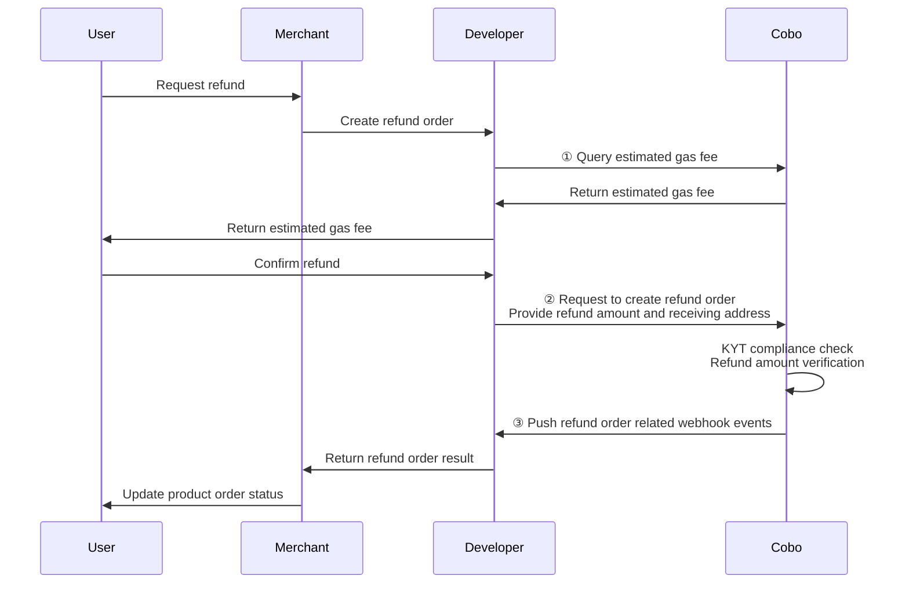

<Note>This document is an AI-assisted translation provided for reference purposes only.</Note>
After a user transfers crypto assets to the receiving address, you may need to handle the funds according to the actual situation.

## Exception Handling

In practice, you may encounter the following exceptions:

* **Overpayment**: During the order validity period, the user's actual payment exceeds the amount due.  
* **Underpayment**: During the order validity period, the user's actual payment is less than the amount due. In this case, the order status is `Underpaid` (final state), and the user cannot continue to pay for this order.  
* **Late Payment**: After the order expires, the user makes a first or subsequent payment. In this case, you will receive a `payment.transaction.late` Webhook event.

For surplus funds caused by exceptions, you can choose one of the following handling methods:

* Refund the surplus funds to the user via API / Payments App / Checkout SDK.  
* Transfer the surplus funds to another wallet and process later.  
* Do not handle separately; the funds will remain in the wallet.

## Refund

This section explains how to use the Payment API to refund funds to users. You can also initiate refunds via the Payment App or Checkout SDK.

The diagram below shows the interaction flow between the user, merchant, developer (you), and Cobo during the refund process.



1. Call [Estimate transaction fee](https://www.cobo.com/developers/v2/api-references/transactions/estimate-transaction-fee) to estimate the gas fee, which serves as a reference for determining the refund handling fee.  
2. Call [Create refund order](https://www.cobo.com/developers/v2/api-references/payment/create-refund-order) to create a refund order. The request must include at least the following key parameters:  
   * **Refund Amount** (`payable_amount`): The amount the user requests to refund.  
   * **Receiving Address** (`to_address`): The address where the user receives the refund.  
   * **Refund Handling Fee** (`developer_fee`): The handling fee you charge the merchant. The amount can be set with reference to the estimated gas fee. This fee will remain in the original address (no separate transfer), but will be reallocated from merchant funds to developer funds.

   After receiving the create refund order request, Cobo will verify the refund amount. If the refund amount is less than the estimated on-chain gas fee, the request will be rejected and the corresponding failure reason will be returned.  
  
   Additionally, depending on the type of wallet you choose, Cobo may proactively perform compliance screening on the receiving address. You can also use Cobo's Screening App to perform compliance screening on the receiving address.

3. You can receive real-time update notifications of the refund order status via the `payment.refund.status.updated` event. You can also query the status of a single refund order by calling [Get refund order information](https://www.cobo.com/developers/v2/api-references/payment/get-refund-order-information), or query the status of all refund orders by calling [List all refund orders](https://www.cobo.com/developers/v2/api-references/payment/list-all-refund-orders).
  
**Example Call**

The following is sample code for calling [Create refund order](https://www.cobo.com/developers/v2/api-references/payment/create-refund-order) to create a refund order:

<Accordion title="Sample code in Python">
```py
from cobo_waas2 import PaymentApi, CreateRefundRequest, ApiClient, Configuration, RefundType
# See configuration.py for a list of all supported configurations.
configuration = Configuration(
  # Replace `<YOUR_PRIVATE_KEY>` with your private key
  api_private_key="<YOUR_PRIVATE_KEY>",
  # Select the development environment. To use the production environment, change the URL to https://api.cobo.com/v2.
  host="https://api.dev.cobo.com/v2",
)
# Enter a context with an instance of the API client
with ApiClient(configuration) as api_client:
   # Create an instance of the API class
   api_instance = PaymentApi(api_client)
   create_refund_request = CreateRefundRequest(
       request_id="<YOUR_REQUEST_ID>",
       merchant_id="<YOUR_MERCHANT_ID>",
       payable_amount="10",
       to_address="<YOUR_REFUND_ADDRESS>",
       token_id="TRON_USDT",
       refund_type=RefundType.MERCHANT,   
   )
   try:
       # Create refund
       api_response = api_instance.create_refund(
           create_refund_request=create_refund_request
       )
       print("The response of PaymentApi->create_refund:\n")
       print(api_response)
   except Exception as e:
       print("Exception when calling PaymentApi->create_refund: %s\n" % e)
```
</Accordion>

<Accordion title="Sample code in Java">
```java
import com.cobo.waas2.ApiClient;
import com.cobo.waas2.ApiException;
import com.cobo.waas2.Configuration;
import com.cobo.waas2.Env;
import com.cobo.waas2.api.PaymentApi;
import com.cobo.waas2.model.*;

public class Example {
 public static void main(String[] args) {
   ApiClient defaultClient = Configuration.getDefaultApiClient();
   // Select the development environment. To use the production environment, replace `Env.DEV` with
   // `Env.PROD
   defaultClient.setEnv(Env.DEV);

   // Replace `<YOUR_PRIVATE_KEY>` with your private key
   defaultClient.setPrivKey("<YOUR_PRIVATE_KEY>");

   PaymentApi apiInstance = new PaymentApi(defaultClient);
   CreateRefundRequest createRefundRequest = new CreateRefundRequest();
   createRefundRequest.setRequestId("<YOUR_REQUEST_ID>");
   createRefundRequest.setMerchantId("<YOUR_MERCHANT_ID>");
   createRefundRequest.setPayableAmount("10");
   createRefundRequest.setToAddress("<YOUR_REFUND_ADDRESS>");
   createRefundRequest.setTokenId("TRON_USDT");
   createRefundRequest.setRefundType(RefundType.MERCHANT);

   try {
          Refund refund = apiInstance.createRefund(createRefundRequest);
          System.out.println(refund);
   } catch (ApiException e) {
     System.err.println("Exception when calling PaymentApi#createRefund");
   }
 }
```
</Accordion>

## Compliance Screening

* For custodial wallets, Cobo will perform compliance screening (such as KYT/AML) on every transaction received at the receiving address. If a transaction does not pass compliance checks, please contact Cobo support at [help@cobo.com](mailto:help@cobo.com) for manual processing.  
* For MPC wallets, you can use the [Screening App](https://manuals.cobo.com/en/apps/screening/introduction) to perform compliance screening on funds yourself and handle transactions that do not pass.

If a transaction initially fails compliance screening but later passes after manual review, it will be handled as follows:

* **Order still within validity period:** The system will update the order status and count the amount in the order's actual received amount.  
* **Order has expired:** The system will record the amount as a late payment for the order.

If a transaction ultimately does not pass manual review and is isolated or frozen, the funds will still be associated with the order but will not be counted in the order's actual received amount.

<Tip>You are welcome to [submit feedback](https://forms.zohopublic.com/cobo/form/DocumentFeedbackForm/formperma/QvLOhxJv1_JMsJ-1dleZ8Itb_7rzN-LtgvsDdxosoVI) to help us improve our documentation!</Tip>