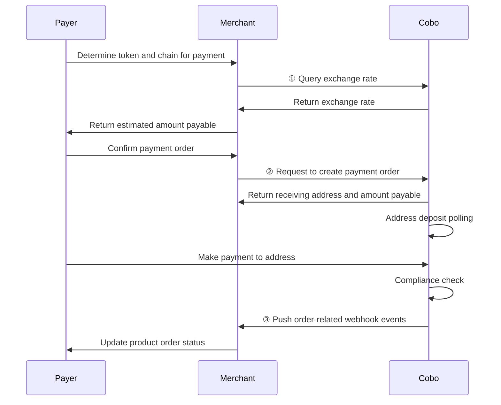
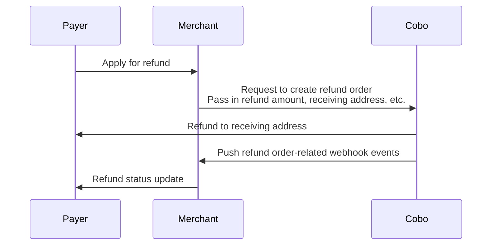

<Note>**Disclaimer: This article contains AI translations and should only be used as reference.** Contact Cobo's support team through [help@cobo.com](mailto:help@cobo.com) if you have any questions.</Note>

Order mode is suitable for scenarios that require specifying a specific payment amount and time limit. In this mode, Cobo creates payment orders with the following characteristics:

- **Fixed amount**: The amount payable is specified when the order is created
- **Validity period**: Payers need to complete payment within the specified time
- **Exception handling**: Supports handling various exception situations, including:
  - Canceling orders that have not been paid
  - Initiating refunds for paid orders
  - Handling payment exceptions such as overpayment, underpayment, and late payment

The following diagram shows the complete interaction process between payers, merchants, and Cobo during the order payment process:
<div style={{maxWidth: '600px', margin: '0 auto'}}>

</div>

## Create order

You can create payment orders through Payments API or Checkout SDK.

### Prerequisites

You have completed all the steps mentioned in [Preparation](/v2/payments/preparation).

### Implementation steps
<Tabs>
  <Tab title="Payments API" icon="code">
1. After the payer selects the token and chain to use for payment, you can first call [Get exchange rate](/v2/api-references/payment/get-exchange-rate) to obtain the real-time fair exchange rate. Based on the product order amount and exchange rate, you can calculate the estimated amount payable and display it to the payer.

2. After the payer confirms payment, call [Create pay-in order](/v2/api-references/payment/create-pay-in-order) to create a payment order. When creating an order, you need to provide the following key parameters:
   * **Merchant ID** (`merchant_id`): Merchant ID, assigned by Cobo when you register the merchant.
   * **Token and chain** (`token_id`): The token and chain type selected by the payer for payment. 
   * **Currency** (`currency`): The currency of the product order, currently only `USD` is supported.
   * **Product order amount** (`order_amount`): The amount payable for the product order.
   * **Developer fee** (`fee_amount`): The developer fee you charge to the merchant. If you are a merchant serving payers directly, you can set this field to `0`. Refer to [Funds allocation and balances](/v2/payments/amounts-and-balances) for more information about developer fees.
   * **Expiration time** (`expired_in`): The validity period of the payment order in seconds. Calculated from the time of the create order request. When the order expires:
     - The order status changes to a final state and cannot be changed
     - The `received_token_amount` field is no longer updated
     - If funds are received again, it will trigger the `transactionLate` webhook event, and the funds will not be counted towards the actual received funds for this order
   * **Developer order number** (`psp_order_code`): Please set this field to the unique number of the order in your system.

   After creating the order, Cobo will return order information including the following fields:

   * **Amount payable** (`payable_amount`): The final amount the payer needs to pay. Due to exchange rate fluctuations, this amount may differ from your estimated amount payable.  
   * **Receiving address** (`receive_address`): The receiving address generated by Cobo for the order based on the token and chain selected by the payer.

**Call example**

The following is sample code for calling [Create pay-in order](/v2/api-references/payment/create-pay-in-order) to create a payment order:

<Accordion title="Sample code in Python">
```py
import cobo_waas2
from cobo_waas2 import PaymentApi

# See configuration.py for a list of all supported configurations.
configuration = cobo_waas2.Configuration(
   # Replace `<YOUR_PRIVATE_KEY>` with your private key
   api_private_key="<YOUR_PRIVATE_KEY>",
   # Select the development environment. To use the production environment, change the URL to https://api.cobo.com/v2.
   host="https://api.dev.cobo.com/v2",
)
# Enter a context with an instance of the API client
with cobo_waas2.ApiClient(configuration) as api_client:
   # Create an instance of the API class
   api_instance = PaymentApi(api_client)
   create_payment_order_request = cobo_waas2.CreatePaymentOrderRequest(
       merchant_id="<YOUR_MERCHANT_ID>",
       token_id="TRON_USDT",
       currency="USD",
       order_amount="10",
       fee_amount="0.3",
       psp_order_code="<YOUR_PSP_ORDER_CODE>",
       expired_in=1800
   )
   try:
       # Create payment order
       api_response = api_instance.create_payment_order(
           create_payment_order_request=create_payment_order_request
       )
       print("The response of PaymentApi->create_payment_order:\n")
       print(api_response)
   except Exception as e:
       print("Exception when calling PaymentApi->create_payment_order: %s\n" % e)
```
</Accordion>

<Accordion title="Sample code in Java">
```java
import com.cobo.waas2.ApiClient;
import com.cobo.waas2.ApiException;
import com.cobo.waas2.Configuration;
import com.cobo.waas2.Env;
import com.cobo.waas2.api.PaymentApi;
import com.cobo.waas2.model.*;

public class Example {
 public static void main(String[] args) {
   ApiClient defaultClient = Configuration.getDefaultApiClient();
   // Select the development environment. To use the production environment, replace `Env.DEV` with
   // `Env.PROD
   defaultClient.setEnv(Env.DEV);

   // Replace `<YOUR_PRIVATE_KEY>` with your private key
   defaultClient.setPrivKey("<YOUR_PRIVATE_KEY>");
   
   PaymentApi apiInstance = new PaymentApi(defaultClient);
   CreatePaymentOrderRequest createPaymentOrderRequest = new CreatePaymentOrderRequest();
   createPaymentOrderRequest.setMerchantId("<YOUR_MERCHANT_ID>");
   createPaymentOrderRequest.setTokenId("TRON_USDT");
   createPaymentOrderRequest.setCurrency("USD");
   createPaymentOrderRequest.setOrderAmount("10");
   createPaymentOrderRequest.setFeeAmount("0.3");
   createPaymentOrderRequest.setPspOrderCode("<YOUR_PSP_ORDER_CODE>");
   createPaymentOrderRequest.setExpiredIn(1800);

   try {
          Order paymentOrder = apiInstance.createPaymentOrder(createPaymentOrderRequest);
          System.out.println(paymentOrder);
   } catch (ApiException e) {
     System.err.println("Exception when calling PaymentApi#createPaymentOrder");
   }
 }
```
</Accordion>
  </Tab>
  <Tab title="Checkout SDK" icon="terminal">
  Checkout SDK provides out-of-the-box payment page frontend components. Through simple iFrame integration, you can quickly develop a secure and reliable cryptocurrency payment page without dealing with tedious UI design and payment logic, significantly reducing development costs and time investment. For details, refer to [Integrate Checkout SDK](/v2/payments/checkout-sdk).
  </Tab>
</Tabs>


## Query order status

You can subscribe to the following webhook events to receive real-time update notifications of order status. Refer to [Webhook reference](/v2/payments/status-and-events) to understand the trigger time and returned data structure of each event.  

- `payment.status.updated`
- `payment.transaction.created`
- `payment.transaction.late`
- `payment.transaction.held`
- `payment.transaction.completed`

You can also actively query order status through Payments App or Payments API.

<Tabs>
  <Tab title="Payments App" icon="pager">
1. Log in to Cobo Portal [development environment](https://portal.dev.cobo.com/login) or [production environment](https://portal.cobo.com/login).
2. In the left navigation bar, click **Apps**, then click the **Payments** card to launch the App.
3. In the App's left navigation bar, click **Orders**. You can view detailed information of all orders on this page, such as order ID, merchant information, payment amount, order status, etc.
4. After the payer completes payment and the transaction passes compliance screening, the order status will change to **Completed**.

  </Tab>


  <Tab title="Payments API" icon="code">
You can call [Get pay-in order information](/v2/api-references/payment/get-pay-in-order-information) to query the status of a single payment order, or call [List all pay-in orders](/v2/api-references/payment/list-all-pay-in-orders) to query the status of all orders.

  </Tab>
</Tabs>


## Exception situations

In order mode, you may need to handle the following exception situations.


### Cancel payment order

When a payment order is in the `Pending` status, that is, no deposit transaction has been detected yet, you can call [Update pay-in order](/v2/api-references/payment/update-pay-in-order) to cancel the order. After cancellation, the order status will change to `Expired`.

**Call example**

The following is sample code for calling [Update pay-in order](/v2/api-references/payment/update-pay-in-order) to cancel an order:

<Accordion title="Sample code in Python">
```py
from cobo_waas2 import PaymentApi, UpdatePaymentOrderRequest, ApiClient, Configuration
from cobo_waas2 import PaymentApi
# See configuration.py for a list of all supported configurations.
configuration = Configuration(
  # Replace `<YOUR_PRIVATE_KEY>` with your private key
  api_private_key="<YOUR_PRIVATE_KEY>",
  # Select the development environment. To use the production environment, change the URL to https://api.cobo.com/v2.
  host="https://api.dev.cobo.com/v2",
)
# Enter a context with an instance of the API client
with ApiClient(configuration) as api_client:
  # Create an instance of the API class
  api_instance = PaymentApi(api_client)
  update_payment_order_request = UpdatePaymentOrderRequest(expired=True)
  try:
      # Cancel payment order
      api_response = api_instance.update_payment_order(
          order_id="<YOUR_ORDER_ID>",
          update_payment_order_request=update_payment_order_request
      )
      print("The response of PaymentApi->update_payment_order:\n")
      print(api_response)
  except Exception as e:
      print("Exception when calling PaymentApi->update_payment_order: %s\n" % e)
```
</Accordion>

<Accordion title="Sample code in Java">
```java
import com.cobo.waas2.ApiClient;
import com.cobo.waas2.ApiException;
import com.cobo.waas2.Configuration;
import com.cobo.waas2.Env;
import com.cobo.waas2.api.PaymentApi;
import com.cobo.waas2.model.*;

public class Example {
 public static void main(String[] args) {
   ApiClient defaultClient = Configuration.getDefaultApiClient();
   // Select the development environment. To use the production environment, replace `Env.DEV` with
   // `Env.PROD
   defaultClient.setEnv(Env.DEV);

   // Replace `<YOUR_PRIVATE_KEY>` with your private key
   defaultClient.setPrivKey("<YOUR_PRIVATE_KEY>");
   PaymentApi apiInstance = new PaymentApi(defaultClient);
   UpdatePaymentOrderRequest updatePaymentOrderRequest = new UpdatePaymentOrderRequest();
   updatePaymentOrderRequest.setExpired(true)
   try {
          Order order = apiInstance.updatePaymentOrder("<YOUR_ORDER_ID>", updatePaymentOrderRequest);
          System.out.println(order);
   } catch (ApiException e) {
     System.err.println("Exception when calling PaymentApi#updatePaymentOrder");
```
</Accordion>


### Overpayment, underpayment, and late payment

The following three exception situations may occur during the payment process:

| Exception situation | Description | Impact |
|---------|------|----------|
| **Overpayment** | Within the order validity period, the payer's actual payment amount exceeds the amount payable | The final order status is `Completed`.|
| **Underpayment** | Within the order validity period, the payer's actual payment amount is less than the amount payable | The order status is `Underpaid` (final state).|
| **Late payment** | The payer makes the first or subsequent payment after the order expires | Does not change the order status. Each late payment will trigger one `payment.transaction.late` webhook event.|

[Funds allocation and balances](/v2/payments/amounts-and-balances) details how Cobo handles funds in the case of overpayment, underpayment, and late payment.


### Handle refund requests
You can initiate a refund order through Payments App or Payments API to refund funds to the payer. The following diagram shows the interaction process between payers, merchants, and Cobo during the refund process.

<div style={{maxWidth: '600px', margin: '0 auto'}}>

</div>


#### Create refund order

<Tabs>
  <Tab title="Payments App" icon="pager">
1. Log in to Cobo Portal [development environment](https://portal.dev.cobo.com/login) or [production environment](https://portal.cobo.com/login).
2. In the left navigation bar, click **Apps**, then click the **Payments** card to launch the App.
3. In the App's left navigation bar, click **Orders**.
4. Select the target order, then click the **View Details** button on the right.
5. On the order details page, click the **Refund** button.
6. In the pop-up form:
   - Select the source of the refund amount. You can choose **Merchant balance** or **Developer balance**.
   - Enter the refund amount. This amount must not exceed the corresponding merchant balance or developer balance.
   - (Optional) Enter the fee amount. This fee will be deducted from the refund amount and credited to the developer balance. For a detailed description of developer fees, refer to [Funds allocation and balances](/v2/payments/amounts-and-balances).
   - Enter the receiving address. You can click **Use original payment address**, and the system will automatically fill in the original payment address for this order. If you want to refund to another address, you can also manually enter the target address.
5. Click **Preview** to confirm that all information is correct, then click **Submit** to create the refund order.

  </Tab>
  <Tab title="Payments API" icon="code">
Call [Create refund order](/v2/api-references/payment/create-refund-order) to create a refund order. When creating a refund order, pay attention to the following points:

   - You need to specify the source of the refund amount through the `refund_type` field. When you select `Merchant`, Cobo will deduct the refund amount from the merchant balance; when you select `Psp`, Cobo will deduct the refund amount from the developer balance.
   - Since refunds involve transfers to external addresses, Cobo will charge related fees. You can charge an appropriate fee as compensation through the developer fee field (`merchant_fee_amount`). After specifying this field:
     - If you choose to deduct the refund amount from the merchant balance, Cobo will transfer the developer fee from the merchant balance to the developer balance. The funds will remain at the original address and no actual transfer will occur.
     - The actual refund amount received by the payer = specified refund amount - developer fee (i.e., `payable_amount` - `merchant_fee_amount`).
     - Cobo will validate the refund amount. If the refund amount is less than the developer fee, the request will be rejected and the reason for failure will be returned, because in this case the payer cannot actually receive any refund.

<Info>For more information about developer fees, refer to [Funds allocation and balances](/v2/payments/amounts-and-balances).</Info>
  
**Call example**

The following is sample code for calling [Create refund order](/v2/api-references/payment/create-refund-order) to create a refund order:

<Accordion title="Sample code in Python">
```py
from cobo_waas2 import PaymentApi, CreateRefundRequest, ApiClient, Configuration, RefundType
# See configuration.py for a list of all supported configurations.
configuration = Configuration(
  # Replace `<YOUR_PRIVATE_KEY>` with your private key
  api_private_key="<YOUR_PRIVATE_KEY>",
  # Select the development environment. To use the production environment, change the URL to https://api.cobo.com/v2.
  host="https://api.dev.cobo.com/v2",
)
# Enter a context with an instance of the API client
with ApiClient(configuration) as api_client:
   # Create an instance of the API class
   api_instance = PaymentApi(api_client)
   create_refund_request = CreateRefundRequest(
       request_id="<YOUR_REQUEST_ID>",
       merchant_id="<YOUR_MERCHANT_ID>",
       payable_amount="10",
       to_address="<YOUR_REFUND_ADDRESS>",
       token_id="TRON_USDT",
       refund_type=RefundType.MERCHANT,
       charge_merchant_fee=True, # Set it to True if developer fee is required
       merchant_fee_amount="1",
       merchant_fee_token_id="TRON_USDT", # The token ID of developer fee. Must be the same as token_id above.
   )
   try:
       # Create refund
       api_response = api_instance.create_refund(
           create_refund_request=create_refund_request
       )
       print("The response of PaymentApi->create_refund:\n")
       print(api_response)
   except Exception as e:
       print("Exception when calling PaymentApi->create_refund: %s\n" % e)
```
</Accordion>

<Accordion title="Sample code in Java">
```java
import com.cobo.waas2.ApiClient;
import com.cobo.waas2.ApiException;
import com.cobo.waas2.Configuration;
import com.cobo.waas2.Env;
import com.cobo.waas2.api.PaymentApi;
import com.cobo.waas2.model.*;

public class Example {
 public static void main(String[] args) {
   ApiClient defaultClient = Configuration.getDefaultApiClient();
   // Select the development environment. To use the production environment, replace `Env.DEV` with
   // `Env.PROD
   defaultClient.setEnv(Env.DEV);

   // Replace `<YOUR_PRIVATE_KEY>` with your private key
   defaultClient.setPrivKey("<YOUR_PRIVATE_KEY>");

   PaymentApi apiInstance = new PaymentApi(defaultClient);
   CreateRefundRequest createRefundRequest = new CreateRefundRequest();
   createRefundRequest.setRequestId("<YOUR_REQUEST_ID>");
   createRefundRequest.setMerchantId("<YOUR_MERCHANT_ID>");
   createRefundRequest.setPayableAmount("10");
   createRefundRequest.setToAddress("<YOUR_REFUND_ADDRESS>");
   createRefundRequest.setTokenId("TRON_USDT");
   createRefundRequest.setRefundType(RefundType.MERCHANT);


   try {
          Refund refund = apiInstance.createRefund(createRefundRequest);
          System.out.println(refund);
   } catch (ApiException e) {
     System.err.println("Exception when calling PaymentApi#createRefund");
   }
 }
```
</Accordion>
  </Tab>
</Tabs>

#### Query refund order status
You can subscribe to the `payment.refund.status.updated` event to receive real-time updates on refund order status. Refer to [Webhook reference](/v2/payments/status-and-events) to understand the detailed trigger conditions and returned data structure of each event.

You can also actively query refund order status through Payments App or Payments API.

<Tabs>
  <Tab title="Payments App" icon="pager">
1. Log in to Cobo Portal [development environment](https://portal.dev.cobo.com/login) or [production environment](https://portal.cobo.com/login).
2. In the left navigation bar, click **Apps**, then click the **Payments** card to launch the App.
3. In the App's left navigation bar, click **Orders**.
4. Click the **Refunds** tab. In the refund order list, find the target order, then click the **View Details** button on the right.
5. View the order status on the refund order details page.

  </Tab>
  <Tab title="Payments API" icon="code">
You can call [Get refund order information](/v2/api-references/payment/get-refund-order-information) to query the status of a single refund order, or call [List all refund orders](/v2/api-references/payment/list-all-refund-orders) to query the status of all refund orders.
  </Tab>
</Tabs>


### Compliance screening failure

When a transaction receives the `payment.transaction.held` event but does not receive the `payment.transaction.completed` event for a long time, this indicates that the transaction has failed to pass compliance screening by Cobo KYT or Screening App. In this case, you need to follow these steps to handle it:


- If the transaction subsequently passes manual review:
    - If the order has not expired: The funds will be counted towards the order's actual received amount, and the order status will be updated accordingly based on the actual received amount
    - If the order has expired: The system will trigger the `payment.transaction.late` event, and all funds will be credited to the developer balance

- If the transaction ultimately fails manual review:
    - The funds will be frozen and will not be counted towards the order's actual received amount
    - The order status will remain unchanged
    - The payer needs to redeposit sufficient funds and pass compliance screening within the order validity period for the order to change to `Completed` status
  
For isolated or frozen funds:
- Cobo KYT: Please contact the Cobo support team through [help@cobo.com](mailto:help@cobo.com) for handling
- Screening App: You can evaluate and handle it yourself within the application

<Tip>Feel free to [share your feedback](https://forms.zohopublic.com/cobo/form/DocumentFeedbackForm/formperma/QvLOhxJv1_JMsJ-1dleZ8Itb_7rzN-LtgvsDdxosoVI) to improve our documentation!</Tip>

