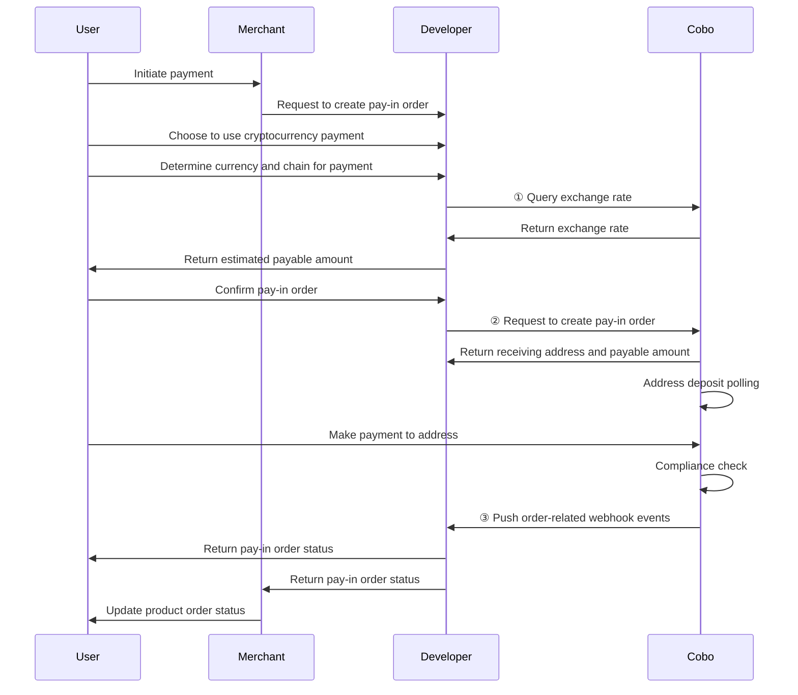

<Note>**Disclaimer: This article contains AI translations and should only be used as reference.** Contact Cobo's support team through [help@cobo.com](mailto:help@cobo.com) if you have any questions.</Note>

This document explains the process of creating pay-in orders using Payment API. In actual development, you can also use [Checkout SDK](/v2/payments/checkout-sdk) to quickly build payment collection pages.

The diagram below shows the interaction flow between users, developers, merchants, and Cobo during the payment collection process.



## Prerequisites

You have completed all steps mentioned in [Preparation](/v2/payments/preparation).

## Create orders and query order status

1. After users choose to use cryptocurrency payment, you can call [Get exchange rate](/v2/api-references/payment/get-exchange-rate) to get exchange rate information and estimate the payable amount for the pay-in order based on the product order amount, developer fees, and exchange rate.
2. After users confirm the pay-in order, you can call [Create pay-in order](/v2/api-references/payment/create-pay-in-order) to create the pay-in order. The request includes the following key parameters:
   * **Merchant ID** (`merchant_id`): The merchant ID assigned by Cobo when you register the merchant. You can call [List all merchants](/v2/api-references/payment/list-all-merchants) to get it.
   * **Token and chain** (`token_id`): The currency and chain type selected by the user for payment.
   * **Currency** (`currency`): The currency of the product order. Currently only `USD` is supported.
   * **Product order amount** (`order_amount`): The payable amount of the product order, excluding developer fees.
   * **Developer fee** (`fee_amount`): The developer fee you charge to the merchant. Please refer to [Amount definitions and balance calculation explanations](/v2/payments/amounts-and-balances) for more information about developer fees.
   * **Use dedicated address** (`use_dedicated_address`): Whether to allocate an independent receiving address for this order.
     - `true`: Allocate an independent receiving address for this order, not shared with other orders. Recommended for large transactions and other scenarios requiring strict fund isolation.
     - `false` (default): Use shared addresses from the address pool.
   * **Expired time** (`expired_in`): The number of seconds for the pay-in order to expire, starting from the time the order is created. After expiration:
     - The order status becomes final and cannot be changed
     - The `received_token_amount` field will no longer be updated
     - If the order is expired and the user makes a payment again, the system will trigger a `transactionLate` webhook event, and the funds will not be counted towards the order's actual received amount
   * **Developer order code** (`psp_order_code`): A unique reference code assigned by the developer to identify this order in their system. If you are a merchant, please set this field to the unique number of this order in your system.

   After creating the order, Cobo will return order information including the following fields:

   * **Payable amount** (`payable_amount`): The final amount that users need to pay. This amount is determined by the product order amount, developer fees, and exchange rate. Due to exchange rate fluctuations, this amount may differ from your estimated payable amount.
   * **Receiving address** (`receive_address`): The receiving address generated by Cobo for this order based on the currency and chain selected by the user.
3. Users transfer tokens to the specified receiving address. Cobo will detect all transactions deposited to the receiving address through polling.
   * You can subscribe to webhook events to get real-time update notifications for order status and transaction status. Please refer to [Webhook reference](/v2/payments/status-and-events) to understand the trigger timing and returned data structure for each event.
   * You can also call [Get pay-in order information](/v2/api-references/payment/get-pay-in-order-information) to query individual pay-in order status, or call [List all pay-in orders](/v2/api-references/payment/list-all-pay-in-orders) to query all order statuses.

## Call example

The following is sample code for calling [Create pay-in order](/v2/api-references/payment/create-pay-in-order) to create a pay-in order:

<Accordion title="Sample code in Python">
```py
import cobo_waas2
from cobo_waas2 import PaymentApi

# See configuration.py for a list of all supported configurations.
configuration = cobo_waas2.Configuration(
   # Replace `<YOUR_PRIVATE_KEY>` with your private key
   api_private_key="<YOUR_PRIVATE_KEY>",
   # Select the development environment. To use the production environment, change the URL to https://api.cobo.com/v2.
   host="https://api.dev.cobo.com/v2",
)
# Enter a context with an instance of the API client
with cobo_waas2.ApiClient(configuration) as api_client:
   # Create an instance of the API class
   api_instance = PaymentApi(api_client)
   create_payment_order_request = cobo_waas2.CreatePaymentOrderRequest(
       merchant_id="<YOUR_MERCHANT_ID>",
       token_id="TRON_USDT",
       currency="USD",
       order_amount="10",
       fee_amount="0.3",
       psp_order_code="<YOUR_PSP_ORDER_CODE>",
       expired_in=1800
   )
   try:
       # Create payment order
       api_response = api_instance.create_payment_order(
           create_payment_order_request=create_payment_order_request
       )
       print("The response of PaymentApi->create_payment_order:\n")
       print(api_response)
   except Exception as e:
       print("Exception when calling PaymentApi->create_payment_order: %s\n" % e)
```
</Accordion>

<Accordion title="Sample code in Java">
```java
import com.cobo.waas2.ApiClient;
import com.cobo.waas2.ApiException;
import com.cobo.waas2.Configuration;
import com.cobo.waas2.Env;
import com.cobo.waas2.api.PaymentApi;
import com.cobo.waas2.model.*;

public class Example {
 public static void main(String[] args) {
   ApiClient defaultClient = Configuration.getDefaultApiClient();
   // Select the development environment. To use the production environment, replace `Env.DEV` with
   // `Env.PROD
   defaultClient.setEnv(Env.DEV);

   // Replace `<YOUR_PRIVATE_KEY>` with your private key
   defaultClient.setPrivKey("<YOUR_PRIVATE_KEY>");
   
   PaymentApi apiInstance = new PaymentApi(defaultClient);
   CreatePaymentOrderRequest createPaymentOrderRequest = new CreatePaymentOrderRequest();
   createPaymentOrderRequest.setMerchantId("<YOUR_MERCHANT_ID>");
   createPaymentOrderRequest.setTokenId("TRON_USDT");
   createPaymentOrderRequest.setCurrency("USD");
   createPaymentOrderRequest.setOrderAmount("10");
   createPaymentOrderRequest.setFeeAmount("0.3");
   createPaymentOrderRequest.setPspOrderCode("<YOUR_PSP_ORDER_CODE>");
   createPaymentOrderRequest.setExpiredIn(1800);

   try {
          Order paymentOrder = apiInstance.createPaymentOrder(createPaymentOrderRequest);
          System.out.println(paymentOrder);
   } catch (ApiException e) {
     System.err.println("Exception when calling PaymentApi#createPaymentOrder");
   }
 }
```
</Accordion>

## Next steps

- You can refer to [Settlement](/v2/payments/settle-orders) to settle merchant balance or developer balance in order mode.
- To handle abnormal situations such as overpayment, underpayment, and refunds, please refer to [Handle abnormality](/v2/payments/handle-abnormality-order).

<Tip>Feel free to [share your feedback](https://forms.zohopublic.com/cobo/form/DocumentFeedbackForm/formperma/QvLOhxJv1_JMsJ-1dleZ8Itb_7rzN-LtgvsDdxosoVI) to improve our documentation!</Tip>