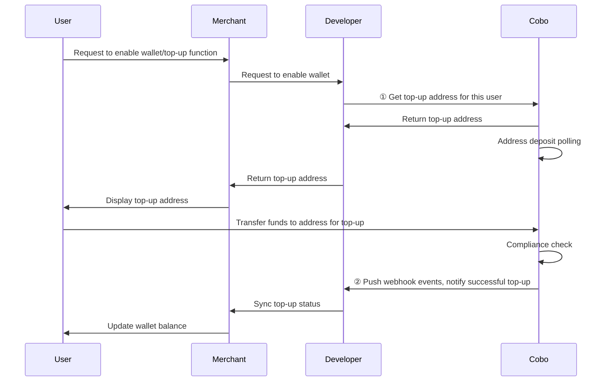

<Note>**Disclaimer: This article contains AI translations and should only be used as reference.** Contact Cobo's support team through [help@cobo.com](mailto:help@cobo.com) if you have any questions.</Note>

You can call Payment API to get dedicated top-up addresses for users. The diagram below shows the interaction flow between users, merchants, developers, and Cobo:



## Prerequisites

You have completed all steps mentioned in [Preparation](/v2/payments/preparation).

## Get top-up addresses

1. Call [Get top-up address](/v2/api-references/payment/get-top-up-address) to create a top-up address for a specified user of a specified merchant. Key parameters in the request include:
   * **Merchant ID** (`merchant_id`): The unique identifier of the merchant in the Cobo system, assigned by Cobo when you register the merchant.
   * **Custom user ID** (`custom_payer_id`): The unique identifier of the user in your system.
   * **Token ID** (`token_id`): Specifies the cryptocurrency and blockchain network that the top-up address needs to support.

2. **Configure top-up event listening**: Receive top-up related event notifications through webhooks, including:
   - `payment.transaction.created`: New deposit transaction detected at the receiving address
   - `payment.transaction.held`: Deposit transaction failed compliance screening
- `payment.transaction.complete`: In top-up mode, deposit transaction passed compliance screening, funds successfully credited and included in actual received amount.

## Call example

The following is sample code for calling [Get top-up address](/v2/api-references/payment/get-top-up-address) to get a top-up address:

<Accordion title="Sample code in Python">
```py
import cobo_waas2
from cobo_waas2 import PaymentApi


# See configuration.py for a list of all supported configurations.
configuration = cobo_waas2.Configuration(
   # Replace `<YOUR_PRIVATE_KEY>` with your private key
   api_private_key="<YOUR_PRIVATE_KEY>",
   # Select the development environment. To use the production environment, change the URL to https://api.cobo.com/v2.
   host="https://api.dev.cobo.com/v2",
)
# Enter a context with an instance of the API client
with (cobo_waas2.ApiClient(configuration) as api_client):
   # Create an instance of the API class
   api_instance = cobo_waas2.PaymentApi(api_client)
   merchant_id = "<YOUR_MERCHANT_ID>"
   token_id = "<YOUR_TOKEN_ID>"
   custom_payer_id = "<YOUR_CUSTOM_PAYER_ID>"


   try:
       # Get top-up address
       api_response = api_instance.get_top_up_address(
           merchant_id=merchant_id, token_id=token_id, custom_payer_id=custom_payer_id
       )
       print("The response of PaymentApi->get_top_up_address:\n")
       print(api_response)
   except Exception as e:
       print("Exception when calling PaymentApi->get_top_up_address: %s\n" % e)
```
</Accordion>

<Accordion title="Sample code in Java">
```java
import com.cobo.waas2.ApiClient;
import com.cobo.waas2.ApiException;
import com.cobo.waas2.Configuration;
import com.cobo.waas2.Env;
import com.cobo.waas2.api.PaymentApi;
import com.cobo.waas2.model.*;


public class Example {
 public static void main(String[] args) {
   ApiClient defaultClient = Configuration.getDefaultApiClient();
   // Select the development environment. To use the production environment, replace `Env.DEV` with
   // `Env.PROD
   defaultClient.setEnv(Env.DEV);


   // Replace `<YOUR_PRIVATE_KEY>` with your private key
   defaultClient.setPrivKey("<YOUR_PRIVATE_KEY>");
   PaymentApi apiInstance = new PaymentApi(defaultClient);
   String merchant_id = "<YOUR_MERCHANT_ID>"
   String token_id = "<YOUR_TOKEN_ID>"
   String custom_payer_id = "<YOUR_CUSTOM_PAYER_ID>"
   try {
          TopUpAddress topUpAddress  = apiInstance.getTopUpAddress(merchant_id, token_id, custom_payer_id);
          System.out.println(topUpAddress);
   } catch (ApiException e) {
     System.err.println("Exception when calling PaymentApi#getTopUpAddress");
   }
 }
} 
```
</Accordion>

<Tip>Feel free to [share your feedback](https://forms.zohopublic.com/cobo/form/DocumentFeedbackForm/formperma/QvLOhxJv1_JMsJ-1dleZ8Itb_7rzN-LtgvsDdxosoVI) to improve our documentation!</Tip>