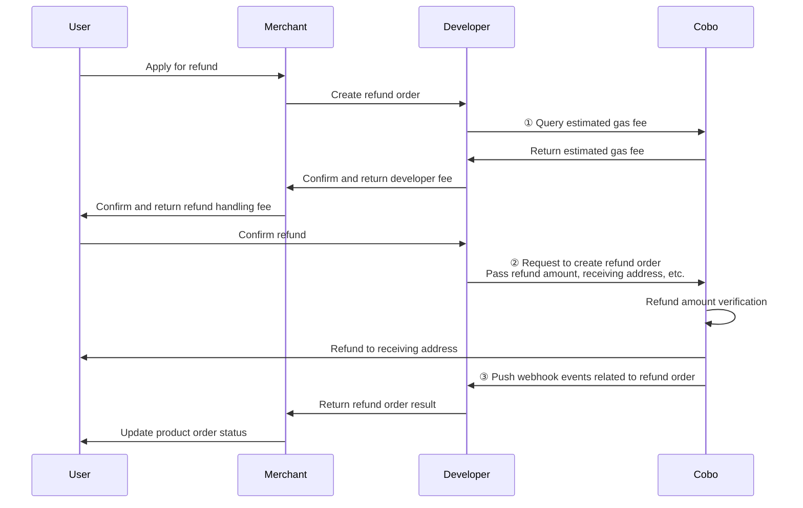

<Note>**Disclaimer: This article contains AI translations and should only be used as reference.** Contact Cobo's support team through [help@cobo.com](mailto:help@cobo.com) if you have any questions.</Note>

In order mode, you may need to handle the following exception situations.

## Cancel pay-in orders

When a pay-in order is in `Pending` status, meaning no deposit transactions have been detected yet, you can call [Update pay-in order](/v2/api-references/payment/update-pay-in-order) to cancel the order. After cancellation, the order status will change to `Expired`.

**Call example**

The following is sample code for calling [Update pay-in order](/v2/api-references/payment/update-pay-in-order) to cancel an order:

<Accordion title="Sample code in Python">
```py
from cobo_waas2 import PaymentApi, UpdatePaymentOrderRequest, ApiClient, Configuration
from cobo_waas2 import PaymentApi
# See configuration.py for a list of all supported configurations.
configuration = Configuration(
  # Replace `<YOUR_PRIVATE_KEY>` with your private key
  api_private_key="<YOUR_PRIVATE_KEY>",
  # Select the development environment. To use the production environment, change the URL to https://api.cobo.com/v2.
  host="https://api.dev.cobo.com/v2",
)
# Enter a context with an instance of the API client
with ApiClient(configuration) as api_client:
  # Create an instance of the API class
  api_instance = PaymentApi(api_client)
  update_payment_order_request = UpdatePaymentOrderRequest(expired=True)
  try:
      # Cancel payment order
      api_response = api_instance.update_payment_order(
          order_id="<YOUR_ORDER_ID>",
          update_payment_order_request=update_payment_order_request
      )
      print("The response of PaymentApi->update_payment_order:\n")
      print(api_response)
  except Exception as e:
      print("Exception when calling PaymentApi->update_payment_order: %s\n" % e)
```
</Accordion>

<Accordion title="Sample code in Java">
```java
import com.cobo.waas2.ApiClient;
import com.cobo.waas2.ApiException;
import com.cobo.waas2.Configuration;
import com.cobo.waas2.Env;
import com.cobo.waas2.api.PaymentApi;
import com.cobo.waas2.model.*;

public class Example {
 public static void main(String[] args) {
   ApiClient defaultClient = Configuration.getDefaultApiClient();
   // Select the development environment. To use the production environment, replace `Env.DEV` with
   // `Env.PROD
   defaultClient.setEnv(Env.DEV);

   // Replace `<YOUR_PRIVATE_KEY>` with your private key
   defaultClient.setPrivKey("<YOUR_PRIVATE_KEY>");
   PaymentApi apiInstance = new PaymentApi(defaultClient);
   UpdatePaymentOrderRequest updatePaymentOrderRequest = new UpdatePaymentOrderRequest();
   updatePaymentOrderRequest.setExpired(true);
   try {
          Order order = apiInstance.updatePaymentOrder("<YOUR_ORDER_ID>", updatePaymentOrderRequest);
          System.out.println(order);
   } catch (ApiException e) {
     System.err.println("Exception when calling PaymentApi#updatePaymentOrder");
   }
 }
}
```
</Accordion>

## Abnormal payment situations explanation

During the payment process, the following three abnormal situations may occur:

| Exception | Description | Impact |
|---------|------|----------|
| **Overpayment** | Within the order validity period, the user's actual payment amount exceeds the required payment amount | The final order status becomes `Completed`. |
| **Underpayment** | Within the order validity period, the user's actual payment amount is less than the required payment amount | The order status becomes `Underpaid` (terminal state). Subsequent payments from the user will be classified as late payment amounts. |
| **Late payment** | The user makes a first or additional payment after the order expires | Will not change the order status. Each late payment will trigger a `payment.transaction.late` webhook event. |

In the above situations, if the related transactions pass compliance screening, Cobo will divide the related funds into merchant funds and developer funds according to the same proportion. You can choose the following processing methods according to your business needs:
* Refund excess funds to users through API / Payments App / Checkout SDK.
* Transfer excess funds to other wallets and wait for processing.
* Do not process separately, and the funds will remain in the wallet.

## Handle refund requests

This section explains how to use the Payment API to refund money to users. In addition, you can also initiate refunds through the Payment App or Checkout SDK.

The following diagram shows the interaction flow between users, merchants, developers, and Cobo during the refund process.



1. Call [Create refund order](/v2/api-references/payment/create-refund-order) to create a refund order. When creating a refund order, you need to pay attention to the following points:

   - You need to specify the source of the refund amount through the `refund_type` field. When you choose `Merchant`, Cobo will deduct the refund amount from the merchant balance; when you choose `Psp`, Cobo will deduct the refund amount from the developer balance.
   - Since refunds involve transfers to external addresses, Cobo will charge you related fees. You can charge merchants an appropriate amount of developer fee as compensation through the developer fee field (`merchant_fee_amount`). Cobo will transfer this fee from the merchant balance to the developer balance, and the funds will remain at the original address without separate transfer. You can first call [Estimate transaction fee](/v2/api-references/transactions/estimate-transaction-fee) to estimate on-chain handling fees, providing a reference for determining the developer fee amount.
   - Cobo will verify the refund amount. If the refund amount is less than the developer fee, the request will be rejected and the failure reason returned, because in this case the user cannot actually receive any refund.

2. You can get real-time update notifications of refund order status through the `payment.refund.status.updated` event. You can also query individual refund order status by calling [Get refund order information](/v2/api-references/payment/get-refund-order-information), or query all refund order statuses by calling [List all refund orders](/v2/api-references/payment/list-all-refund-orders).

**Call example**

The following is sample code for calling [Create refund order](/v2/api-references/payment/create-refund-order) to create a refund order:

<Accordion title="Sample code in Python">
```py
from cobo_waas2 import PaymentApi, CreateRefundRequest, ApiClient, Configuration, RefundType
# See configuration.py for a list of all supported configurations.
configuration = Configuration(
  # Replace `<YOUR_PRIVATE_KEY>` with your private key
  api_private_key="<YOUR_PRIVATE_KEY>",
  # Select the development environment. To use the production environment, change the URL to https://api.cobo.com/v2.
  host="https://api.dev.cobo.com/v2",
)
# Enter a context with an instance of the API client
with ApiClient(configuration) as api_client:
   # Create an instance of the API class
   api_instance = PaymentApi(api_client)
   create_refund_request = CreateRefundRequest(
       request_id="<YOUR_REQUEST_ID>",
       merchant_id="<YOUR_MERCHANT_ID>",
       payable_amount="10",
       to_address="<YOUR_REFUND_ADDRESS>",
       token_id="TRON_USDT",
       refund_type=RefundType.MERCHANT,
       charge_merchant_fee=True, # Set it to True if developer fee is required
       merchant_fee_amount="1",
       merchant_fee_token_id="TRON_USDT", # The token ID of developer fee. Must be the same as token_id above.
   )
   try:
       # Create refund
       api_response = api_instance.create_refund(
           create_refund_request=create_refund_request
       )
       print("The response of PaymentApi->create_refund:\n")
       print(api_response)
   except Exception as e:
       print("Exception when calling PaymentApi->create_refund: %s\n" % e)
```
</Accordion>

<Accordion title="Sample code in Java">
```java
import com.cobo.waas2.ApiClient;
import com.cobo.waas2.ApiException;
import com.cobo.waas2.Configuration;
import com.cobo.waas2.Env;
import com.cobo.waas2.api.PaymentApi;
import com.cobo.waas2.model.*;

public class Example {
 public static void main(String[] args) {
   ApiClient defaultClient = Configuration.getDefaultApiClient();
   // Select the development environment. To use the production environment, replace `Env.DEV` with
   // `Env.PROD
   defaultClient.setEnv(Env.DEV);

   // Replace `<YOUR_PRIVATE_KEY>` with your private key
   defaultClient.setPrivKey("<YOUR_PRIVATE_KEY>");

   PaymentApi apiInstance = new PaymentApi(defaultClient);
   CreateRefundRequest createRefundRequest = new CreateRefundRequest();
   createRefundRequest.setRequestId("<YOUR_REQUEST_ID>");
   createRefundRequest.setMerchantId("<YOUR_MERCHANT_ID>");
   createRefundRequest.setPayableAmount("10");
   createRefundRequest.setToAddress("<YOUR_REFUND_ADDRESS>");
   createRefundRequest.setTokenId("TRON_USDT");
   createRefundRequest.setRefundType(RefundType.MERCHANT);

   try {
          Refund refund = apiInstance.createRefund(createRefundRequest);
          System.out.println(refund);
   } catch (ApiException e) {
     System.err.println("Exception when calling PaymentApi#createRefund");
   }
 }
}
```
</Accordion>

## Compliance screening failure

* For Custodial Wallets or MPC Wallets with Cobo KYC enabled, Cobo will perform compliance screening (such as KYT/AML screening) on every transaction transferred to receiving addresses.
* For MPC Wallets without Cobo KYC enabled, you can perform compliance screening on funds yourself through [Screening App](https://manuals.cobo.com/en/apps/screening/introduction) and handle transactions that fail.

When a transaction initially fails compliance screening, the system will trigger a `payment.transaction.held` event. The subsequent processing workflow is as follows:

- If the transaction subsequently passes manual review:
    - If the order has not expired: The funds will be included in the order received amount, and the order status will be updated accordingly based on the received amount
    - If the order has expired: The system will trigger a `payment.transaction.late` event, and the funds will be included in the order's late payment amount

- If the transaction ultimately fails manual review:
    - Funds will be isolated or frozen and will not be included in the order received amount
    - The order status will remain unchanged
    - You need to contact Cobo's support team through [help@cobo.com](mailto:help@cobo.com) to handle the isolated/frozen funds
    - Users need to redeposit sufficient funds and pass compliance screening within the order validity period for the order to change to `Completed` status

<Tip>Feel free to [share your feedback](https://forms.zohopublic.com/cobo/form/DocumentFeedbackForm/formperma/QvLOhxJv1_JMsJ-1dleZ8Itb_7rzN-LtgvsDdxosoVI) to improve our documentation!</Tip>