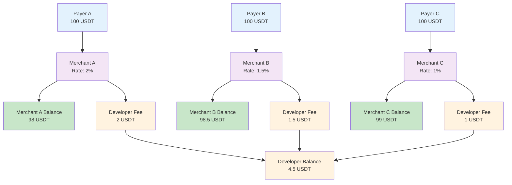

<Note>**Disclaimer: This article contains AI translations and should only be used as reference.** Contact Cobo's support team through [help@cobo.com](mailto:help@cobo.com) if you have any questions.</Note>

The merchant management function is designed to provide flexible fund management solutions for your business. Whether you are a collection-on-behalf-of platform serving multiple downstream merchants or an independent merchant managing multiple business lines, you can achieve refined business management through this function, including:

- **Exclusive configuration**: Configure exclusive developer fees/rates for each merchant to achieve automated revenue sharing
- **Independent funds**: Manage fund balances separately for each merchant to ensure fund security and isolation
- **Exclusive data**: View corresponding transaction records to achieve independent data management

## Fund allocation mechanism

Cobo maintains revenue and expenditure records for two types of funds: **merchant funds** and **developer funds**. After a payer completes a payment, the system automatically allocates funds to the corresponding merchant balance and developer balance based on the merchant associated with that payment and its developer fee rate.

<Info>For a more detailed introduction to the fund allocation mechanism, refer to [Funds allocation and balances](/v2/payments/amounts-and-balances).</Info>

## Practical application scenarios

Each merchant represents an independent payment collection entity. Merchants can be different stores on an e-commerce platform, different business lines of a direct-to-consumer website, or other business units that require independent accounting.

### E-commerce platform serving multiple merchants

An e-commerce platform creates independent merchants for each merchant and sets differentiated rates based on different product types:

- **Merchant A (Electronics)**: Set a 2% developer fee rate
- **Merchant B (Clothing)**: Set a 1.5% developer fee rate  
- **Merchant C (Books)**: Set a 1% developer fee rate

The platform can view the transaction data and balance of each merchant in real time to achieve differentiated charging and refined management.

### Multiple business lines management for DTC websites

A DTC website operates multiple business lines and creates independent merchants for each business line to achieve fund isolation and independent accounting:

- **Main site sales**: Serves the B2C business line and processes payments from individual consumers on the main site
- **Wholesale business**: Facilitates B2B customer management and wholesale data analysis
- **Overseas business**: Meets cross-border compliance requirements and exchange rate management

This architecture achieves fund isolation, independent accounting, and refined operations for different business lines.

## Merchant creation and configuration

- Create merchants: For specific merchant creation and configuration steps, refer to [Preparation for development environment](/v2/payments/preparation#merchants).

- Developer fee rate settings: Different payment collection modes have different configuration methods. For detailed instructions on rate configuration and fund flows, refer to [Funds allocation and balances](/v2/payments/amounts-and-balances).

<Tip>Feel free to [share your feedback](https://forms.zohopublic.com/cobo/form/DocumentFeedbackForm/formperma/QvLOhxJv1_JMsJ-1dleZ8Itb_7rzN-LtgvsDdxosoVI) to improve our documentation!</Tip>

