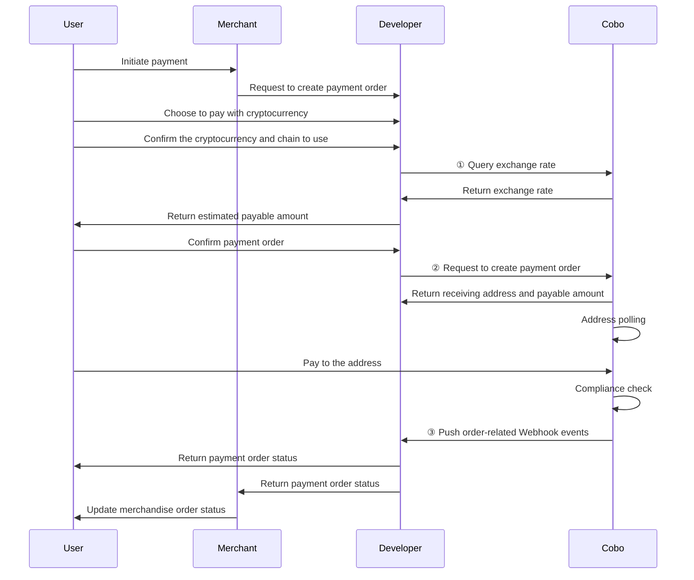

<Note>This document is an AI-assisted translation provided for reference purposes only.</Note>

After completing the pre-requisites, you can start developing the payment acceptance module, including creating orders, listening to order status, and canceling orders.

## Create Payment Order

This section describes the process of using the Payment API to create a payment order. In actual development, you can also use the Checkout SDK to quickly build a payment page.

The following diagram shows the interaction flow between the user, merchant, developer (i.e., you), and Cobo during the payment acceptance process.



1. After the user chooses to pay with cryptocurrency, you can call [Get exchange rate](https://www.cobo.com/developers/v2/api-references/payment/get-exchange-rate) to obtain the exchange rate information and estimate the payable amount based on the merchandise order amount, developer fees, and exchange rate.
2. After the user confirms the payment order, you can call [Create pay-in order](https://www.cobo.com/developers/v2/api-references/payment/create-pay-in-order) to create a payment order. The request must include the following key parameters:
   * **Merchandise order amount** (`order_amount`): The payable amount of the merchandise order.
   * **Developer fees** (`fee_amount`): The fees you charge the merchant.
   * **Cryptocurrency and chain** (`token_id`): The cryptocurrency and chain chosen by the user for payment.
   * **Whether to use a dedicated address** (`is_dedicated_address`): Whether to use a dedicated receiving address for this order.
     - `true`: Assign a dedicated receiving address for this order, which will not be shared with other orders. Recommended for large transactions and scenarios requiring strict fund isolation.
     - `false` (default): The address will be recycled after the order expires and may be assigned to other orders.
   * **Order expiration time** (`expired_at`): The expiration time of the merchandise order. After expiration, any funds transferred to the receiving address will not be counted towards the order's payable amount and can only be settled as [developer funds](/v2/payments/amounts-and-balances).

   After creating the order, Cobo will return the following information:

   * **Payable amount** (`payable_amount`): The final amount the user needs to pay. This amount is determined by the merchandise order amount, developer fees, and exchange rate. Due to exchange rate fluctuations, this amount may differ from your estimated payable amount.
   * **Receiving address** (`receive_address`): The receiving address generated by Cobo based on the user's chosen cryptocurrency and chain.

   The user will then transfer funds to the receiving address. Cobo will detect all transactions transferred to the receiving address through polling.
   * You can subscribe to Webhook events to receive real-time updates on order status and transaction status. Please refer to [Webhook reference](?tab=t.0#heading=h.iesi2e7yooag) for the trigger time and returned data structure of each event.
   * You can also call [Get pay-in order information](https://www.cobo.com/developers/v2/api-references/payment/get-pay-in-order-information) to query the status of a single payment order or call [List all pay-in orders](https://www.cobo.com/developers/v2/api-references/payment/list-all-pay-in-orders) to query the status of all orders.

**Calling Example**

Below is an example of calling [Create pay-in order](https://www.cobo.com/developers/v2/api-references/payment/create-pay-in-order) to create a payment order:

<Accordion title="Sample code in Python">
```py
import cobo_waas2
from cobo_waas2 import PaymentApi

# See configuration.py for a list of all supported configurations.
configuration = cobo_waas2.Configuration(
   # Replace `<YOUR_PRIVATE_KEY>` with your private key
   api_private_key="<YOUR_PRIVATE_KEY>",
   # Select the development environment. To use the production environment, change the URL to https://api.cobo.com/v2.
   host="https://api.dev.cobo.com/v2",
)
# Enter a context with an instance of the API client
with cobo_waas2.ApiClient(configuration) as api_client:
   # Create an instance of the API class
   api_instance = PaymentApi(api_client)
   create_payment_order_request = cobo_waas2.CreatePaymentOrderRequest(
       merchant_id="<YOUR_MERCHANT_ID>",
       token_id="TRON_USDT",
       currency="USD",
       order_amount="10",
       fee_amount="0.3",
       merchant_order_code="<YOUR_MERCHANT_ORDER_CODE>",
       psp_order_code="<YOUR_PSP_ORDER_CODE>",
       expired_at=1742563968
   )
   try:
       # Create payment order
       api_response = api_instance.create_payment_order(
           create_payment_order_request=create_payment_order_request
       )
       print("The response of PaymentApi->create_payment_order:\n")
       print(api_response)
   except Exception as e:
       print("Exception when calling PaymentApi->create_payment_order: %s\n" % e)
```
</Accordion>

<Accordion title="Sample code in Java">
```java
import com.cobo.waas2.ApiClient;
import com.cobo.waas2.ApiException;
import com.cobo.waas2.Configuration;
import com.cobo.waas2.Env;
import com.cobo.waas2.api.PaymentApi;
import com.cobo.waas2.model.*;

public class Example {
 public static void main(String[] args) {
   ApiClient defaultClient = Configuration.getDefaultApiClient();
   // Select the development environment. To use the production environment, replace `Env.DEV` with
   // `Env.PROD
   defaultClient.setEnv(Env.DEV);

   // Replace `<YOUR_PRIVATE_KEY>` with your private key
   defaultClient.setPrivKey("<YOUR_PRIVATE_KEY>");
   
   PaymentApi apiInstance = new PaymentApi(defaultClient);
   CreatePaymentOrderRequest createPaymentOrderRequest = new CreatePaymentOrderRequest();
   createPaymentOrderRequest.setMerchantId("<YOUR_MERCHANT_ID>");
   createPaymentOrderRequest.setTokenId("TRON_USDT");
   createPaymentOrderRequest.setCurrency("USD");
   createPaymentOrderRequest.setOrderAmount("10");
   createPaymentOrderRequest.setFeeAmount("0.3");
   createPaymentOrderRequest.setMerchantOrderCode("<YOUR_MERCHANT_ORDER_CODE>");
   createPaymentOrderRequest.setPspOrderCode("<YOUR_PSP_ORDER_CODE>");
   createPaymentOrderRequest.setExpiredAt("1742563968");

   try {
          Order paymentOrder = apiInstance.createPaymentOrder(createPaymentOrderRequest);
          System.out.println(paymentOrder);
   } catch (ApiException e) {
     System.err.println("Exception when calling PaymentApi#createPaymentOrder");
   }
 }
```
</Accordion>

## Cancel Payment Order

When a payment order is in the `Pending` state, i.e., no incoming transactions have been detected, you can call [Update pay-in order](https://www.cobo.com/developers/v2/api-references/payment/update-pay-in-order) to cancel the order. After cancellation, the order status will change to `Expired`.

**Calling Example**

Below is an example of calling [Update pay-in order](https://www.cobo.com/developers/v2/api-references/payment/update-pay-in-order) to cancel an order:

<Accordion title="Sample code in Python">
```py
from cobo_waas2 import PaymentApi, UpdatePaymentOrderRequest, ApiClient, Configuration
from cobo_waas2 import PaymentApi
# See configuration.py for a list of all supported configurations.
configuration = Configuration(
  # Replace `<YOUR_PRIVATE_KEY>` with your private key
  api_private_key="<YOUR_PRIVATE_KEY>",
  # Select the development environment. To use the production environment, change the URL to https://api.cobo.com/v2.
  host="https://api.dev.cobo.com/v2",
)
# Enter a context with an instance of the API client
with ApiClient(configuration) as api_client:
  # Create an instance of the API class
  api_instance = PaymentApi(api_client)
  update_payment_order_request = UpdatePaymentOrderRequest(expired=True)
  try:
      # Cancel payment order
      api_response = api_instance.update_payment_order(
          order_id="<YOUR_ORDER_ID>",
          update_payment_order_request=update_payment_order_request
      )
      print("The response of PaymentApi->update_payment_order:\n")
      print(api_response)
  except Exception as e:
      print("Exception when calling PaymentApi->update_payment_order: %s\n" % e)
```
</Accordion>

<Accordion title="Sample code in Java">
```java
import com.cobo.waas2.ApiClient;
import com.cobo.waas2.ApiException;
import com.cobo.waas2.Configuration;
import com.cobo.waas2.Env;
import com.cobo.waas2.api.PaymentApi;
import com.cobo.waas2.model.*;

public class Example {
 public static void main(String[] args) {
   ApiClient defaultClient = Configuration.getDefaultApiClient();
   // Select the development environment. To use the production environment, replace `Env.DEV` with
   // `Env.PROD
   defaultClient.setEnv(Env.DEV);

   // Replace `<YOUR_PRIVATE_KEY>` with your private key
   defaultClient.setPrivKey("<YOUR_PRIVATE_KEY>");
   PaymentApi apiInstance = new PaymentApi(defaultClient);
   UpdatePaymentOrderRequest updatePaymentOrderRequest = new UpdatePaymentOrderRequest();
   updatePaymentOrderRequest.setExpired(true)
   try {
          Order order = apiInstance.updatePaymentOrder("<YOUR_ORDER_ID>", updatePaymentOrderRequest);
          System.out.println(order);
   } catch (ApiException e) {
     System.err.println("Exception when calling PaymentApi#updatePaymentOrder");
```
</Accordion>

<Tip>You are welcome to [submit feedback](https://forms.zohopublic.com/cobo/form/DocumentFeedbackForm/formperma/QvLOhxJv1_JMsJ-1dleZ8Itb_7rzN-LtgvsDdxosoVI) to help us improve our documentation!</Tip>