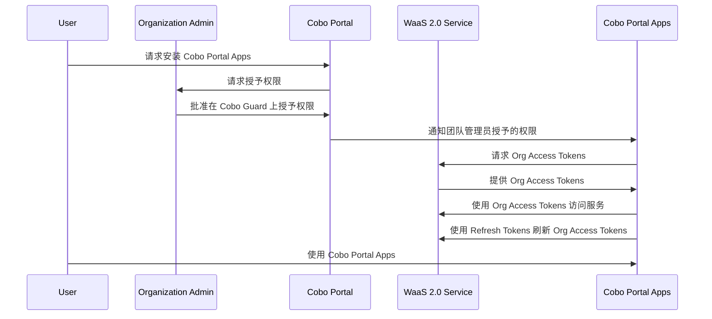

<Note>本文档由 AI 辅助翻译。如需确认内容准确性，请参考[英文官方文档](https://www.cobo.com/developers/v2/guides/overview/introduction)。</Note>

当 Cobo Portal Apps 需要访问团队的资源时， Org Access Tokens 向 WaaS 服务发出信号，表明该 App 已获得团队管理员的批准，可以访问某些资源。

出于安全考虑， Org Access Tokens 将在一定时间后过期。 App 可以使用 Refresh Tokens 获取新的 Org Access Tokens 。

## 工作原理



1. 团队下的用户在 Cobo Portal 上安装您的 App 。在安装过程中，用户选择授予您的 App 的权限以及您的 App 可以与之交互的钱包。
    <Note>如果用户在 App 安装后更新权限设置，则需要团队管理员的批准，并且 App 需要像在 App 安装期间一样请求新的 Org Access Tokens 。</Note>
2. Cobo Portal 向团队管理员发送批准请求，要求用户选择的钱包的权限和访问权限。
3. 团队管理员在 Cobo Guard 上批准请求。
4. Cobo Portal 向您在Manifest 文件中提供的回调 URL 发送包含团队 ID 和批准结果的回调消息。
5. 您的 App 通过调用 [获取 Org Access Tokens ](/v2/api-references/oauth/get-org-access-token) 操作从 WaaS 服务获取 Org Access Tokens 。
6. 您的 App 使用 Org Access Tokens 访问 WaaS 2.0 服务。
7. 当 Org Access Tokens 过期时，您的 App 调用 [刷新 Org Access Tokens ](/v2/api-references/oauth/refresh-org-access-token) 操作以使用 Refresh Tokens 获取新的 Org Access Tokens 。否则 API 请求将返回 500 错误。
    <Note> Refresh Tokens 的过期时间目前设置为 30 天，可能会更改。如果 Refresh Tokens 过期，用户需要重新安装 App ，按照安装新 App 的相同流程进行操作。</Note>
8. 用户使用您的 App 与所选钱包交互，使用授予的权限。

 Org Access Tokens 与团队管理员授予的权限相关联。每个权限都是操作和资源类型的组合。您的 App 只能在相应的资源类型上执行指定的操作。

## 获取 Org Access Tokens 

您的 App 需要调用 [获取 Org Access Tokens](/v2/api-references/oauth/get-org-access-token) 来获取 Org Access Tokens ，并调用 [刷新 Org Access Tokens](/v2/api-references/oauth/refresh-org-access-token) 来刷新 Org Access Tokens 。调用这两个操作时，您的 App 必须提供 App Key、客户端 ID 和团队 ID 作为输入。

### 1. 生成 App Key

 App Key用于在 App 向 WaaS 服务发出 API 请求时进行身份验证。有关如何生成 App Key的信息，请参阅 [生成 App Key](/v2_cn/apps/authentication#generate-an-app-key)。

### 2. 检索客户端 ID

当 App 发布时，Cobo 会为您的 App 生成一个客户端 ID，可以在Manifest 文件中找到。有关如何获取客户端 ID 的信息，请参阅 [发布 App ](/v2_cn/apps/build-app#publish-the-app)。

### 3. 检索团队 ID

当用户在 Cobo Portal 上安装 App 并且团队管理员已授予权限时，将向配置的端点 `callback_url` 发送回调消息，该端点在Manifest 文件中配置。回调消息包括批准结果和用户团队的 ID。

回调消息示例如下：
```
POST <callback_url>?approval_result=1&org_id=ba3b0323-7000-4278-8cf4-92ad4ae96b74
```

目前，`approval_result` 参数有以下可能的值：

- `1`：团队下的用户安装了 App ，团队管理员批准了用户授予的权限。
- `2`： App 安装后，团队下的用户更新了 App 设置，包括所需权限、可选权限和钱包范围，团队管理员批准了更新。

### 4. 调用获取 Org Access Tokens操作

调用 [获取 Org Access Tokens](/v2/api-references/oauth/get-org-access-token) 操作来获取 Org Access Tokens ，并调用 [刷新 Org Access Tokens](/v2/api-references/oauth/refresh-org-access-token) 操作来刷新 Org Access Tokens 。

以下示例代码显示了如何使用 Python SDK 获取 Org Access Tokens 。

```python
from cobo_waas2 import Configuration, ApiClient, OAuthApi

configuration = Configuration(
  # 如果您的 App 需要访问开发环境中的团队资源，请使用 https://api.dev.cobo.com/v2，否则请使用 https://api.cobo.com/v2。
  host="https://api.dev.cobo.com/v2",
  # 将 `<APP_SECRET>` 替换为您的 App Secret
  api_private_key=<APP_SECRET>,
)

client = ApiClient(configuration=configuration)
api_instance = OAuthApi(client)
org_token = api_instance.get_token(
  # 将 `<CLIENT_ID>` 替换为您的 App 的客户端 ID。
  client_id=<CLIENT_ID>,
  # 将 `<ORG_ID>` 替换为您的 App 要访问的团队 ID。
  org_id=<ORG_ID>,
  grant_type="org_implicit",
)
```

 Org Access Tokens 示例如下：
```json
{
 "access_token": "wu0Wx4jv9SOKzPXt15APApEpbJqGvi9sowUDPi5G9pUZvQgZxxLYfoEvMFFIMMYz",
 "token_type": "Bearer",
 "scope": "",
 "expires_in": 43199,
 "refresh_token": "AMLABEIz4GgFknxniMEj2TTILXCqc6bXYKmrHg4Ms6TSjGGbPX4ipz5xFrcErmGg"
}
```

<Tip>欢迎您[提交反馈](https://forms.zohopublic.com/cobo/form/DocumentFeedbackForm/formperma/QvLOhxJv1_JMsJ-1dleZ8Itb_7rzN-LtgvsDdxosoVI)来帮助改进我们的文档！</Tip>