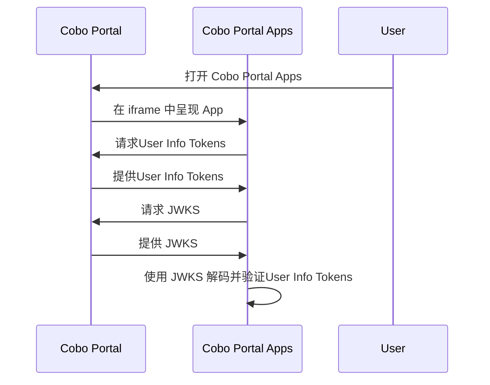

import WaasSkillReminder from '/snippets/waas_skill_reminder_cn.mdx';
User Info Tokens 是由 Cobo Portal 签名的 JSON Web  Tokens  (JWT)。这些 Tokens 允许 Cobo Portal Apps 检索有关用户的信息，包括他们的用户 ID、电子邮件地址和权限。Cobo Portal Apps 可以使用这些信息来验证用户的身份并根据权限控制他们对团队资源的访问。

## 工作原理



1. 用户在 Cobo Portal 上打开 Cobo Portal Apps 。
2. Cobo Portal 在 iframe 中呈现 App 。
3.  App 从 Cobo Portal 请求User Info Tokens 。
4. Cobo Portal 提供User Info Tokens 。
5.  App 从 Cobo Portal 请求 JSON Web 密钥集 (JWKS)。
6. Cobo Portal 提供 JWKS。
7.  App 使用 JWKS 解码并验证User Info Tokens 。
    <Note>请使用 JWT 头中指定的 `alg` 字段中的算法进行验证。</Note>

## 请求User Info Tokens 

要获取User Info Tokens ，请按照以下步骤操作：

1. 通过运行以下命令安装 Cobo UI Toolkit：
    ```shell
    npm install cobo-ui-toolkit
    ```
2. 使用 Cobo UI Toolkit提供的 `getAuthInfo` 函数：
    ```javascript
    import { getAuthInfo } from 'cobo-ui-toolkit';

<WaasSkillReminder />

    const authInfo = await getAuthInfo();

    /*
    type AuthInfo = {
        // User Info Tokens 
        token: string;
        // 用户的团队 ID
        orgID: string;
        // 用户 ID
        userID?: string;
    };
    */

    if (authInfo.data) {
        // 处理User Info Tokens 。
        // 处理团队 ID。
    } else if (authInfo.error) {
        // 处理错误。
    }
    ```

以下是一个解码后的User Info Tokens 示例：

```json
{
    "sub": "1234",
    "email": "dev@cobo.com",
    "role_names": [
        "Viewer",
        "Spender",
        "Approver",
        "Operator",
        "Admin"
    ],
    "iss": "https://portal.dev.cobo.com/",
    "iat": 1723705170,
    "exp": 1723705470,
    "jti": "6a02090be57a4718bc1b0a3914d70584",
    "aud": "I5rK1KnSA9xtIbIrqdzJLVPrTc0EsaGG"
}
```

## 验证User Info Tokens 

使用 JWKS 验证User Info Tokens 。要检索 JWKS，请根据 App 程序使用的环境发送 HTTP GET 请求到相应的 URL：
- 生产环境：`https://api.cobo.com/v2/oauth/authorize/jwks.json`
- 开发环境：`https://api.dev.cobo.com/v2/oauth/authorize/jwks.json`

此外，您需要验证 `iss`（发行者）、`exp`（过期时间）和 `aud`（受众）字段是否正确。