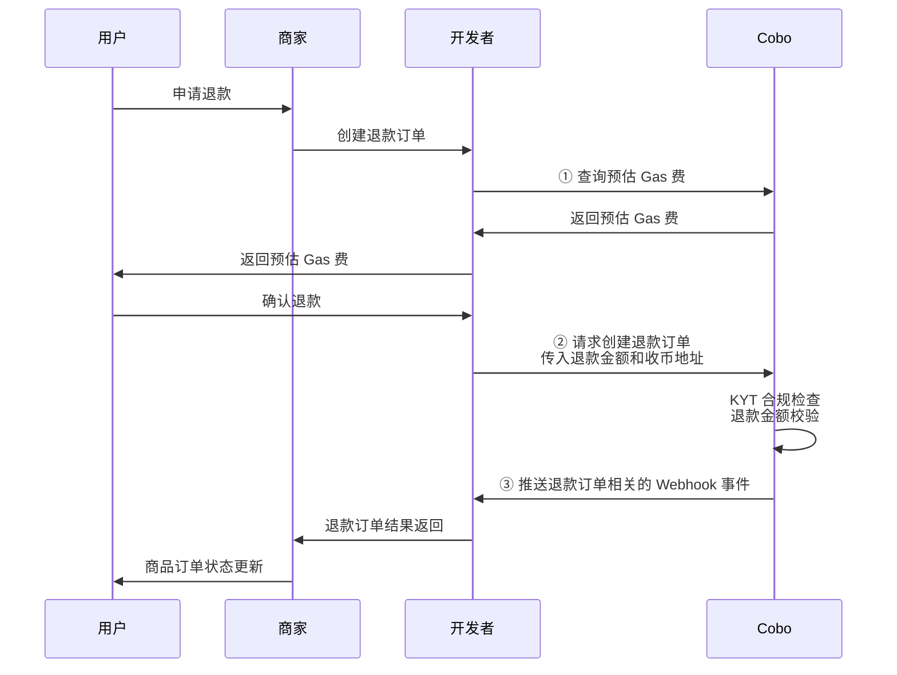

在用户将加密资产转入收币地址后，您可能需要根据实际情况对资金进行处理。

## 异常处理

在实际操作过程中，您可能会遇到以下异常情况：

* **多付**：在订单有效期内，用户的实付金额超过应付金额。  
* **少付**：在订单有效期内，用户的实付金额少于应付金额。此种情况下订单状态为 `Underpaid`，为终态，用户无法再为该订单继续进行付款。  
* **晚付**：在订单过期后，用户进行首次或再次付款。此种情况您会收到 `payment.transaction.late` 的 Webhook 事件。

对于异常情况造成的多余资金，您可以选择如下的处理方式：

* 通过 API / Payments App / Checkout SDK 将多余资金退还给用户。  
* 将多余资金转移到其他钱包，等待处理。  
* 不单独处理，资金将保留在钱包中。

## 退款

本节交代如何使用 Payment API 将资金退还给用户。此外，您也可以通过 Payment App 或 Checkout SDK 发起退款。

下图展示了退款环节中，用户、商户、开发者（即您）以及 Cobo 之间的交互流程。



1. 调用 [Estimate transaction fee](https://www.cobo.com/developers/v2/api-references/transactions/estimate-transaction-fee) 对 Gas 费进行预估，为确定退款手续费提供参考。  
2. 调用 [Create refund order](https://www.cobo.com/developers/v2/api-references/payment/create-refund-order) 创建退款订单。请求中需至少包含以下关键参数：  
   * **应退金额**（`payable_amount`）：用户申请的退款金额。  
   * **充币地址**（`to_address`）：用户用于接收退款的地址。  
   * **退款手续费**（`developer_fee`）：您向商户收取的手续费，金额可参考预估 Gas 费进行设定。该笔费用的资金将保留在原地址（即不另行转账），但将从商户资金划转为开发者资金。

   收到创建退款订单的请求后，Cobo 会对退款金额做校验，若退款金额小于预估的链上 Gas 费，则该请求将被拒绝，并返回相应的失败原因。  
  
   另外，取决于您所选取的钱包类型，Cobo 可能会主动对充币地址进行合规扫描。您也可以使用 Cobo 提供的 Screening App 对充币地址进行合规扫描。

3. 您可以通过 `payment.refund.status.updated` 事件获取退款订单状态的实时更新通知。您也可以通过调用 [Get refund order information](https://www.cobo.com/developers/v2/api-references/payment/get-refund-order-information) 查询单个退款订单状态，或调用 [List all refund orders](https://www.cobo.com/developers/v2/api-references/payment/list-all-refund-orders) 查询所有退款订单状态。
  
**调用示例**

以下为调用 [Create refund order](https://www.cobo.com/developers/v2/api-references/payment/create-refund-order) 创建退款订单的示例代码：

<Accordion title="Sample code in Python">
```py
import cobo_waas2
from cobo_waas2 import PaymentApi
# See configuration.py for a list of all supported configurations.
configuration = cobo_waas2.Configuration(
   # Replace `<YOUR_PRIVATE_KEY>` with your private key
   api_private_key="<YOUR_PRIVATE_KEY>",
   # Select the development environment. To use the production environment, change the URL to https://api.cobo.com/v2.
   host="https://api.dev.cobo.com/v2",
)
# Enter a context with an instance of the API client
with cobo_waas2.ApiClient(configuration) as api_client:
   # Create an instance of the API class
   api_instance = cobo_waas2.PaymentApi(api_client)
   create_refund_request = cobo_waas2.CreateRefundRequest()
   try:
       # Estimate transaction fee
       api_response = api_instance.create_refund(
           create_refund_request=create_refund_request
       )
       print("The response of PaymentApi->create_refund:\n")
       print(api_response)
   except Exception as e:
       print("Exception when calling PaymentApi->create_refund: %s\n" % e)
```
</Accordion>

<Accordion title="Sample code in Java">
```java
import com.cobo.waas2.ApiClient;
import com.cobo.waas2.ApiException;
import com.cobo.waas2.Configuration;
import com.cobo.waas2.Env;
import com.cobo.waas2.api.PaymentApi;
import com.cobo.waas2.model.*;


public class Example {
 public static void main(String[] args) {
   ApiClient defaultClient = Configuration.getDefaultApiClient();
   // Select the development environment. To use the production environment, replace `Env.DEV` with
   // `Env.PROD
   defaultClient.setEnv(Env.DEV);


   // Replace `<YOUR_PRIVATE_KEY>` with your private key
   defaultClient.setPrivKey("<YOUR_PRIVATE_KEY>");
   PaymentApi apiInstance = new PaymentApi(defaultClient);
   CreateRefundRequest createRefundRequest = new CreateRefundRequest();
   try {
          Refund refund = apiInstance.createRefund(orderId, createRefundRequest);
          System.out.println(refund);
   } catch (ApiException e) {
     System.err.println("Exception when calling PaymentApi#createRefund");
   }
 }
```
</Accordion>

## 合规扫描

* 对于全托管钱包，Cobo 将对每笔转入收币地址的交易进行合规扫描（如 KYT/AML 扫描）。若交易未通过合规检查，请通过 [help@cobo.com](mailto:help@cobo.com) 联系 Cobo 的支持团队进行人工处理。  
* 对于 MPC 钱包，您可通过 [Screening App](https://manuals.cobo.com/en/apps/screening/introduction) 自行对资金进行合规扫描，并处理未通过的交易。

若某笔交易初次未通过合规扫描，但在后续人工审核后通过，则按以下规则处理：

* **订单仍在有效期内：** 系统将更新订单状态，并将该笔资金计入订单的实付金额。  
* **订单已过期：** 系统将该笔资金记录为该订单的晚付金额。

若某笔交易最终未通过人工审核，并被隔离或冻结，则该笔资金仍会与订单关联，但不会计入订单的实付金额。

<Tip>欢迎您[提交反馈](https://forms.zohopublic.com/cobo/form/DocumentFeedbackForm/formperma/QvLOhxJv1_JMsJ-1dleZ8Itb_7rzN-LtgvsDdxosoVI)来帮助改进我们的文档！</Tip>