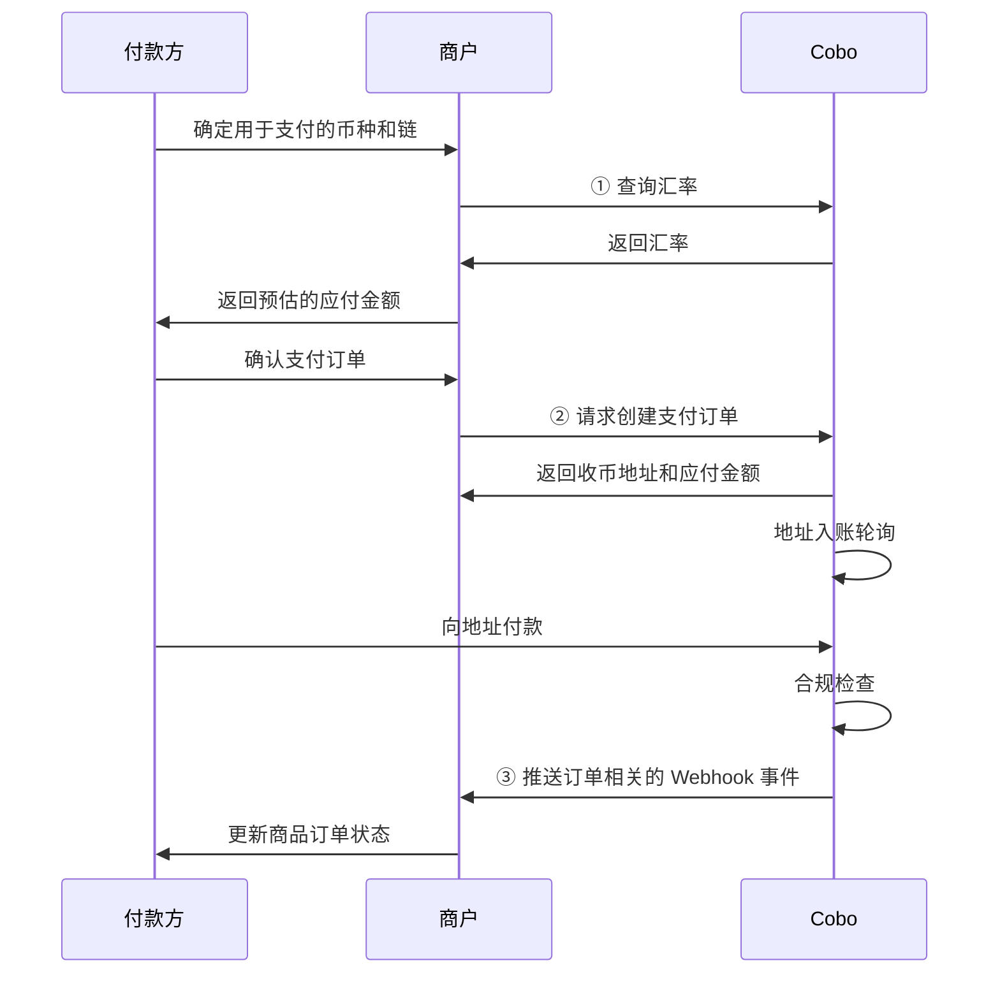
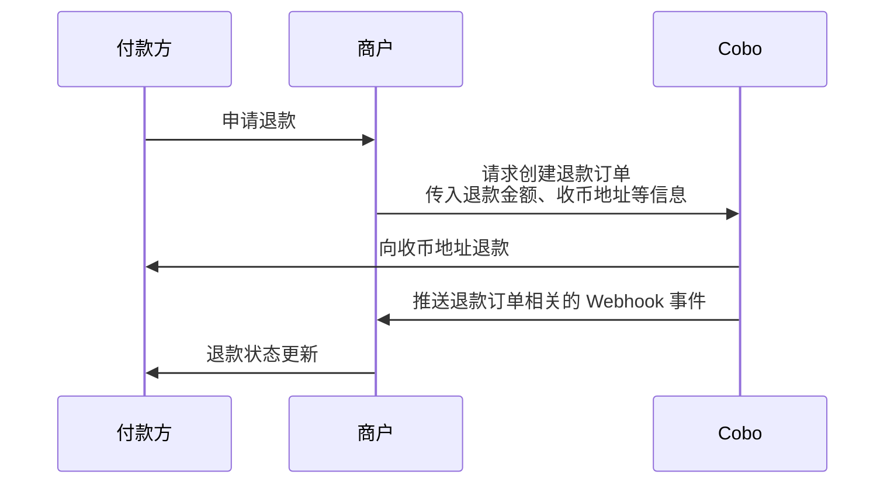

订单模式适用于需要指定具体支付金额和时限的场景。在该模式下，Cobo 会创建带有以下特点的支付订单：

- **固定金额**：订单创建时即指定具体的应付金额
- **有效期限**：付款方需要在指定时间内完成支付
- **异常处理**：支持多种异常情况的处理，包括：
  - 取消尚未支付的订单
  - 对已支付订单发起退款
  - 处理多付、少付、晚付等支付异常

下图展示了订单支付过程中，付款方、商户与 Cobo 之间的完整交互流程：
<div style={{maxWidth: '600px', margin: '0 auto'}}>

</div>

## 创建订单

您可以通过 Payments API 或 Checkout SDK 创建支付订单。

### 前提条件

您已完成[前置准备](/v2_cn/payments/preparation)中提到的所有步骤。

### 实现步骤
<Tabs>
  <Tab title="Payments API" icon="code">
1. 付款方选择用于支付的币种和链之后，您可以先调用 [Get exchange rate](/v2/api-references/payment/get-exchange-rate) 获取实时的公允汇率。根据商品订单金额和汇率，您可以计算出预估的应付金额并展示给付款方。

2. 在付款方确认支付后，调用 [Create pay-in order](/v2/api-references/payment/create-pay-in-order) 创建支付订单。创建订单时需要提供以下关键参数：
   * **商户 ID**（`merchant_id`）：商户 ID，在您录入商户时由 Cobo 分配。
   * **币种及链**（`token_id`）：付款方选择的用于支付的币种及链类型。 
   * **币种**（`currency`）：商品订单的币种，目前仅支持 `USD`。
   * **商品订单金额**（`order_amount`）：商品订单的应付金额。
   * **开发者费用**（`fee_amount`）：您向商户收取的开发者费用。如果您是直接服务于付款方的商户，可以将该字段设置为 `0`。请参考[资金分配与余额管理](/v2_cn/payments/amounts-and-balances)获取更多关于开发者费用的说明。
   * **过期时间**（`expired_in`）：支付订单的有效期，以秒为单位。从创建订单请求的时间开始计算。当订单过期后：
     - 订单状态变为最终状态且无法更改
     - `received_token_amount` 字段不再更新
     - 如果再次收到资金，将触发 `transactionLate` webhook 事件，且该资金不会计入该笔订单的实收资金
   * **开发者订单号**（`psp_order_code`）：请将此字段设置为您系统中该订单的唯一编号。

   创建订单后，Cobo 会返回包括以下字段在内的订单信息：

   * **应付金额**（`payable_amount`）：付款方最终需要支付的金额。由于汇率波动的关系，该金额可能与您预估的应付金额存在差异。  
   * **收币地址**（`receive_address`）：Cobo 根据付款方选择的币种和链，为该订单生成的收币地址。

**调用示例**

以下为调用 [Create pay-in order](/v2/api-references/payment/create-pay-in-order) 创建支付订单的示例代码：

<Accordion title="Sample code in Python">
```py
import cobo_waas2
from cobo_waas2 import PaymentApi

# See configuration.py for a list of all supported configurations.
configuration = cobo_waas2.Configuration(
   # Replace `<YOUR_PRIVATE_KEY>` with your private key
   api_private_key="<YOUR_PRIVATE_KEY>",
   # Select the development environment. To use the production environment, change the URL to https://api.cobo.com/v2.
   host="https://api.dev.cobo.com/v2",
)
# Enter a context with an instance of the API client
with cobo_waas2.ApiClient(configuration) as api_client:
   # Create an instance of the API class
   api_instance = PaymentApi(api_client)
   create_payment_order_request = cobo_waas2.CreatePaymentOrderRequest(
       merchant_id="<YOUR_MERCHANT_ID>",
       token_id="TRON_USDT",
       currency="USD",
       order_amount="10",
       fee_amount="0.3",
       psp_order_code="<YOUR_PSP_ORDER_CODE>",
       expired_in=1800
   )
   try:
       # Create payment order
       api_response = api_instance.create_payment_order(
           create_payment_order_request=create_payment_order_request
       )
       print("The response of PaymentApi->create_payment_order:\n")
       print(api_response)
   except Exception as e:
       print("Exception when calling PaymentApi->create_payment_order: %s\n" % e)
```
</Accordion>

<Accordion title="Sample code in Java">
```java
import com.cobo.waas2.ApiClient;
import com.cobo.waas2.ApiException;
import com.cobo.waas2.Configuration;
import com.cobo.waas2.Env;
import com.cobo.waas2.api.PaymentApi;
import com.cobo.waas2.model.*;

public class Example {
 public static void main(String[] args) {
   ApiClient defaultClient = Configuration.getDefaultApiClient();
   // Select the development environment. To use the production environment, replace `Env.DEV` with
   // `Env.PROD
   defaultClient.setEnv(Env.DEV);

   // Replace `<YOUR_PRIVATE_KEY>` with your private key
   defaultClient.setPrivKey("<YOUR_PRIVATE_KEY>");
   
   PaymentApi apiInstance = new PaymentApi(defaultClient);
   CreatePaymentOrderRequest createPaymentOrderRequest = new CreatePaymentOrderRequest();
   createPaymentOrderRequest.setMerchantId("<YOUR_MERCHANT_ID>");
   createPaymentOrderRequest.setTokenId("TRON_USDT");
   createPaymentOrderRequest.setCurrency("USD");
   createPaymentOrderRequest.setOrderAmount("10");
   createPaymentOrderRequest.setFeeAmount("0.3");
   createPaymentOrderRequest.setPspOrderCode("<YOUR_PSP_ORDER_CODE>");
   createPaymentOrderRequest.setExpiredIn(1800);

   try {
          Order paymentOrder = apiInstance.createPaymentOrder(createPaymentOrderRequest);
          System.out.println(paymentOrder);
   } catch (ApiException e) {
     System.err.println("Exception when calling PaymentApi#createPaymentOrder");
   }
 }
```
</Accordion>
  </Tab>
  <Tab title="Checkout SDK" icon="terminal">
  Checkout SDK 提供开箱即用的支付页面前端组件。通过简单的 iFrame 集成，您可以快速开发一个安全可靠的加密货币支付页面，无需处理繁琐的 UI 设计和支付逻辑，从而显著降低开发成本和时间投入。详情请参考[集成 Checkout SDK](/v2_cn/payments/checkout-sdk)。
  </Tab>
</Tabs>


## 查询订单状态

您可以订阅以下 Webhook 事件，以获取订单状态的实时更新通知。请参考 [Webhook reference](/v2_cn/payments/status-and-events) 了解每个事件的触发时间和返回的数据结构。  

- `payment.status.updated`
- `payment.transaction.created`
- `payment.transaction.late`
- `payment.transaction.held`
- `payment.transaction.completed`

您也可以通过 Payments App 或 Payments API 主动查询订单状态。

<Tabs>
  <Tab title="Payments App" icon="pager">
1. 登录 Cobo Portal [开发环境](https://portal.dev.cobo.com/login)或[生产环境](https://portal.cobo.com/login)。
2. 在左侧导航栏中点击 **Apps**，然后点击 **Payments** 卡片，启动 App。
3. 在 App 的左侧导航栏中点击**订单**。您可以在此页面查看所有订单的详细信息，如订单 ID、商户信息、支付金额、订单状态等。
4. 当付款方完成支付、且交易通过合规扫描后，订单状态会流转为**已完成**。

  </Tab>


  <Tab title="Payments API" icon="code">
您可以调用 [Get pay-in order information](/v2/api-references/payment/get-pay-in-order-information) 查询单个支付订单状态，或调用 [List all pay-in orders](/v2/api-references/payment/list-all-pay-in-orders) 查询所有订单状态。

  </Tab>
</Tabs>


## 异常情况

在订单模式下，您可能要处理以下几种异常情况。


### 撤销支付订单

当一笔支付订单在 `Pending` 状态下，即尚未检测到入账交易时，您可以调用 [Update pay-in order](/v2/api-references/payment/update-pay-in-order) 撤销该订单。撤销后，订单状态将变更为 `Expired`。

**调用示例**

以下为调用 [Update pay-in order](/v2/api-references/payment/update-pay-in-order) 撤销订单的示例代码：

<Accordion title="Sample code in Python">
```py
from cobo_waas2 import PaymentApi, UpdatePaymentOrderRequest, ApiClient, Configuration
from cobo_waas2 import PaymentApi
# See configuration.py for a list of all supported configurations.
configuration = Configuration(
  # Replace `<YOUR_PRIVATE_KEY>` with your private key
  api_private_key="<YOUR_PRIVATE_KEY>",
  # Select the development environment. To use the production environment, change the URL to https://api.cobo.com/v2.
  host="https://api.dev.cobo.com/v2",
)
# Enter a context with an instance of the API client
with ApiClient(configuration) as api_client:
  # Create an instance of the API class
  api_instance = PaymentApi(api_client)
  update_payment_order_request = UpdatePaymentOrderRequest(expired=True)
  try:
      # Cancel payment order
      api_response = api_instance.update_payment_order(
          order_id="<YOUR_ORDER_ID>",
          update_payment_order_request=update_payment_order_request
      )
      print("The response of PaymentApi->update_payment_order:\n")
      print(api_response)
  except Exception as e:
      print("Exception when calling PaymentApi->update_payment_order: %s\n" % e)
```
</Accordion>

<Accordion title="Sample code in Java">
```java
import com.cobo.waas2.ApiClient;
import com.cobo.waas2.ApiException;
import com.cobo.waas2.Configuration;
import com.cobo.waas2.Env;
import com.cobo.waas2.api.PaymentApi;
import com.cobo.waas2.model.*;

public class Example {
 public static void main(String[] args) {
   ApiClient defaultClient = Configuration.getDefaultApiClient();
   // Select the development environment. To use the production environment, replace `Env.DEV` with
   // `Env.PROD
   defaultClient.setEnv(Env.DEV);

   // Replace `<YOUR_PRIVATE_KEY>` with your private key
   defaultClient.setPrivKey("<YOUR_PRIVATE_KEY>");
   PaymentApi apiInstance = new PaymentApi(defaultClient);
   UpdatePaymentOrderRequest updatePaymentOrderRequest = new UpdatePaymentOrderRequest();
   updatePaymentOrderRequest.setExpired(true)
   try {
          Order order = apiInstance.updatePaymentOrder("<YOUR_ORDER_ID>", updatePaymentOrderRequest);
          System.out.println(order);
   } catch (ApiException e) {
     System.err.println("Exception when calling PaymentApi#updatePaymentOrder");
```
</Accordion>


### 多付、少付和晚付

在支付过程中可能出现以下三种异常情况：

| 异常情况 | 描述 | 影响 |
|---------|------|----------|
| **多付** | 在订单有效期内，付款方实付金额超过应付金额 | 订单最终状态为 `Completed`。|
| **少付** | 在订单有效期内，付款方实付金额少于应付金额 | 订单状态为 `Underpaid`（终态）。|
| **晚付** | 付款方在订单过期后进行首次或再次付款 | 不会改变订单状态。每次晚付都会触发一次 `payment.transaction.late` Webhook 事件。|

[资金分配与余额管理](/v2_cn/payments/amounts-and-balances)中详细介绍了多付、少付和晚付情况下，Cobo 对资金的处理规则。


### 处理退款申请
您可以通过 Payments App 或 Payments API 发起一笔退款订单，将资金退还给付款方。下图展示了退款环节中，付款方、商户以及 Cobo 之间的交互流程。

<div style={{maxWidth: '600px', margin: '0 auto'}}>

</div>


#### 创建退款订单

<Tabs>
  <Tab title="Payments App" icon="pager">
1. 登录 Cobo Portal [开发环境](https://portal.dev.cobo.com/login)或[生产环境](https://portal.cobo.com/login)。
2. 在左侧导航栏中点击 **Apps**，然后点击 **Payments** 卡片，启动 App。
3. 在 App 的左侧导航栏中点击**订单**。
4. 选择目标订单，然后点击右侧的**查看详情**按钮。

5. 在订单详情页面，点击**退款**按钮。

6. 在弹出的表单中：
   - 选择退款金额的来源，可以选择**商户余额**或**开发者余额**。
   - 填入退款金额。该金额不得高于对应的商户余额或开发者余额。
   - （可选）填入手续费金额。该手续费会从退款金额中扣除，归入开发者余额。有关开发者费用的详细说明，请参考[资金分配与余额管理](/v2_cn/payments/amounts-and-balances)。
   - 输入收款地址。您可以点击**使用原始支付地址**，系统将自动填入该笔订单的原始支付地址。如果您想退款到其他地址，也可以手动输入目标地址。
5. 点击**预览**确认所有信息无误后，点击**提交**创建退款订单。

  </Tab>
  <Tab title="Payments API" icon="code">
调用 [Create refund order](/v2/api-references/payment/create-refund-order) 创建退款订单。创建退款订单时需要注意以下几点：

   - 您需要通过 `refund_type` 字段指定退款金额的来源。当您选择 `Merchant` 时，Cobo 会从商户余额中扣除退款金额；当您选择 `Psp` 时，Cobo 会从开发者余额中扣除退款金额。
   - 由于退款涉及到向外部地址转账，Cobo 会收取相关手续费。您可以通过开发者费用字段（`merchant_fee_amount`）收取适当的费用作为补偿。指定该字段后：
     - 如果您选择从商户余额中扣除退款金额，Cobo 会将开发者费用从商户余额划转至开发者余额，资金会保留在原地址，不会发生实际转账。
     - 付款方实际收到的退款金额 = 指定退款金额 - 开发者费用（即 `payable_amount` - `merchant_fee_amount`）。
     - Cobo 会对退款金额进行校验。如果退款金额小于开发者费用，该请求将被拒绝并返回失败原因，因为此时付款方实际无法收到任何退款。

<Info>关于更多开发者费用的说明，请参考[资金分配与余额管理](/v2_cn/payments/amounts-and-balances)。</Info>
  
**调用示例**

以下为调用 [Create refund order](/v2/api-references/payment/create-refund-order) 创建退款订单的示例代码：

<Accordion title="Sample code in Python">
```py
from cobo_waas2 import PaymentApi, CreateRefundRequest, ApiClient, Configuration, RefundType
# See configuration.py for a list of all supported configurations.
configuration = Configuration(
  # Replace `<YOUR_PRIVATE_KEY>` with your private key
  api_private_key="<YOUR_PRIVATE_KEY>",
  # Select the development environment. To use the production environment, change the URL to https://api.cobo.com/v2.
  host="https://api.dev.cobo.com/v2",
)
# Enter a context with an instance of the API client
with ApiClient(configuration) as api_client:
   # Create an instance of the API class
   api_instance = PaymentApi(api_client)
   create_refund_request = CreateRefundRequest(
       request_id="<YOUR_REQUEST_ID>",
       merchant_id="<YOUR_MERCHANT_ID>",
       payable_amount="10",
       to_address="<YOUR_REFUND_ADDRESS>",
       token_id="TRON_USDT",
       refund_type=RefundType.MERCHANT,
       charge_merchant_fee=True, # Set it to True if developer fee is required
       merchant_fee_amount="1",
       merchant_fee_token_id="TRON_USDT", # The token ID of developer fee. Must be the same as token_id above.
   )
   try:
       # Create refund
       api_response = api_instance.create_refund(
           create_refund_request=create_refund_request
       )
       print("The response of PaymentApi->create_refund:\n")
       print(api_response)
   except Exception as e:
       print("Exception when calling PaymentApi->create_refund: %s\n" % e)
```
</Accordion>

<Accordion title="Sample code in Java">
```java
import com.cobo.waas2.ApiClient;
import com.cobo.waas2.ApiException;
import com.cobo.waas2.Configuration;
import com.cobo.waas2.Env;
import com.cobo.waas2.api.PaymentApi;
import com.cobo.waas2.model.*;

public class Example {
 public static void main(String[] args) {
   ApiClient defaultClient = Configuration.getDefaultApiClient();
   // Select the development environment. To use the production environment, replace `Env.DEV` with
   // `Env.PROD
   defaultClient.setEnv(Env.DEV);

   // Replace `<YOUR_PRIVATE_KEY>` with your private key
   defaultClient.setPrivKey("<YOUR_PRIVATE_KEY>");

   PaymentApi apiInstance = new PaymentApi(defaultClient);
   CreateRefundRequest createRefundRequest = new CreateRefundRequest();
   createRefundRequest.setRequestId("<YOUR_REQUEST_ID>");
   createRefundRequest.setMerchantId("<YOUR_MERCHANT_ID>");
   createRefundRequest.setPayableAmount("10");
   createRefundRequest.setToAddress("<YOUR_REFUND_ADDRESS>");
   createRefundRequest.setTokenId("TRON_USDT");
   createRefundRequest.setRefundType(RefundType.MERCHANT);


   try {
          Refund refund = apiInstance.createRefund(createRefundRequest);
          System.out.println(refund);
   } catch (ApiException e) {
     System.err.println("Exception when calling PaymentApi#createRefund");
   }
 }
```
</Accordion>
  </Tab>
</Tabs>

#### 查询退款订单状态
您可以订阅 `payment.refund.status.updated` 事件，获取退款订单状态的实时更新。请参考 [Webhook reference](/v2_cn/payments/status-and-events) 了解每个事件的详细触发条件和返回的数据结构。

您也可以通过 Payments App 或 Payments API 主动查询退款订单状态。

<Tabs>
  <Tab title="Payments App" icon="pager">
1. 登录 Cobo Portal [开发环境](https://portal.dev.cobo.com/login)或[生产环境](https://portal.cobo.com/login)。
2. 在左侧导航栏中点击 **Apps**，然后点击 **Payments** 卡片，启动 App。
3. 在 App 的左侧导航栏中点击**订单**。
4. 点击**退款**标签页。在退款订单列表中，找到目标订单，然后点击右侧的**查看详情**按钮。

5. 在退款订单详情页面查看订单状态。

  </Tab>
  <Tab title="Payments API" icon="code">
您可以调用 [Get refund order information](/v2/api-references/payment/get-refund-order-information) 查询单个退款订单状态，或调用 [List all refund orders](/v2/api-references/payment/list-all-refund-orders) 查询所有退款订单状态。
  </Tab>
</Tabs>


### 合规扫描不通过

当某笔交易收到 `payment.transaction.held` 事件，但长期未收到 `payment.transaction.completed` 事件时，这表明该笔交易未能通过 Cobo KYT 或 Screening App 的合规扫描。这种情况下，您需要按照以下步骤进行处理：


- 若该笔交易后续通过人工审核：
    - 如果订单未过期：该笔资金将计入订单实收金额，订单状态将根据实收金额相应更新
    - 如果订单已过期：系统将触发 `payment.transaction.late` 事件，该笔资金将全部计入开发者余额

- 若该笔交易最终未通过人工审核：
    - 资金将被冻结，不会被计入订单实收金额
    - 订单状态将保持不变
    - 付款方需要在订单有效期内重新充入足额资金并通过合规扫描，订单才能转为 `Completed` 状态
  
对于被隔离或冻结的资金：
- Cobo KYT：请通过 [help@cobo.com](mailto:help@cobo.com) 联系 Cobo 支持团队处理
- Screening App：您可以在应用内自行评估和处理

<Tip>欢迎您[提交反馈](https://forms.zohopublic.com/cobo/form/DocumentFeedbackForm/formperma/QvLOhxJv1_JMsJ-1dleZ8Itb_7rzN-LtgvsDdxosoVI)来帮助改进我们的文档！</Tip>