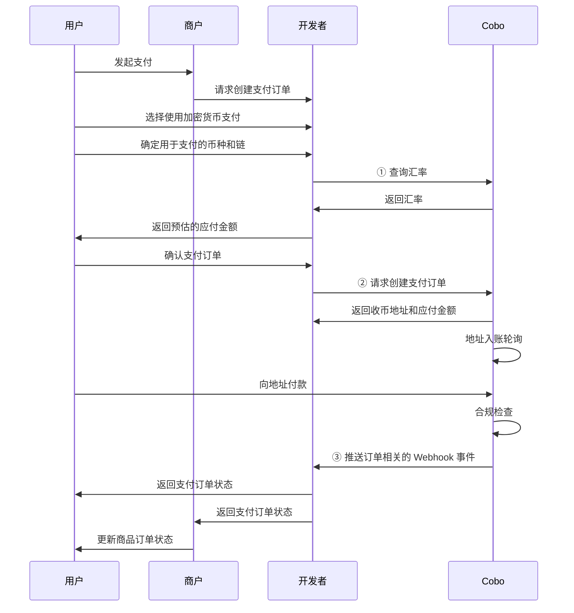

本文交代使用 Payment API 创建支付订单的过程。在实际开发过程中，您也可以使用 [Checkout SDK](/v2_cn/payments/checkout-sdk) 快速搭建收单页面。

下图展示了收单环节中，用户、开发者、商户、以及 Cobo 之间的交互流程。



## 前提条件

您已完成[前置准备](/v2_cn/payments/preparation)中提到的所有步骤。

## 创建订单并查询订单状态

1. 用户选择使用加密货币支付后，您可以调用 [Get exchange rate](/v2/api-references/payment/get-exchange-rate) 获取汇率信息，并根据商品订单金额、开发者费用以及汇率，预估支付订单的应付金额。  
2. 用户确定支付订单后，您可以调用 [Create pay-in order](/v2/api-references/payment/create-pay-in-order) 创建支付订单。请求中包含以下关键参数：  
   * **商户 ID**（`merchant_id`）：商户 ID，在您录入商户时由 Cobo 分配，可调用 [List all merchants](/v2/api-references/payment/list-all-merchants) 获取。
   * **币种及链**（`token_id`）：用户选择的用于支付的币种及链类型。 
   * **币种**（`currency`）：商品订单的币种，目前仅支持 `USD`。
   * **商品订单金额**（`order_amount`）：商品订单的应付金额，不包含开发者费用。
   * **开发者费用**（`fee_amount`）：您向商户收取的开发者费用。请参考[金额定义与余额计算说明](/v2_cn/payments/amounts-and-balances)获取更多关于开发者费用的说明。
   * **是否独立地址** (`use_dedicated_address`): 该订单是否分配独立的收币地址。
     - `true`: 为该订单分配独立的收币地址，不与其他订单共享。推荐用于大额交易以及其他需要严格资金隔离的场景。
     - `false` (默认): 使用地址池中的共享地址。
   * **过期时间**（`expired_in`）：支付订单过期的秒数，从请求创建订单的时间开始计算。过期后：
     - 订单状态变为最终状态且无法更改
     - `received_token_amount` 字段不再更新
     - 如果再次收到资金，将触发 `transactionLate` webhook 事件，且该资金不会计入该笔订单的实收资金
   * **开发者订单号**（`psp_order_code`）：开发者分配的用于在其系统中标识此订单的唯一参考代码。如果您是商户，请将此字段设置为您系统中该订单的唯一编号。

   创建订单后，Cobo 会返回包括以下字段在内的订单信息：

   * **应付金额**（`payable_amount`）：用户最终需要支付的金额。该金额由商品订单金额、开发者费用和汇率共同决定。由于汇率波动的关系，该金额可能与您预估的应付金额存在差异。  
   * **收币地址**（`receive_address`）：Cobo 根据用户选择的币种和链，为该订单生成的收币地址。 
3. 用户向指定的收币地址转入代币。Cobo 会通过轮询检测存入收币地址的所有交易。  
   * 您可以订阅 Webhook 事件，以获取订单状态和交易状态的实时更新通知。请参考 [Webhook reference](/v2_cn/payments/status-and-events) 了解每个事件的触发时间和返回的数据结构。  
   * 您也可以通过调用 [Get pay-in order information](/v2/api-references/payment/get-pay-in-order-information) 查询单个支付订单状态，或调用 [List all pay-in orders](/v2/api-references/payment/list-all-pay-in-orders) 查询所有订单状态。

## 调用示例

以下为调用 [Create pay-in order](/v2/api-references/payment/create-pay-in-order) 创建支付订单的示例代码：

<Accordion title="Sample code in Python">
```py
import cobo_waas2
from cobo_waas2 import PaymentApi

# See configuration.py for a list of all supported configurations.
configuration = cobo_waas2.Configuration(
   # Replace `<YOUR_PRIVATE_KEY>` with your private key
   api_private_key="<YOUR_PRIVATE_KEY>",
   # Select the development environment. To use the production environment, change the URL to https://api.cobo.com/v2.
   host="https://api.dev.cobo.com/v2",
)
# Enter a context with an instance of the API client
with cobo_waas2.ApiClient(configuration) as api_client:
   # Create an instance of the API class
   api_instance = PaymentApi(api_client)
   create_payment_order_request = cobo_waas2.CreatePaymentOrderRequest(
       merchant_id="<YOUR_MERCHANT_ID>",
       token_id="TRON_USDT",
       currency="USD",
       order_amount="10",
       fee_amount="0.3",
       psp_order_code="<YOUR_PSP_ORDER_CODE>",
       expired_in=1800
   )
   try:
       # Create payment order
       api_response = api_instance.create_payment_order(
           create_payment_order_request=create_payment_order_request
       )
       print("The response of PaymentApi->create_payment_order:\n")
       print(api_response)
   except Exception as e:
       print("Exception when calling PaymentApi->create_payment_order: %s\n" % e)
```
</Accordion>

<Accordion title="Sample code in Java">
```java
import com.cobo.waas2.ApiClient;
import com.cobo.waas2.ApiException;
import com.cobo.waas2.Configuration;
import com.cobo.waas2.Env;
import com.cobo.waas2.api.PaymentApi;
import com.cobo.waas2.model.*;

public class Example {
 public static void main(String[] args) {
   ApiClient defaultClient = Configuration.getDefaultApiClient();
   // Select the development environment. To use the production environment, replace `Env.DEV` with
   // `Env.PROD
   defaultClient.setEnv(Env.DEV);

   // Replace `<YOUR_PRIVATE_KEY>` with your private key
   defaultClient.setPrivKey("<YOUR_PRIVATE_KEY>");
   
   PaymentApi apiInstance = new PaymentApi(defaultClient);
   CreatePaymentOrderRequest createPaymentOrderRequest = new CreatePaymentOrderRequest();
   createPaymentOrderRequest.setMerchantId("<YOUR_MERCHANT_ID>");
   createPaymentOrderRequest.setTokenId("TRON_USDT");
   createPaymentOrderRequest.setCurrency("USD");
   createPaymentOrderRequest.setOrderAmount("10");
   createPaymentOrderRequest.setFeeAmount("0.3");
   createPaymentOrderRequest.setPspOrderCode("<YOUR_PSP_ORDER_CODE>");
   createPaymentOrderRequest.setExpiredIn(1800);

   try {
          Order paymentOrder = apiInstance.createPaymentOrder(createPaymentOrderRequest);
          System.out.println(paymentOrder);
   } catch (ApiException e) {
     System.err.println("Exception when calling PaymentApi#createPaymentOrder");
   }
 }
```
</Accordion>

## 下一步

- 您可以参考[结算](/v2_cn/payments/settle-orders)，对订单模式下的商户余额或开发者余额进行结算。
- 如需处理多付、少付、退款等异常情况，请参考[异常处理](/v2_cn/payments/handle-abnormality-order)。

<Tip>欢迎您[提交反馈](https://forms.zohopublic.com/cobo/form/DocumentFeedbackForm/formperma/QvLOhxJv1_JMsJ-1dleZ8Itb_7rzN-LtgvsDdxosoVI)来帮助改进我们的文档！</Tip>