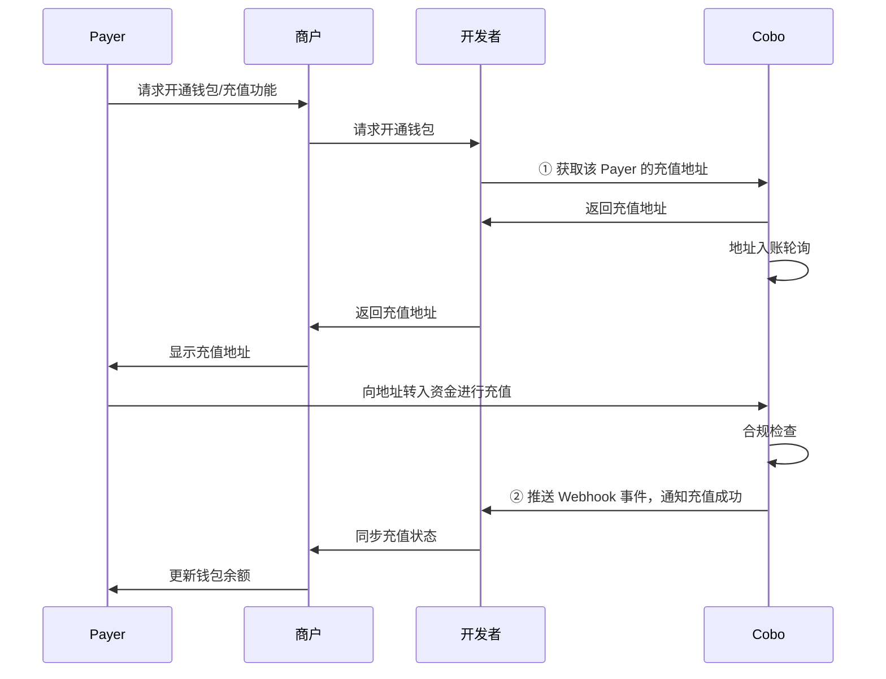

您可以调用 Payment API 为用户（Payer）获取专用的充值地址。下图展示了 Payer、商户、开发者以及 Cobo 之间的交互流程：



## 前提条件

您已完成[前置准备](/v2_cn/payments/preparation)中提到的所有步骤。

## 获取充值地址

1. 调用 [Get top-up address](/v2/api-references/payment/get-top-up-address) 为指定商户的指定 Payer 创建充值地址。请求中的关键参数包括：
   * **商户 ID** (`merchant_id`)：商户在 Cobo 系统中的唯一标识，在您进行商户录入时由 Cobo 分配。
   * **自定义 Payer ID** (`custom_payer_id`)：Payer 在您的系统中的唯一标识。
   * **Token ID** (`token_id`)：指定充值地址需要支持的加密货币和区块链网络。

2. **配置充值事件监听**：通过 Webhook 接收充值相关的事件通知，包括：
   - `payment.transaction.created`：检测到收币地址有新的充币交易
   - `payment.transaction.held`：充币交易未通过合规扫描
   - `payment.transaction.complete`：充值模式下，充币交易通过合规扫描，资金已成功入账并计入实收金额。

## 调用示例

以下为调用 [Get top-up address](/v2/api-references/payment/get-top-up-address) 获取充值地址的示例代码：
<Accordion title="Sample code in Python">
```py
import cobo_waas2
from cobo_waas2 import PaymentApi


# See configuration.py for a list of all supported configurations.
configuration = cobo_waas2.Configuration(
   # Replace `<YOUR_PRIVATE_KEY>` with your private key
   api_private_key="<YOUR_PRIVATE_KEY>",
   # Select the development environment. To use the production environment, change the URL to https://api.cobo.com/v2.
   host="https://api.dev.cobo.com/v2",
)
# Enter a context with an instance of the API client
with (cobo_waas2.ApiClient(configuration) as api_client):
   # Create an instance of the API class
   api_instance = cobo_waas2.PaymentApi(api_client)
   merchant_id = "<YOUR_MERCHANT_ID>"
   token_id = "<YOUR_TOKEN_ID>"
   custom_payer_id = "<YOUR_CUSTOM_PAYER_ID>"


   try:
       # Get top-up address
       api_response = api_instance.get_top_up_address(
           merchant_id=merchant_id, token_id=token_id, custom_payer_id=custom_payer_id
       )
       print("The response of PaymentApi->get_top_up_address:\n")
       print(api_response)
   except Exception as e:
       print("Exception when calling PaymentApi->get_top_up_address: %s\n" % e)
```
</Accordion>

<Accordion title="Sample code in Java">
```java
import com.cobo.waas2.ApiClient;
import com.cobo.waas2.ApiException;
import com.cobo.waas2.Configuration;
import com.cobo.waas2.Env;
import com.cobo.waas2.api.PaymentApi;
import com.cobo.waas2.model.*;


public class Example {
 public static void main(String[] args) {
   ApiClient defaultClient = Configuration.getDefaultApiClient();
   // Select the development environment. To use the production environment, replace `Env.DEV` with
   // `Env.PROD
   defaultClient.setEnv(Env.DEV);


   // Replace `<YOUR_PRIVATE_KEY>` with your private key
   defaultClient.setPrivKey("<YOUR_PRIVATE_KEY>");
   PaymentApi apiInstance = new PaymentApi(defaultClient);
   String merchant_id = "<YOUR_MERCHANT_ID>"
   String token_id = "<YOUR_TOKEN_ID>"
   String custom_payer_id = "<YOUR_CUSTOM_PAYER_ID>"
   try {
          TopUpAddress topUpAddress  = apiInstance.getTopUpAddress(merchant_id, token_id, custom_payer_id);
          System.out.println(topUpAddress);
   } catch (ApiException e) {
     System.err.println("Exception when calling PaymentApi#getTopUpAddress");
   }
 }
} 
```
</Accordion>

## 下一步

- 您可以参考[结算](/v2_cn/payments/settle-topup)，对充值模式下的商户余额或开发者余额进行结算。
- 如需处理充值地址更换、合规异常等情况，请参考[异常处理](/v2_cn/payments/handle-abnormality-topup)。

<Tip>欢迎您[提交反馈](https://forms.zohopublic.com/cobo/form/DocumentFeedbackForm/formperma/QvLOhxJv1_JMsJ-1dleZ8Itb_7rzN-LtgvsDdxosoVI)来帮助改进我们的文档！</Tip>