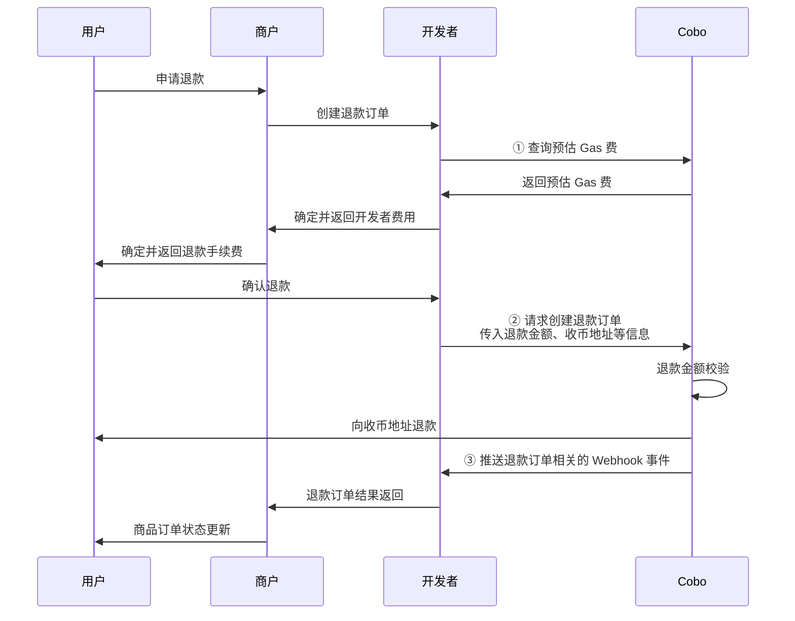

在订单模式下，您可能要处理以下几种异常情况。


## 撤销支付订单

当一笔支付订单在 `Pending` 状态下，即尚未检测到入账交易时，您可以调用 [Update pay-in order](/v2/api-references/payment/update-pay-in-order) 撤销该订单。撤销后，订单状态将变更为 `Expired`。

**调用示例**

以下为调用 [Update pay-in order](/v2/api-references/payment/update-pay-in-order) 撤销订单的示例代码：

<Accordion title="Sample code in Python">
```py
from cobo_waas2 import PaymentApi, UpdatePaymentOrderRequest, ApiClient, Configuration
from cobo_waas2 import PaymentApi
# See configuration.py for a list of all supported configurations.
configuration = Configuration(
  # Replace `<YOUR_PRIVATE_KEY>` with your private key
  api_private_key="<YOUR_PRIVATE_KEY>",
  # Select the development environment. To use the production environment, change the URL to https://api.cobo.com/v2.
  host="https://api.dev.cobo.com/v2",
)
# Enter a context with an instance of the API client
with ApiClient(configuration) as api_client:
  # Create an instance of the API class
  api_instance = PaymentApi(api_client)
  update_payment_order_request = UpdatePaymentOrderRequest(expired=True)
  try:
      # Cancel payment order
      api_response = api_instance.update_payment_order(
          order_id="<YOUR_ORDER_ID>",
          update_payment_order_request=update_payment_order_request
      )
      print("The response of PaymentApi->update_payment_order:\n")
      print(api_response)
  except Exception as e:
      print("Exception when calling PaymentApi->update_payment_order: %s\n" % e)
```
</Accordion>

<Accordion title="Sample code in Java">
```java
import com.cobo.waas2.ApiClient;
import com.cobo.waas2.ApiException;
import com.cobo.waas2.Configuration;
import com.cobo.waas2.Env;
import com.cobo.waas2.api.PaymentApi;
import com.cobo.waas2.model.*;

public class Example {
 public static void main(String[] args) {
   ApiClient defaultClient = Configuration.getDefaultApiClient();
   // Select the development environment. To use the production environment, replace `Env.DEV` with
   // `Env.PROD
   defaultClient.setEnv(Env.DEV);

   // Replace `<YOUR_PRIVATE_KEY>` with your private key
   defaultClient.setPrivKey("<YOUR_PRIVATE_KEY>");
   PaymentApi apiInstance = new PaymentApi(defaultClient);
   UpdatePaymentOrderRequest updatePaymentOrderRequest = new UpdatePaymentOrderRequest();
   updatePaymentOrderRequest.setExpired(true)
   try {
          Order order = apiInstance.updatePaymentOrder("<YOUR_ORDER_ID>", updatePaymentOrderRequest);
          System.out.println(order);
   } catch (ApiException e) {
     System.err.println("Exception when calling PaymentApi#updatePaymentOrder");
```
</Accordion>


## 异常支付情况说明

在支付过程中可能出现以下三种异常情况：

| 异常情况 | 描述 | 影响 |
|---------|------|----------|
| **多付** | 在订单有效期内，用户实付金额超过应付金额 | 订单最终状态为 `Completed`。|
| **少付** | 在订单有效期内，用户实付金额少于应付金额 | 订单状态为 `Underpaid`（终态）。用户后续的付款会被归为晚付金额。|
| **晚付** | 用户在订单过期后进行首次或再次付款 | 不会改变订单状态。每次晚付都会触发一次 `payment.transaction.late` Webhook 事件。|


对于上述异常情况，您可以选择如下的处理方式：
* 通过 API / Payments App / Checkout SDK 将多余资金退还给用户。  
* 将多余资金转移到其他钱包，等待处理。  
* 不单独处理，资金将保留在钱包中。

## 处理退款申请
本节交代如何使用 Payment API 将资金退还给用户。此外，您也可以通过 Payment App 或 Checkout SDK 发起退款。

下图展示了退款环节中，用户、商户、开发者以及 Cobo 之间的交互流程。


  
1. 调用 [Create refund order](/v2/api-references/payment/create-refund-order) 创建退款订单。创建退款订单时需要注意以下几点：

   - 您需要通过 `refund_type` 字段指定退款金额的来源。当您选择 `Merchant` 时，Cobo 会从商户余额中扣除退款金额；当您选择 `Psp` 时，Cobo 会从开发者余额中扣除退款金额。
   - 由于退款涉及到向外部地址转账，Cobo 会对您收取相关费用。您可以通过开发者费用字段（`merchant_fee_amount`）向商户收取合适金额的开发者费用作为补偿。Cobo 会将该费用从商户余额划转为开发者余额，资金会保留在原地址而不会另行转账。您可以先调用 [Estimate transaction fee](/v2/api-references/transactions/estimate-transaction-fee) 对链上手续费进行预估，为确定开发者费用金额提供参考。 
   - Cobo 会对退款金额进行校验。如果退款金额小于开发者费用，该请求将被拒绝并返回失败原因，因为这种情况下用户实际无法收到任何退款。

2. 您可以通过 `payment.refund.status.updated` 事件获取退款订单状态的实时更新通知。您也可以通过调用 [Get refund order information](/v2/api-references/payment/get-refund-order-information) 查询单个退款订单状态，或调用 [List all refund orders](/v2/api-references/payment/list-all-refund-orders) 查询所有退款订单状态。
  
**调用示例**

以下为调用 [Create refund order](/v2/api-references/payment/create-refund-order) 创建退款订单的示例代码：

<Accordion title="Sample code in Python">
```py
from cobo_waas2 import PaymentApi, CreateRefundRequest, ApiClient, Configuration, RefundType
# See configuration.py for a list of all supported configurations.
configuration = Configuration(
  # Replace `<YOUR_PRIVATE_KEY>` with your private key
  api_private_key="<YOUR_PRIVATE_KEY>",
  # Select the development environment. To use the production environment, change the URL to https://api.cobo.com/v2.
  host="https://api.dev.cobo.com/v2",
)
# Enter a context with an instance of the API client
with ApiClient(configuration) as api_client:
   # Create an instance of the API class
   api_instance = PaymentApi(api_client)
   create_refund_request = CreateRefundRequest(
       request_id="<YOUR_REQUEST_ID>",
       merchant_id="<YOUR_MERCHANT_ID>",
       payable_amount="10",
       to_address="<YOUR_REFUND_ADDRESS>",
       token_id="TRON_USDT",
       refund_type=RefundType.MERCHANT,
       charge_merchant_fee=True, # Set it to True if developer fee is required
       merchant_fee_amount="1",
       merchant_fee_token_id="TRON_USDT", # The token ID of developer fee. Must be the same as token_id above.
   )
   try:
       # Create refund
       api_response = api_instance.create_refund(
           create_refund_request=create_refund_request
       )
       print("The response of PaymentApi->create_refund:\n")
       print(api_response)
   except Exception as e:
       print("Exception when calling PaymentApi->create_refund: %s\n" % e)
```
</Accordion>

<Accordion title="Sample code in Java">
```java
import com.cobo.waas2.ApiClient;
import com.cobo.waas2.ApiException;
import com.cobo.waas2.Configuration;
import com.cobo.waas2.Env;
import com.cobo.waas2.api.PaymentApi;
import com.cobo.waas2.model.*;

public class Example {
 public static void main(String[] args) {
   ApiClient defaultClient = Configuration.getDefaultApiClient();
   // Select the development environment. To use the production environment, replace `Env.DEV` with
   // `Env.PROD
   defaultClient.setEnv(Env.DEV);

   // Replace `<YOUR_PRIVATE_KEY>` with your private key
   defaultClient.setPrivKey("<YOUR_PRIVATE_KEY>");

   PaymentApi apiInstance = new PaymentApi(defaultClient);
   CreateRefundRequest createRefundRequest = new CreateRefundRequest();
   createRefundRequest.setRequestId("<YOUR_REQUEST_ID>");
   createRefundRequest.setMerchantId("<YOUR_MERCHANT_ID>");
   createRefundRequest.setPayableAmount("10");
   createRefundRequest.setToAddress("<YOUR_REFUND_ADDRESS>");
   createRefundRequest.setTokenId("TRON_USDT");
   createRefundRequest.setRefundType(RefundType.MERCHANT);


   try {
          Refund refund = apiInstance.createRefund(createRefundRequest);
          System.out.println(refund);
   } catch (ApiException e) {
     System.err.println("Exception when calling PaymentApi#createRefund");
   }
 }
```
</Accordion>


## 合规扫描不通过

* 对于全托管钱包或者启用了 Cobo KYC 的 MPC 钱包，Cobo 将对每笔转入收币地址的交易进行合规扫描（如 KYT/AML 扫描）。若交易未通过合规检查，请通过 [help@cobo.com](mailto:help@cobo.com) 联系 Cobo 的支持团队进行人工处理。  
* 对于未启用 Cobo KYC 的 MPC 钱包，您可通过 [Screening App](https://manuals.cobo.com/cn/apps/screening/introduction) 自行对资金进行合规扫描，并处理未通过的交易。

若某笔交易初次未通过合规扫描，但在后续人工审核后通过，则按以下规则处理：

* **订单仍在有效期内：** 系统将更新订单状态，并将该笔资金计入订单的实付金额。  
* **订单已过期：** 系统将该笔资金记录为该订单的晚付金额。

若某笔交易最终未通过人工审核，并被隔离或冻结，则该笔资金仍会与订单关联，但不会计入订单的实付金额。

<Tip>欢迎您[提交反馈](https://forms.zohopublic.com/cobo/form/DocumentFeedbackForm/formperma/QvLOhxJv1_JMsJ-1dleZ8Itb_7rzN-LtgvsDdxosoVI)来帮助改进我们的文档！</Tip>