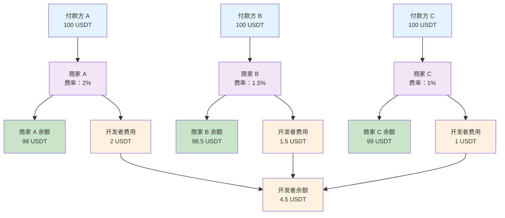

商户管理功能旨在为您的业务提供灵活的资金管理方案。无论您是服务多个下游商户的代收款平台，还是需要管理多个业务线的独立商户，都可以通过该功能实现精细化的业务管理，包括：

- **专属配置**：为每个商户配置专属的开发者费用/费率，实现自动化收入分成
- **独立资金**：为每个商户单独管理资金余额，确保资金安全隔离
- **专属数据**：查看对应的交易记录，实现数据独立管理

## 资金分配机制

Cobo 为您维护两类资金的收支记录：**商户资金**与**开发者资金**。当付款方完成支付后，系统会根据该笔支付关联的商户及其开发者费率，自动将资金分配至对应的商户余额和开发者余额。

<Info>有关资金分配机制的更详细介绍，请参考[资金分配与余额管理](/v2_cn/payments/amounts-and-balances)。</Info>

## 实际应用场景

每个商户代表一个独立的收款实体。商户可以是电商平台上的不同店铺，也可以是独立站的不同业务线，或者其他需要独立核算的业务单元。

### 电商平台服务多个商家

某电商平台为入驻商家分别创建独立商户，并根据不同商品类型设置差异化费率：

- **商家 A（电子产品）**：设置 2% 开发者费率
- **商家 B（服装）**：设置 1.5% 开发者费率  
- **商家 C（图书）**：设置 1% 开发者费率

平台可实时查看每个商家的交易数据和余额，实现差异化收费和精细化管理。

### 独立站多业务线管理

某独立站运营多个业务线，为每个业务线创建独立商户以实现资金隔离和独立核算：

- **主站销售**：服务于 B2C 业务线，处理主站个人消费者的付款
- **批发业务**：便于 B2B 客户管理和批发数据分析
- **海外业务**：满足跨境合规要求和汇率管理

这种架构实现了不同业务线的资金隔离、独立核算和精细化运营。

## 商户创建与配置

- 创建商户：具体的商户创建和配置步骤请参考[开发环境前置准备](/v2_cn/payments/preparation#merchants)。

- 开发者费率设置：不同收款模式有不同的配置方式。关于费率配置和资金流向的详细说明，请参考[资金分配与余额管理](/v2_cn/payments/amounts-and-balances)。

<Tip>欢迎您[提交反馈](https://forms.zohopublic.com/cobo/form/DocumentFeedbackForm/formperma/QvLOhxJv1_JMsJ-1dleZ8Itb_7rzN-LtgvsDdxosoVI)来帮助改进我们的文档！</Tip>