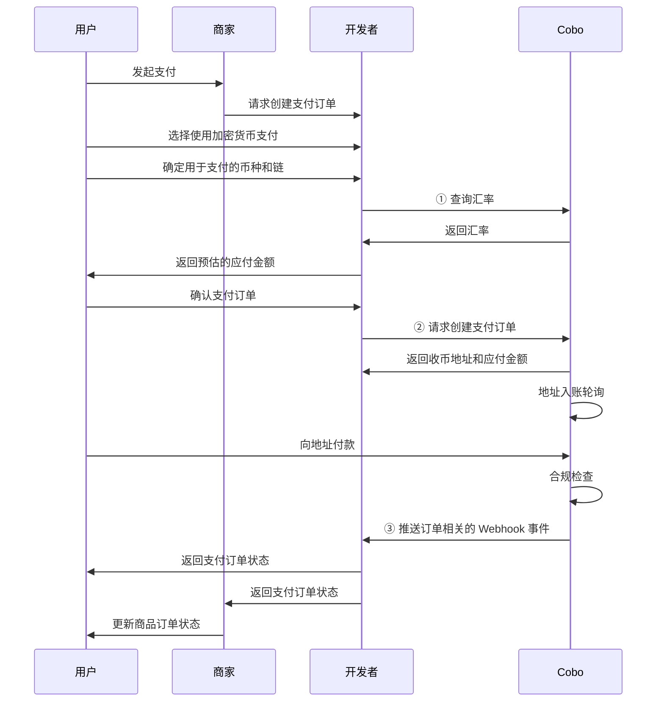

完成前置准备后，即可以开始开发收单模块，包括创建订单、监听订单状态、撤销订单等。

## 创建支付订单

本节交代使用 Payment API 创建支付订单的过程。在实际开发过程中，您也可以使用 Checkout SDK 快速搭建收单页面。

下图展示了收单环节中，用户、商户、开发者（即您）以及 Cobo 之间的交互流程。



1. 用户选择使用加密货币支付后，您可以调用 [Get exchange rate](https://www.cobo.com/developers/v2/api-references/payment/get-exchange-rate) 获取汇率信息，并根据商品订单金额、开发者费用以及汇率，预估支付订单的应付金额。  
2. 用户确定支付订单后，您可以调用 [Create pay-in order](https://www.cobo.com/developers/v2/api-references/payment/create-pay-in-order) 创建支付订单。请求中需至少包含以下关键参数：  
   * **商品订单金额**（`order_amount`）：商品订单的应付金额。  
   * **开发者费用**（`fee_amount`）：您向商户收取的手续费。  
   * **币种及链**（`token_id`）：用户选择的用于支付的币种及链类型。  
   * **是否独立地址** (`is_dedicated_address`): 该订单是否使用独立的收币地址。
     - `true`: 为该订单分配独立的收币地址，不与其他订单共享地址。推荐用于大额交易以及其他需要严格资金隔离的场景。
     - `false` (默认): 地址会在订单过期后回收并可能分配给其他订单。
   * **订单过期时间**（`expired_at`）：商品订单的过期时间。订单过期后，任何转入收币地址的资金都不会被计入订单的实收金额，只能作为[开发者资金](/v2_cn/payments/amounts-and-balances)进行结算。

   创建订单后，Cobo 会返回以下信息：

   * **应付金额**（`payable_amount`）：用户最终需要支付的金额。该金额由商品订单金额、开发者费用和汇率共同决定。由于汇率波动的关系，该金额可能与您预估的应付金额存在差异。  
   * **收币地址**（`receive_address`）：Cobo 根据用户选择的币种和链，为该订单生成的收币地址。  
3. 用户向指定的收币地址转入代币。Cobo 会通过轮询检测到存入收币地址的所有交易。  
   * 您可以订阅 Webhook 事件，以获取订单状态和交易状态的实时更新通知。请参考 [Webhook reference](?tab=t.0#heading=h.iesi2e7yooag) 了解每个事件的触发时间和返回的数据结构。  
   * 您也可以通过调用 [Get pay-in order information](https://www.cobo.com/developers/v2/api-references/payment/get-pay-in-order-information) 查询单个支付订单状态，或调用 [List all pay-in orders](https://www.cobo.com/developers/v2/api-references/payment/list-all-pay-in-orders) 查询所有订单状态。

**调用示例**

以下为调用 [Create pay-in order](https://www.cobo.com/developers/v2/api-references/payment/create-pay-in-order) 创建支付订单的示例代码：

<Accordion title="Sample code in Python">
```py
import cobo_waas2
from cobo_waas2 import PaymentApi
# See configuration.py for a list of all supported configurations.
configuration = cobo_waas2.Configuration(
   # Replace `<YOUR_PRIVATE_KEY>` with your private key
   api_private_key="<YOUR_PRIVATE_KEY>",
   # Select the development environment. To use the production environment, change the URL to https://api.cobo.com/v2.
   host="https://api.dev.cobo.com/v2",
)
# Enter a context with an instance of the API client
with cobo_waas2.ApiClient(configuration) as api_client:
   # Create an instance of the API class
   api_instance = cobo_waas2.PaymentApi(api_client)
   create_payment_order_request = cobo_waas2.CreatePaymentOrderRequest()
   try:
       # Estimate transaction fee
       api_response = api_instance.create_payment_order(
           create_payment_order_request=create_payment_order_request
       )
       print("The response of PaymentApi->create_payment_order:\n")
       print(api_response)
   except Exception as e:
       print("Exception when calling PaymentApi->create_payment_order: %s\n" % e)
```
</Accordion>

<Accordion title="Sample code in Java">
```java
import com.cobo.waas2.ApiClient;
import com.cobo.waas2.ApiException;
import com.cobo.waas2.Configuration;
import com.cobo.waas2.Env;
import com.cobo.waas2.api.PaymentApi;
import com.cobo.waas2.model.*;


public class Example {
 public static void main(String[] args) {
   ApiClient defaultClient = Configuration.getDefaultApiClient();
   // Select the development environment. To use the production environment, replace `Env.DEV` with
   // `Env.PROD
   defaultClient.setEnv(Env.DEV);


   // Replace `<YOUR_PRIVATE_KEY>` with your private key
   defaultClient.setPrivKey("<YOUR_PRIVATE_KEY>");
   PaymentApi apiInstance = new PaymentApi(defaultClient);
   CreatePaymentOrderRequest createPaymentOrderRequest = new CreatePaymentOrderRequest();
   try {
          Order paymentOrder = apiInstance.createPaymentOrder(createPaymentOrderRequest);
          System.out.println(paymentOrder);
   } catch (ApiException e) {
     System.err.println("Exception when calling PaymentApi#createPaymentOrder");
   }
 }
}
```
</Accordion>


## 撤销支付订单

当一笔支付订单在 `Pending` 状态下，即尚未检测到入账交易时，您可以调用 [Update pay-in order](https://www.cobo.com/developers/v2/api-references/payment/update-pay-in-order) 撤销该订单。撤销后，订单状态将变更为 `Expired`。

**调用示例**

以下为调用 [Update pay-in order](https://www.cobo.com/developers/v2/api-references/payment/update-pay-in-order) 撤销订单的示例代码：

<Accordion title="Sample code in Python">
```py
import cobo_waas2
from cobo_waas2 import PaymentApi
# See configuration.py for a list of all supported configurations.
configuration = cobo_waas2.Configuration(
   # Replace `<YOUR_PRIVATE_KEY>` with your private key
   api_private_key="<YOUR_PRIVATE_KEY>",
   # Select the development environment. To use the production environment, change the URL to https://api.cobo.com/v2.
   host="https://api.dev.cobo.com/v2",
)
# Enter a context with an instance of the API client
with cobo_waas2.ApiClient(configuration) as api_client:
   # Create an instance of the API class
   api_instance = cobo_waas2.PaymentApi(api_client)
   update_payment_order_request = cobo_waas2.UpdatePaymentOrderRequest()
   try:
       # Estimate transaction fee
       api_response = api_instance.update_payment_order(
           update_payment_order_request=update_payment_order_request
       )
       print("The response of PaymentApi->update_payment_order:\n")
       print(api_response)
   except Exception as e:
       print("Exception when calling PaymentApi->update_payment_order: %s\n" % e)
```
</Accordion>

<Accordion title="Sample code in Java">
```java
import com.cobo.waas2.ApiClient;
import com.cobo.waas2.ApiException;
import com.cobo.waas2.Configuration;
import com.cobo.waas2.Env;
import com.cobo.waas2.api.PaymentApi;
import com.cobo.waas2.model.*;


public class Example {
 public static void main(String[] args) {
   ApiClient defaultClient = Configuration.getDefaultApiClient();
   // Select the development environment. To use the production environment, replace `Env.DEV` with
   // `Env.PROD
   defaultClient.setEnv(Env.DEV);


   // Replace `<YOUR_PRIVATE_KEY>` with your private key
   defaultClient.setPrivKey("<YOUR_PRIVATE_KEY>");
   PaymentApi apiInstance = new PaymentApi(defaultClient);
   String orderId = "";
   UpdatePaymentOrderRequest updatePaymentOrderRequest = new UpdatePaymentOrderRequest();
   try {
          Order order = apiInstance.updatePaymentOrder(orderId, updatePaymentOrderRequest);
          System.out.println(order);
   } catch (ApiException e) {
     System.err.println("Exception when calling PaymentApi#updatePaymentOrder");
   }
 }
}
```
</Accordion>

<Tip>欢迎您[提交反馈](https://forms.zohopublic.com/cobo/form/DocumentFeedbackForm/formperma/QvLOhxJv1_JMsJ-1dleZ8Itb_7rzN-LtgvsDdxosoVI)来帮助改进我们的文档！</Tip>